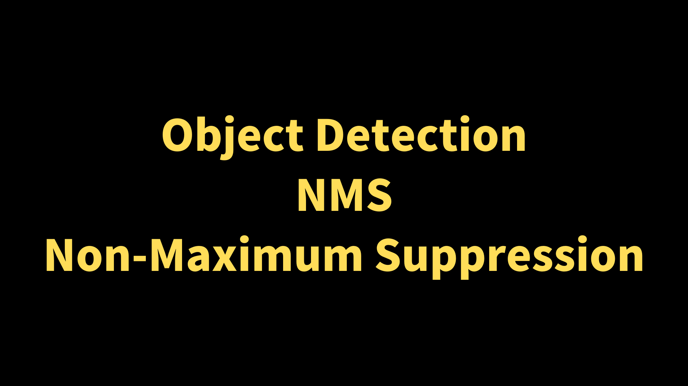
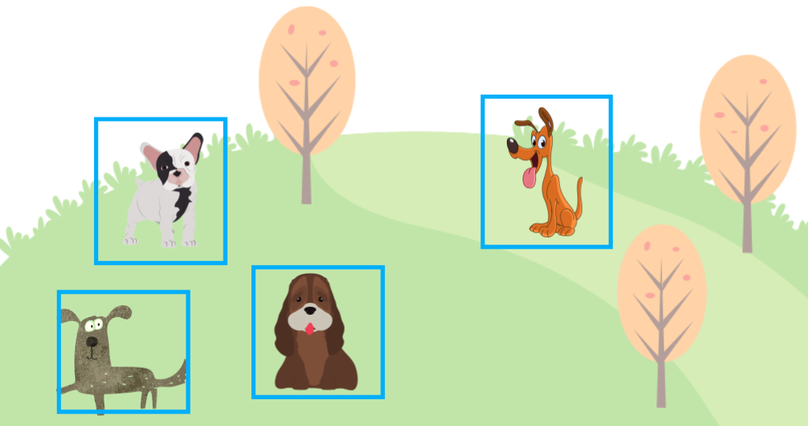
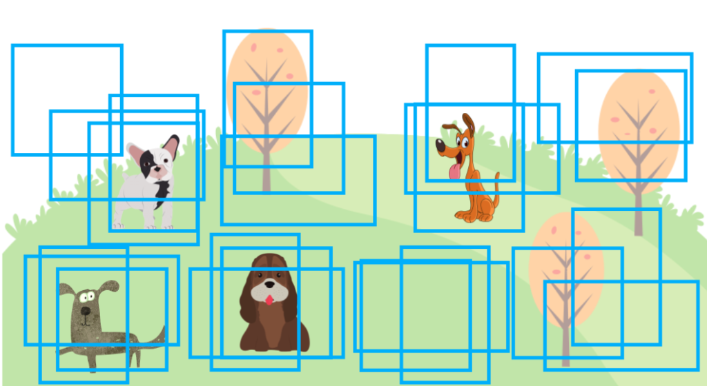
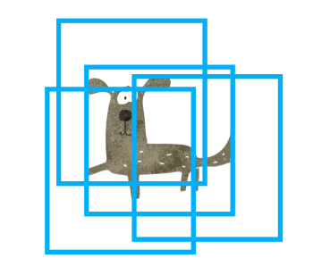
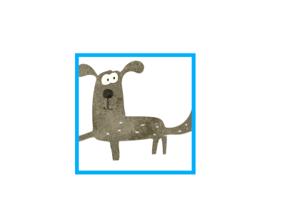
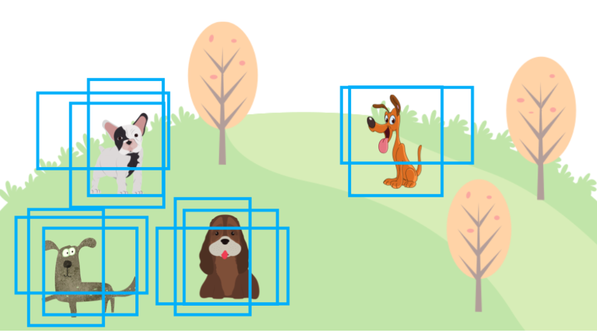

Object detection models like [YOLOv5](/blog/2022-05-08-yolov5-pytorch/) and [SSD](/blog/2022-07-31-ssd-single-shot-multibox-detector/) predict objects' locations by generating bounding boxes (shown in blue rectangles below).

{width="70%"}

However, object detection models produce more bounding boxes than the final output with different locations, sizes, and confidence levels. They do not just predict one bounding box per object. It is where Non-Maximum Suppression (NMS) comes to play, keeping the most probable bounding boxes and eliminating other less likely bounding boxes.

This article explains how NMS works.

## Overlapping Bounding Boxes

If we don't do NMS, an object detection output may look like the one below, with many overlapping bounding boxes. There would be many more bounding boxes than in the image below, but that would make the image too chaotic, so I'm showing only some overlapping bounding boxes to get my point across.

{width="70%"}

Some object detection models like YOLO (since version 2) use anchors to generate predictions. Anchors are a predefined set of boxes (width and height) located at every grid cell. For example, YOLOv2 predicts more than a thousand bounding boxes. In other words, anchor boxes provide reasonable priors for object shapes (width-height ratios) calculated from the training dataset. The model only needs to predict an offset and scale to each anchor box, simplifying the network as we can make it fully convolutional.

In this article, we are not going into more detail about anchors. We only need to know that an object detection model generates many bounding boxes, and we need to apply post-processing to eliminate redundant ones.

Each predicted bounding box has a confidence score which indicates how likely (the model believes) an object exists in a bounding box. For example, the model may output a bounding box for a dog with a confidence score of 75%. The confidence score tells us which bounding boxes are more important (or less important). So, we can use it to rank bounding boxes. We'll call it "__score__" in this article.

Now, we are ready to discuss how NMS works. For simplicity, we'll deal with only one class ("dog"). Doing so does not change the nature of NMS. We'll touch upon the multi-class case later on.

## Non-Maximum Suppression

As the name suggests, NMS means "suppress the ones that are not maximum (score)". We are eliminating predicted bounding boxes overlapping with the highest score bounding box. For example, the image below has multiple predicted bounding boxes for a dog, and those bounding boxes overlap each other.

{width="30%"}

Since each bounding box has a score, we can sort them by descending order. Suppose the red bounding box has the highest score.

{width="30%"}

For each of the blue bounding boxes (with a lower score than the red one), we calculate the IoU ([Intersection over Union](/blog/2022-05-24-object-detection-intersection-over-union/)) with the red one. An IoU value represents an overlap between two boxes, ranging from 0 (no overlap) to 1 (maximum overlap). The below image shows the IoU concept, where the black part is an overlap area (intersection) between two boxes. Then, we calculate the IoU between the blue and red boxes as the intersection over the union area of the two boxes.

{width="40%"}

We set an IoU threshold (hyperparameter) to determine if two predicted bounding boxes are for the same object or not. Let's say we use 0.5 as the IoU threshold. If the above blue and red boxes overlap with an IoU value of 0.5 or more, we say they are for the same object ("dog" in this case), and we should suppress (eliminate) the blue box because the red box has a higher score. As we repeat the steps, we eliminate all overlapping (lower score) bounding boxes and leave the highest score one. And that's how NMS works for a single dog case.

{width="30%"}

Even if there is more than one dog, the process works the same way. We sort all bounding boxes by score and repeat, eliminating the lower score bounding boxes as per the IoU threshold hyperparameter. First, we eliminate all overlapping bounding boxes for the highest score bounding box. Then, we'll find the next highest score bounding box that does not overlap with the highest score bounding box to eliminate lower score ones. And the process repeats.

The following summarizes the NMS steps for one class:

1. Prepare an empty list for selected bounding boxes. `outputs = []`
2. Sort all bounding boxes by score (descending) and call the list `bboxes`.
3. Take out the highest score bounding box from `bboxes` and put it into `outputs`.
4. Calculate IoU between the highest score bounding box with other bounding boxes in `bboxes`. We remove bounding boxes from `bboxes` if IoU is 0.5 or higher. (The IoU threshold is a hyperparameter).
5. If `bboxes` is not empty, we repeat the process from step 3.
6. Finally, we return `outputs` containing the non-overlapping bounding boxes (per the IoU threshold).

Hopefully, NMS is not that scary or complicated to understand. In reality, we'd use a function provided by a library like PyTorch ([torchvision.ops.nms](https://pytorch.org/vision/stable/ops.html#torchvision.ops.nms)), so it's easy to perform NMS. YOLOv5 also uses that internally.

Now, let's extend the process to multiple classes.

### Dealing with Multiple Classes

So far, we have talked about one "dog" class only. We must deal with multiple classes like "cat" and others in real object detection datasets. In this case, we perform NMS for each class as an object-detection model outputs scores for all classes the target dataset supports.

If there are 80 classes, a model produces 80 probabilities per bounding box. For example, a model would predict a bounding box with confidence scores like 75% "dog", 20% "cat", and some probabilities for the other 78 classes. There would be many bounding boxes, each with 80 probabilities.

We perform NMS independently for each class, ranking bounding boxes by score within one class. We do that for "dog", "cat", and others. It can work well even when a dog and a cat are very close to each other since we are dealing with different classes separately, overlapping bounding boxes for different classes can survive NMS.

However, we may not want to repeat NMS for each class because it takes too much time.

### Dealing with Slowness

NMS is a sequential process, and it cannot run in parallel. We are dealing with 80 or so classes, so running NMS for thousands of bounding boxes may take too much time. For example, to detect running vehicles via a stream of video images, we'd want to reduce latency as much as possible.

Therefore, implementations such as YOLOv5 shift the (x, y) coordinates of bounding boxes for each class so that bounding boxes in one class never overlap with bounding boxes in another class. Such an arrangement allows one NMS process to handle all classes in an image in one NMS function call instead of 80 NMS function calls.

### Eliminate Low Score Predictions First

Since more bounding boxes require more time in NMS, we should probably eliminate low-score predictions as they will likely not survive NSM anyway.

{width="70%"}

In other words, we set a confidence threshold to eliminate bounding boxes with less than a specific score value. It's yet another hyperparameter. For example, we could set the confidence threshold to 0.05 and eliminate all bounding boxes with 0.05 or lower scores before starting NMS. If the confidence threshold is high enough, it can remove many bounding boxes and dramatically improve the speed.

{width="70%"}

However, it can sacrifice the accuracy ([mAP](/blog/2022-05-27-object-detection-mean-average-precision/)) because a lower score does not necessarily mean the prediction is wrong. So, we should be careful when setting this hyperparameter, as it balances speed and accuracy.

Another way of eliminating lower score bounding boxes is to limit the number of bounding boxes we give to NMS. It is another hyperparameter. For example, if the limit is 1000, we enter only the top 1000 bounding boxes into NMS. Since we have less number of bounding boxes handled by NMS, it could run a lot faster depending on the limit. In terms of accuracy, one image won't usually have so many ground truth bounding boxes, so it may still produce a good mAP. However, as mentioned before, a low score does not necessarily mean the prediction is wrong. So, this approach still requires us to adjust the hyperparameter carefully.

### Non-Maximum Suppression Speed versus mAP

Another way of looking at this balancing act is to adjust those hyperparameters depending on whether we focus on speed or accuracy.

*   Confidence threshold
*   IoU threshold
*   Maximum number of bounding boxes

If you look closely at [the speed test of YOLO v5 and the mAP report](https://github.com/ultralytics/yolov5), you can see that the parameters are adjusted differently for speed and mAP. For example, if you want to increase the speed, set the confidence threshold to a higher value (say, 0.25), and if you want to improve mAP, set the confidence threshold to a lower value (say, 0.001).

__Reproduce mAP__ by:

```python
python test.py --data coco.yaml --img 640 --conf 0.001 --iou 0.65
```

__Reproduce speed__ by:

```python
python test.py --data coco.yaml --img 640 --conf 0.25 --iou 0.45
```

<cite>[https://github.com/ultralytics/yolov5/blob/master/README.md](https://github.com/ultralytics/yolov5/blob/master/README.md)</cite>

Looking at the above settings, the IoU threshold (`` --iou ``) is also set low in the speed test so that the NMS execution is faster, excluding bounding boxes with a small overlap.

## References

- [Object Detection vs Image Classification](/blog/2022-05-23-object-detection-vs-image-classification/)
- [IoU (Intersection over Union)](/blog/2022-05-24-object-detection-intersection-over-union/)
- [mAP (mean Average Precision)](/blog/2022-05-27-object-detection-mean-average-precision/)
- [NMS (Non-maximum Suppression)](/blog/2022-06-01-object-detection-non-maximum-suppression/)
- [Non-maximum Suppression (NMS)](https://towardsdatascience.com/non-maximum-suppression-nms-93ce178e177c) \
  [Sambasivarao. K](https://medium.com/@SambasivaraoK)
