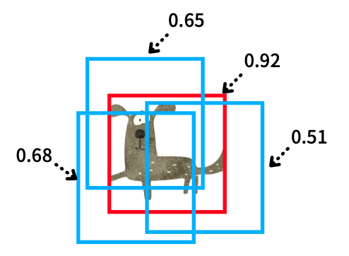

R-CNN (Region-based Convolutional Neural Network) was an epoch-making model in 2013 which successfully combined CNN with classical computer vision techniques for object detection and broke the previous record. R-CNN is now an old model, but it's essential to have knowledge of the origin in studying the subsequent development in object detection. 

If you are new to object detection, please refer to [this article](/blog/2022-05-23-object-detection-vs-image-classification/) that explains the difference between image classification and object detection. Otherwise, let's get started with an overview of R-CNN.

## Ross Girshick

[Ross Girshick](https://www.rossgirshick.info/), the central figure behind R-CNN, was a postdoc at the University of California, Berkeley, at the time. Then, he worked for Microsoft for a while and now belongs to Facebook (Meta) AI Research (FAIR).

Note: Yann LeCun [tweeted](https://twitter.com/ylecun/status/1532423599428186113) that FAIR now stands for __Fundamental__ AI Research. 

](images/RossGirshick.jpg){width="25%"}

In addition to R-CNN, Ross Girshick researched and developed __Fast R-CNN__ and __Faster R-CNN__. He was involved in developing __YOLO__ (first version only) with Joseph Redmon. He co-authored the paper for __Mask R-CNN__ with Kaiming He (famous for __Kaiming Weight Initialization__, or __He Weight Initialization__). Later, he also participated in the Faster R-CNN project at Microsoft (and later moved to FAIR).

Ross Girshick integrated convolutional neural networks (feature extraction) with existing computer vision techniques in object detection and achieved significant performance improvements over previous models.

## R-CNN at a Glance

R-CNN performs object detection according to the steps shown in the figure below.

](images/figure-1.png){width="90%"}

1.   Input Image
2.   Region Proposals
3.   CNN Feature Extraction
4.   SVM Classification

Finally, the post-processing performs [NMS](/blog/2022-06-01-object-detection-non-maximum-suppression/) (Non-Maximum Suppression).

Let's take a look at each step.

## Input Image

Below is an example of images from PASCAL VOC (object detection dataset).

](images/PASCAL-VOC-bicycle_03.jpeg)

As an aside, the PASCAL VOC site is often inaccessible. Or maybe the server just happened to be down. In any case, I wasn't able to open the site from time to time. If you want to get the PASCAL VOC dataset, you can use [this mirror](https://pjreddie.com/projects/pascal-voc-dataset-mirror/) by Joseph Redmon, the developer of YOLO.  According to him, the server of PASCAL VOC is often down, so he prepared a mirror. I believe researchers use [COCO](https://cocodataset.org/#home) more than PASCAL VOC, so it may no longer be such an issue.

---

Prior to the appearance of R-CNN, the object detection results with PASCAL VOC were sluggish. Then, in 2014, R-CNN made an impressive 30% (relative) improvement over the previous best. 

There was a historical background there. In 2012, [AlexNet](https://papers.nips.cc/paper/2012/file/c399862d3b9d6b76c8436e924a68c45b-Paper.pdf) won [ILSVRC](https://image-net.org/challenges/LSVRC/) (The ImageNet Large Scale Visual Recognition Challenge) in image classification, achieving great success. Ross Girshick incorporated AlexNet into R-CNN and proved that deep learning is highly effective in object detection. In other words, CNN trained on images from ImageNet can work well as a feature extractor on images from PASCAL VOC.

So, deep learning worked great with object detection, but Ross Girshick didn't directly use it on input images.

Many object detection models (before R-CNN) used various computer vision techniques. He combined CNN with classical methods instead of using deep learning end-to-end. For example, he used __Selective Search__ to select interest regions.

Let's briefly look at it next.

## Region Proposals

The region proposal step selects about 2000 areas (bounding boxes) in the image where objects are likely to be. They chose the __Selective Search__ method because it is easy to compare the performance with the previous research that uses the same method.

<blockquote>
While R-CNN is agnostic to the particular region proposal method, we use selective search to enable a controlled comparison with prior detection work (e.g., [39, 41]).<cite>Source: [paper](http://www.huppelen.nl/publications/selectiveSearchDraft.pdf)</cite></blockquote>

R-CNN is agnostic to region proposal methods because the region proposal step and the subsequent CNN feature extraction step are independent. It first selects regions and then applies CNN feature extraction to each region.

](images/SelectiveSearch-figure-2a.png){width="90%"}

Since selected rectangle areas have various sizes, all areas are warped (resized) to a fixed size of 227 x 227 pixels. It ensures that the bounding box dimensions are constant and that the features extracted by the CNN layers all result in the exact dimensions.

## CNN Feature Extraction

As mentioned earlier, R-CNN uses CNN layers from AlexNet to extract features from selected and warped regions in images. At that time, AlexNet was a good choice since it topped the ILSVRC (ImageNet Large Scale Visual Recognition Challenge) in 2012, which became a famous model that triggered the rekindling of deep learning research fever. It was far behind second place and below in the competition. Since AlexNet, it has become mainstream to use deep learning for image classification. So, it was a matter of time before someone attempted to use it for object detection.

](images/AlexNet-figure-2.png)

R-CNN uses five convolutional layers and two fully connected layers in AlexNet to extract features from each area (227 x 227 pixels) into a 4096-dimensional vector. It then uses the features to classify the images in each area. It is transfer learning, where the final part is SVM ([support vector machine](https://en.wikipedia.org/wiki/Support-vector_machine)) that makes the judgment for image classification. SVM was a widely used method, and they followed the same approach for the last classification step.

## SVM Classification

The image below outlines the process, including the part that employs SVM, which takes in extracted features to calculate a score for each class.

](images/RCNN-CVPR14.png){width="80%"}

There is one SVM for each class. For example, one that identifies only dogs, one that identifies only cats, and so on. If you look at the rightmost part of the figure below, it will be easier to imagine how that works.

](images/figure-1.png){width="90%"}

Since one SVM can only judge the authenticity of one class, it has one SVM model per class. That sounds very slow, but it's not that bad. Because they used a linear SVM kernel that uses a dot product between an SVM model's weights and an input feature vector, they can use one SVM weight matrix of 4096 x N, where N is the number of classes.

Moreover, they can batch all input features from 2000 regions into an input feature matrix of 2000 x 4096. So, R-CNN can calculate scores with a matrix-matrix product between all the SVM models' weights and the batched input features in one shot. It is similar to a fully connected layer in modern deep learning. 

With the steps up to this point, R-CNN completes image classification for each selected area. Next, object detection requires post-processing.

## NMS (Non-Maximum Suppression)

NMS, which is post-processing, is a well-known computer vision method and is not unique to R-CNN. Simply put, it is a way to eliminate overlapping predictions to leave the most probable bounding box. For example, the below figure shows overlapping bounding boxes for an object ("dog" in this case).

{width="25%"}

NMS removes overlapping bounding boxes using the score (confidence) calculated by SVM models. It eliminates the predictions with lower scores and leaves the most confident prediction.

{width="30%"}

Effectively, it will leave one prediction per object (depending on the accuracy of bounding box prediction and confidence score).

{width="60%"}

For more details, I've written [an article](/blog/2022-06-01-object-detection-non-maximum-suppression/) that explains it in detail here, but here is a short overview of NMS.

## Good Results with Complex Pipeline

R-CNN achieved a significant performance ([mAP](/blog/2022-05-27-object-detection-mean-average-precision/)) improvement compared to previous models. However, from today's point of view, it is undeniable that the model uses hybrid mechanisms. As a result, it was slow. It was much slower than the R-CNN successors and YOLO that appeared later.

In addition, it is laborious and time-consuming to train each part of the model separately. If you've read this far, you'll likely come up with various ways to improve it. That is because we are looking from the future standpoint. On the other hand, the researchers at that time were working hard to improve the methods from the past. We can see various trials and efforts in the R-CNN paper.

For example, the model has an additional bounding box regression step to adjust the position and size of each area selected by Selective Search: 

<blockquote>
After scoring each selective search proposal with a class-specific detection SVM, we predict a new bounding box for the detection using a class-specific bounding-box regressor.<cite>Source: [paper](https://arxiv.org/abs/1311.2524)</cite></blockquote>

So, R-CNN uses Selective Search to generate bounding boxes, performs CNN feature extraction on them, executes linear SVM classification, and then regresses bounding boxes for the predicted classes, adding one more step in the entire pipeline. As a result, the model becomes more complex and slower. It was much slower than the previous state-of-the-art (SOTA) in object detection.

## Comparison with OverFeat by Yann Lecun

[OverFeat](https://arxiv.org/abs/1312.6229) (Yann LeCun et al.) was the previous SOTA object detector that also used CNN. R-CNN beat OverFeat in terms of mAP. The below mAP results are with ILSVRC (ImageNet) 2013 detection test set.

](images/figure-3-left.png)

Note: R-CNN BB means R-CNN with Bounding Box regression.

However, it was nine times slower than OverFeat. So, what's the difference between OverFeat and R-CNN? Ross Girshick says OverFeat is a particular case of R-CNN:

<blockquote>
If one were to replace selective search region proposals with a multi-scale pyramid of regular square regions and change the per-class bounding-box regressors to a single bounding-box regressor, then the systems would be very similar (modulo some potentially significant differences in how they are trained: CNN detection fine-tuning, using SVMs, etc.).
<cite>Source: [paper](https://arxiv.org/abs/1311.2524)</cite>
</blockquote>

So, OverFeat is more straightforward and faster than R-CNN.

In other words, R-CNN is more complex due to selective search that can predict bounding boxes of any size and bounding box regressors specialized for each class. In return, it is better in terms of mAP.

Their next objective was to increase accuracy and speed, and they needed to make radical improvements to simplify the overall pipeline.

As history shows, Ross Girshick et al. did precisely that to evolve R-CNN into Fast R-CNN and further improve it into Faster R-CNN.

## References

- [Fast R-CNN: Understanding why it’s 213 Times Faster than R-CNN and More Accurate](/blog/2022-06-21-fast-r-cnn-213/)
- [Object Detection vs Image Classification](/blog/2022-05-23-object-detection-vs-image-classification/)
- [Non-Maximum Suppression (NMS)](/blog/2022-06-01-object-detection-non-maximum-suppression/)
- [mean Average Precision (mAP)](/blog/2022-05-27-object-detection-mean-average-precision/)
- [Rich feature hierarchies for accurate object detection and semantic segmentation](https://arxiv.org/abs/1311.2524) \
  [Ross Girshick](https://www.rossgirshick.info)
- [Selective Search for Object Recognition (slides)](http://vision.stanford.edu/teaching/cs231b_spring1415/slides/ssearch_schuyler.pdf) \
  [J.R.R. Uijlings](http://disi.unitn.it/~uijlings/MyHomepage/index.php#page=projects1)
- [Fast R-CNN and Faster R-CNN](https://jhui.github.io/2017/03/15/Fast-R-CNN-and-Faster-R-CNN/) \
  [Jonathan Hui](https://jhui.github.io/about/)
