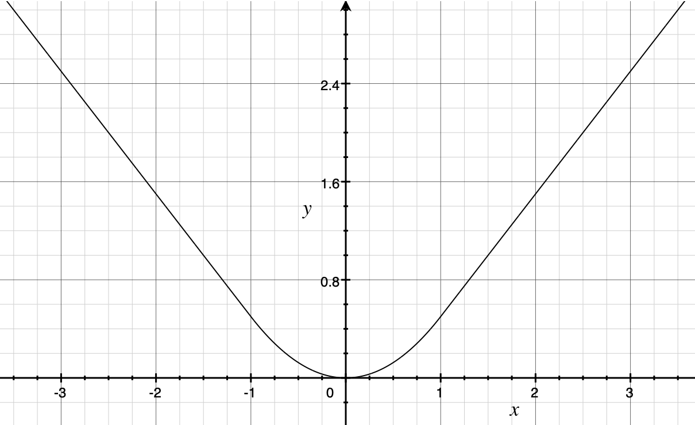

In 2013, Ross Girshick et al. introduced [R-CNN](/blog/2022-06-11-r-cnn-original/), an object detection model that combined convolutional layers with existing computer vision techniques, breaking previous records. It was a groundbreaking model at the time. 

In 2015, Ross Girshick developed Fast R-CNN, setting a new record. It was more accurate, and the inference speed became 213 times faster.

Of course, we need to know what they were comparing. So, this article examines the results published in the paper to understand how Fast R-CNN became that fast.

If you are not familiar with R-CNN, please first read [the previous article](/blog/2022-06-11-r-cnn-original/) so that this article makes better sense.

## R-CNN Slowness Reasons

In the original R-CNN paper, Ross Girshick explained that R-CNN is more accurate than [OverFeat](https://arxiv.org/abs/1312.6229) (Yann LeCun et al.) and then pointed out that R-CNN was nine times slower than OverFeat. So, he wanted to make R-CNN faster.

<blockquote>
Speeding up R-CNN should be possible in a variety of ways and remains as future work.<cite>Source: [paper](https://arxiv.org/abs/1311.2524)</cite></blockquote>

However, the below figure from [the paper](https://arxiv.org/abs/1311.2524) shows that the pipeline is rather complex.

](images/R-CNN-figure-1.png){width="90%"}

Ross Girshick raised three problems of R-CNN.

1.   Training is a multi-stage pipeline.
2.   Training is expensive in space and time.
3.   Object detection is slow.

Let's examine each problem:

### Training is a multi-stage pipeline

The training R-CNN is rather complex. They needed to train a CNN, SVMs, and bounding-box regressors.

First, they pre-trained their CNN on ImageNet (2012) classification tasks for 1000 classes. Then, they replaced the classification layer with an (N+1)-way classification layer (For Pascal VOC, N = 20 classes. For ImageNet detection task, N = 200. Plus one is for background) with randomly initialized weights and fine-tuned the model using only warped region proposals.

They treated any region proposal with 0.5 or greater IoU overlap with a ground-truth box as positive for that box's class and the other proposals as negatives. Using those positive and negative regions, they built batches of size 128 for training. Each batch sampled 32 positive regions (over all classes) and 96 background regions. They biased the sampling toward positive region proposals because they are infrequent compared to background regions.

Once they finished fine-tuning the model, they replaced the (N+1)-way classifier with class-specific SVMs and trained them. According to the paper, SVMs empirically performed better than the (N+1)-way classifier:

<blockquote>
Why, after fine-tuning, train SVMs at all? It would be cleaner to simply apply the last layer of the fine-tuned network, which is a 21-way softmax regression classifier, as the object detector. We tried this and found that performance on VOC 2007 dropped from 54.2% to 50.9% mAP.<cite>Source: [paper](https://arxiv.org/abs/1311.2524) (Appendix B)</cite></blockquote>

Finally, they trained class-specific bounding-box regressors that regress bounding boxes (4 values per box that are center x, center y, width, and height). So, there was a lot involved in the multi-stage training pipeline, making it slow.

### Training is expensive in space and time.

During training, they needed to store CNN-extracted features on a disc for each image for SVM and bounding-box regressor training. As CNN extracted features from object proposals in each image, it consumed a long time and a lot of space. For 5,000 training images from Pascal VOC, it took 2.5 GPU days when using [VGG16](https://arxiv.org/abs/1409.1556), and the amount of data was hundreds of gigabytes.

Note: GPU day is the number of GPUs times training days. For example, if you train for a half-day on 5 GPUs, 0.5 Days x 5 GPUs = 2.5 GPU days.

### Object detection is slow.

Object detection (inference) was slow because R-CNN transformed (warped) about 2,000 selected areas in each image to a size of 227 x 227 pixels and used CNN to extract features from each warped area. The process took about 47 seconds (with VGG) per image during test inference on a GPU. 

Moreover, those selected regions overlap each other. Therefore, R-CNN applied CNN to the overlapping areas over and over, which was a waste of time and computation power. It was the primary culprit for the R-CNN slowness in inference.

Now that we understand the three problems that made R-CNN slow, let's look at how Fast R-CNN resolved the three problems.

## SPPnets

### CNN Feature Extraction Once And For All

In 2014, Kaiming He et al. published a new model called [SPPnets](https://arxiv.org/abs/1406.4729) (Spatial pyramid pooling networks), which was an improved version of R-CNN. Like R-CNN, it used __Selective Search__ to make about 2,000 region proposals.

However, unlike R-CNN, it resized the entire image and then applied CNN to the image only once. It then picked up features of each selected area for classification by fully-connected layers. 

As shown below diagram, SPPnets applied max-pooling of various kernel sizes and strides to pool the features, capturing finer to coarser details into fixed-length representation.

](images/SPPnets-figure-3.png){width="75%"}

For example, if the size of a region proposal (window in the above image) is 13x13, we can apply the following three max-pooling to generate a fixed-length representation:

|kernel size|stride size|pooled cells|# of feature vectors|
|:-:        |:-:        |:-:         |:-:                 |
|4x4        |3          |4x4         |16                  |
|7x7        |6          |2x2         |4                   |
|13x13      |13         |1x1         |1                   |

If the feature map depth is 256, we have 256 * (16 + 4 + 1) fixed-length representation for classification. The point is that only one CNN forward pass with per-region spatial pyramid pooling could replace 2,000 region-specific overlapping CNN feature extractions and eliminate the need to warp each selected area. SPPnet accelerated R-CNN, reducing training time to one-third and making inference 10 to 100 times faster.

However, SPPnets used a multi-stage pipeline like R-CNN, and there was still room for improvement. Ross Girshick said in the paper:

<blockquote>
SPPnet also has notable drawbacks. Like R-CNN, training is a multi-stage pipeline that involves extracting features, fine-tuning a network with log loss, training SVMs, and finally fitting bounding-box regressors. Features are also written to disk.<cite>Source: [paper](https://arxiv.org/abs/1504.08083)</cite></blockquote>

## Fast R-CNN 

In the Fast R-CNN paper, they proposed a new training algorithm that fixed the disadvantages of R-CNN and SPPnets by combining the multiple stages into one:

1.   It extracts CNN features from the input image to produce a feature map.
2.   It extracts a fixed-length feature vector for each proposed region (RoI pooling).
3.   It passes each feature vector through fully-connected layers (FCs in the diagram) for further enrichment.
4.   Softmax provides probability estimates over K object classes and a catch-all "background" class.
5.   The bounding box regressor estimates four values for each K class.

The below image from the paper should clarify the process.

](images/figure-1.png)

Although the Selective Search step was not part of the single-stage training, Fast R-CNN streamlined a large part of the multi-stage training and eliminated the need for warping regions, region-specific CNN operations, and CNN-feature caching. There were no more class-specific SVMs, and updating all network parameters in single-stage training became possible.

Next, let's discuss the RoI pooling and bounding box regression.

### RoI Pooling

RoI (Region of Interest) pooling is similar to the spatial pyramid pooling from SPPnets that pools CNN features from selected regions into a fixed-length feature vector for further enrichment.

<blockquote>
The RoI layer is simply the special-case of the spatial pyramid pooling layer used in SPPnets [11] in which there is only one pyramid level.<cite>Source: [paper](https://arxiv.org/abs/1504.08083)</cite>
</blockquote>

RoI max-pooling divides a window (proposed area) of size `` h × w `` pixels into an `` H × W `` grid of sub-window of size approximately `` h/H × w/W `` pixels. It applies max-pooling in each sub-window to generate a fixed spatial extent of H × W compatible with the first fully-connected layer.

For example, when they experimented with VGG16 (the winner of the ImageNet 2014 image classification competition), they used H × W = 7 × 7 = 49, which is compatible with the first fully connected layer of VGG16. RoI pooling was applied independently to each feature map channel as in a standard max-pooling.

For sure, Ross Girshick got inspiration from SPPnets. Still, it might be easier to understand RoI pooling as a simple max-pooling to select representative feature values from each sub-window rather than considering it a simpler version of spatial pyramid pooling. 

Simple max-pooling was advantageous, making it easier to back-propagate through the RoI pooling layer. Gradients flow through activations selected by the argmax operation. If an activation contributes through multiple pooling outputs, we can sum all partial derivatives (of the loss) by that activation.

### Bounding Box Regression

Rectangular areas by Selective Search didn't produce accurate bounding boxes. In the original R-CNN, the bounding-box regressors adjusted rectangular areas. They trained one regression model per class, which I suppose could learn to make a class-specific adjustment because each class has typical shapes (i.e., aspect ratio), requiring different adjustments on selected regions.

The bounding box regression step happened after the SVM classification step, so it was disjoint from the CNN feature extraction. Hence, the CNN parameter update occurs separately from the bounding-box regressor parameter update. However, in Fast R-CNN, this became no longer the case.

Fast R-CNN adjusted the rectangular area in the same network. It did not divide the forward process by class and reduced training time. After CNN feature extraction, RoI pooling, and fully-connected layers, the flow continued into softmax for classification and bounding-box regressor for rectangular area adjustment.

So, back-propagation can adjust parameters for the bounding-box regressor that naturally incorporates class-specific information from CNN features. As such, CNN-parameter updates incorporate losses by the classifier and the regressor. There was no need for class-specific regression models.

## Multi-task Loss

Fast R-CNN has two sibling output layers, so they have two loss functions, one for the classifier and the other for the regressor. Although there is λ (a hyperparameter) that can balance the two losses, all their experiments use λ = 1.

$$
\text{L} = \text{L}_{\text{class}} + \lambda \, \text{L}_{\text{bbox}}
$$

Note: I'm using simpler math notation than the paper to avoid cluttering.

### Negative Log Loss for Classification

The loss for the classifier is a negative log probability for true class T.

$$
\text{L}_{\text{class}} = -\log \, P_T
$$

Intuitively, the logarithm would be an enormous negative value if the probability is tiny for the true class. Hence, it is multiplied by -1. The result is a higher loss when the softmax produces a lower probability for the true class.

### Robust Loss for Bounding Box Regression

They used robust loss (smooth L1 loss) to calculate the loss for object position (rectangular area) prediction. Robust loss is mostly L1 loss but becomes L2 loss where L1 loss is less than 1. As a result, it has a smooth curve, and we can calculate the derivative at any point.

Mathematically, it is defined as follows:

$$
L_{bbox} = \sum_\limits{i \in \{x, y, w, h\}} \text{smooth}_{L_1}(T_i, V_i)
$$

$$
\text{smooth}_{\text{L}_1}(T_i, V_i) =
\begin{cases}
  0.5 (T_i \ - \ V_i)^2 \quad \text{if } |T_i \ - \ V_i| < 1 \\
  |T_i \ - \ V_i| \ - \ 0.5 \quad \text{otherwise}
\end{cases}
$$

- A ground truth bounding box for class is $(T_x, T_y, T_w, T_h)$
- A predicted bounding box is $(V_x, V_y, V_w, V_h)$ 
- $\sum_\limits{i \in \{x, y, w, h\}}$ means smooth loss is calculated for each of $x, y, w, h$ and summed up.

The paper reasoned that robust loss could avoid exploding gradients more than L2 loss.

<blockquote>
When the regression targets are unbounded, training with L2 loss can require careful tuning of learning rates in order to prevent exploding gradients.<cite>Source: [paper](https://arxiv.org/abs/1504.08083)</cite></blockquote>

While L2 loss may be a typical loss function for regression models, it is too sensitive to outliers and challenging to adjust the learning rate.

## Fast R-CNN Test Results

Fast R-CNN addressed the three problems and achieved the following advantages over R-CNN.

*   Higher detection quality than R-CNN
*   Training is single-stage
*   Training can update all network layers
*   No feature caching. Hence, no disk storage requirement.

As the name of Fast R-CNN suggests, it improved execution speed and even achieved better accuracy ([mAP](/blog/2022-05-27-object-detection-mean-average-precision/)). Overall, the test results sum up to the following:

*   With Pascal VOC07, 2010, and 2012, mAP is more accurate than ever.
*   It's much faster than R-CNN and SPPnets.
*   Fine-tuning the convolutional layer of VGG16 improved the accuracy.

In the original R-CNN, they used AlexNet because VGG16 was too slow. Fast R-CNN was faster even with VGG16, giving better accuracy than AlexNet. So, VGG16 became the primary model for feature extraction.

The speed comparison was between the original R-CNN and Fast R-CNN, with VGG16 as the feature extraction layer. Therefore, the comparison was with the slower version of the original R-CNN, which is not a problem, as the paper clearly stated.

However, it may be hard to notice by only reading the abstract section of the paper that says Fast R-CNN is 213 times faster.

Furthermore, where Fast R-CNN is 213 times faster, they reduced the number of parameters to improve the execution speed by factorizing fully-connected layers by the Truncated SVD method.

As a result, it reduced the parameter count. It made inference faster because the number of RoIs to process was large, and almost half of the forward pass time was due to repeated computation in fully-connected layers. With SVD, mAP became slightly lower but not too much. You can see it in the table below:

 (Yellow Highlight by me)](images/table-4.png){width="75%"}

__S__, __M__, and __L__ are abbreviations for small, medium, and large, respectively, representing the number of parameters (weights). __L__ corresponds to the version using VGG16 for feature extraction. The speedup by the Fast R-CNN __L__ model (with SVD) was 213 times the R-CNN __L__ model in test inference. What used to take about 47 seconds per image is now 0.22 seconds.

One thing to note is that the above time measurement does not include the time spent by the Selective Search process, which took 2 seconds. So, overall, Fast R-CNN was not ready for real-time use, and the slowness of the region proposal step became the most significant bottleneck to resolve in future work.

## Towards Faster R-CNN and Mask R-CNN

The R-CNN used Cafe (C++) and MATLAB, while the Fast R-CNN used Cafe and Python. Perhaps this also contributed a bit to the speedup. I am not entirely sure about it, but I thought it was interesting to know people were using different tools than today.

By the way, this Cafe was an open-source project by BVLC (Berkeley Vision and Learning Center), and Ross Girshick also participated in the research and development. Later, Facebook adopted Cafe, which became Cafe2, and eventually integrated into PyTorch, which started as a fork from [Chainer](https://github.com/chainer/chainer) (now discontinued), developed by [Preferred Networks](https://www.preferred.jp/en/) in Japan.

Ross Girshick, a Microsoft research team member then, later joined [FAIR (Facebook AI Research)](https://ai.facebook.com/), where Yann LeCun was the principal research scientist. I wonder if Yann LeCun noticed Ross Girshick's work on R-CNN since the R-CNN paper cited OverFeat, whereas the OverFeat paper does not cite any Ross Girshick works. Or maybe they knew each other via Cafe development? Perhaps, they met at related conferences.

In any case, Ross Girshick joined Facebook (Meta) in Fall 2015. Also, Kaiming He, who published the SPPnets paper and is well-known for [Kaiming Weight Initialization](https://arxiv.org/abs/1502.01852v1) (or He Weight Initialization), joined Facebook in August 2016. Before joining Facebook, he was at Microsoft Research, working with Ross Girshick (who was already at Facebook) to publish a paper on [Faster R-CNN](https://arxiv.org/abs/1506.01497). Later, at FAIR, Kaiming He and Ross Girshick published a paper on another object detection model called [Mask R-CNN](https://arxiv.org/abs/1703.06870).

## References

- [R-CNN](/blog/2022-06-11-r-cnn-original/)
- [Object Detection vs Image Classification](/blog/2022-05-23-object-detection-vs-image-classification/)
- [Non-Maximum Suppression (NMS)](/blog/2022-06-01-object-detection-non-maximum-suppression/)
- [mean Average Precision (mAP)](/blog/2022-05-27-object-detection-mean-average-precision/)
- [Fast R-CNN](https://arxiv.org/abs/1504.08083) \
  Ross Girshick
- [Very Deep Convolutional Networks for Large-Scale Image Recognition](https://arxiv.org/abs/1409.1556) \
  Karen Simonyan,&nbsp;Andrew Zisserman
