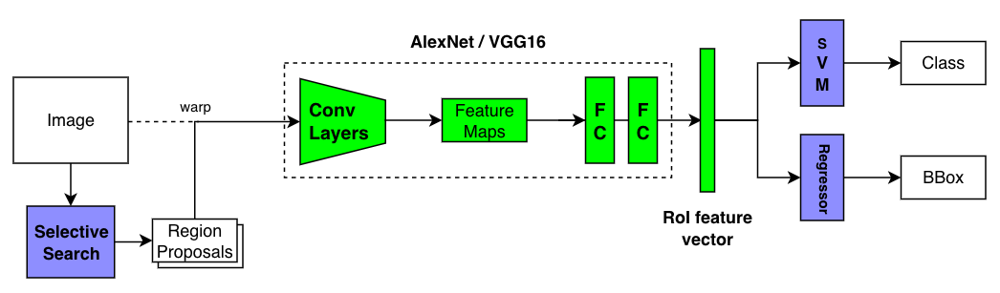
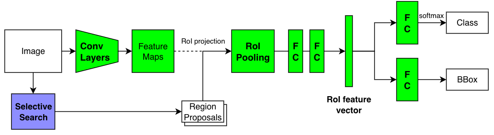
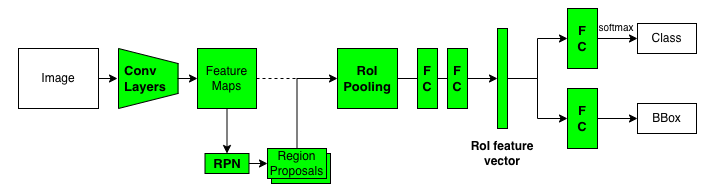
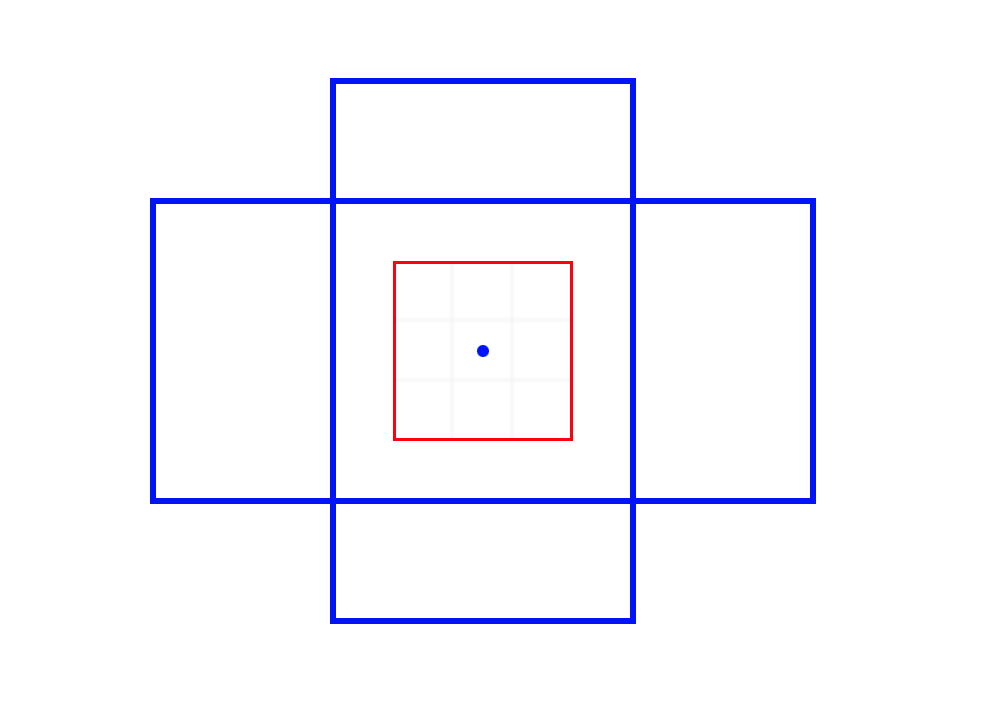
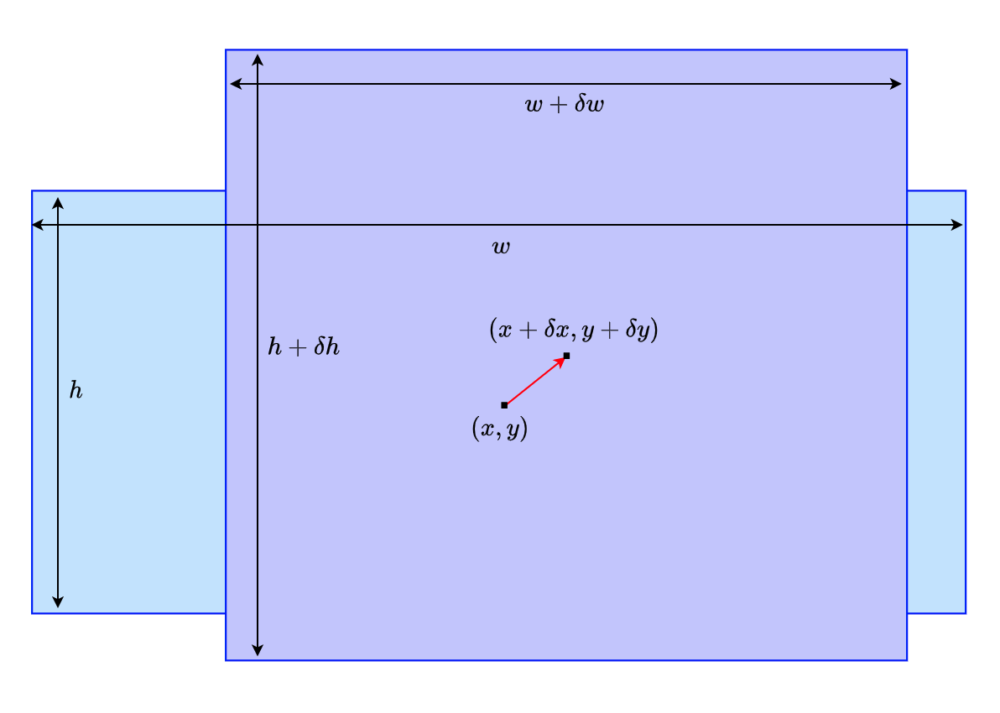

There was no doubt [Fast R-CNN](/blog/2022-06-21-fast-r-cnn-213/) was faster than [R-CNN](/blog/2022-06-11-r-cnn-original/). What used to take 47 seconds per image went down to 0.22 seconds. That is, Fast R-CNN was 213 times faster than R-CNN. It significantly improved inference speed, albeit excluding the region proposal step that took around 2 seconds.

It made sense to compare the latency without the region proposal step since both models used the same Selective Search method that took the same time. But the total latency was still more than 2 seconds per image, not fast enough for real-time object detection use. That motivated Ross Girshick to develop __Faster R-CNN__ that overcame the latency issue.

Ross Girshick worked with three co-authors (Kaiming He, Shaoqing Ren, and Jian Sun) who were part of the Microsoft Research team that later developed [ResNet](https://arxiv.org/abs/1512.03385), the winner of [ILSVRC 2015](https://image-net.org/challenges/LSVRC/2015/) (Image Classification). So, the best researchers worked on Faster R-CNN, replacing the Selective Search method with the Region Proposal Network (RPN), which is the main topic of this article.

Let’s review how R-CNN evolved into Fast R-CNN and Faster R-CNN to see how RPN fits in the Faster R-CNN pipeline.

## R-CNN, Fast R-CNN, and Faster R-CNN - A Quick Comparison

### R-CNN

Traditional object detection systems scanned every grid position over an image using large and small window frames to identify the locations of objects and their classes. Researchers extracted features using classical techniques like [HOG](https://en.wikipedia.org/wiki/Histogram_of_oriented_gradients) (Histogram of Oriented Gradients) and input them into SVM to perform classification tasks. That changed due to the appearance of AlexNet (the winner of [ILSVRC 2012](https://image-net.org/challenges/LSVRC/2012/)), which made it clear that CNN would improve the accuracy of object detection models. However, applying CNN on every window frame would take too much time. R-CNN alleviated this problem by selecting candidate areas using Selective Search and applying CNN to each region proposal, reducing the number of convolutions.



In 2013, R-CNN achieved SOTA (State Of The Art) accuracy ([mAP](/blog/2022-05-27-object-detection-mean-average-precision/)) on [Pascal VOC 2012](https://paperswithcode.com/dataset/pascal-voc). However, it was still slow, as it took 47 seconds per image. The bottleneck was the repeated application of CNN on overlapping candidate regions. 

The below pseudo-code (not working code) shows how R-CNN loops through proposed regions, warping (resizing) each region and applying CNN to extract features.

```python
# Pseudo code

# Region proposals by Selective Search
regions = SelectiveSearch(image)

# Loop through region proposals
features = Tensor()
for region in regions:
    # Resize the selected region
    warped = warp_region(image, region)

    # Part of CNN (i.e., AlexNet, VGG16) to extract feature vector
    feature = CNN(warped) # i.e., (1, 4096)
    features.add(feature) # up to (2000, 4096)

# Classifier (Linear SVM kernels)
# (2000, 4096) x (4096, N) where N = number of classes
scores = dot_product(features, SVM_weights)

# Bounding Box Regressor (one regressor per class)
predictions = Tensor()
for cls in 1:num_classes:
    b_boxes = Regressors[cls](regions, features)

    # Non-Maximum Suppression
    b_boxes = NMS(b_boxes, scores[:, cls])
    predictions.add(concatenate(b_boxes, cls)) # (number of boxes, 4 + 1)
```

The training process is a complicated multi-stage pipeline. It first fine-tuned the CNN as a classifier. Then, they replaced the final classification layer with SVMs for further training. So, they cached CNN features on the disk to train SVM, and they had to train one SVM model and one bounding box regressor per class. The reason they used SVM classifiers was that SVM empirically performed better. Please read [this article](/blog/2022-06-11-r-cnn-original/) for more details.

### Fast R-CNN

Fast R-CNN applied the convolutional layers on an entire image to extract features, eliminating the primary bottleneck. It then used the RoI pooing to select CNN features for each region proposal. Moreover, it replaced SVMs and bounding box regressors with fully-connected layers (FC), enabling back-propagation through more layers and simplifying the training pipeline.



Fast R-CNN ran 213 faster than R-CNN without counting the latency in the Selective Search time. The mAP improved, too. As shown in the below pseudo-code, it no longer required caching features on the desk or training per-class modules.

```python
# Pseudo code

# Conv Layers from a CNN (i.e., AlexNet, VGG16)
feature_maps = ConvLayers(image)

# Region proposals by Selective Search
regions = SelectiveSearch(image)

# Loop through region proposals
features = Tensor()
for region in regions:
    # RoI Pooling
    pooled = RoI_Pooling(feature_maps, region)

    # FC layers to generate feature vector
    feature = FCs(pooled)
    features.add(feature)

# Classifier (FC)
scores = Classifier(features)

# Bounding Box Regressor (FC) for all classes
regions = Regressor(regions, features)

# Non-Maximum Suppression
predictions = Tensor()
for cls in 1:num_classes:
    b_boxes = NMS(regions, scores[:, cls])
    predictions.add(concatenate(b_boxes, cls)) # (number of boxes, 4 + 1)
```

However, the slowness of the region proposal stood out. Selective Search used the CPU and could not take advantage of GPU powers. You can read more details on Fast R-CNN [here](/blog/2022-06-21-fast-r-cnn-213/).

### Faster R-CNN

The Faster R-CNN paper title is "Faster R-CNN: _Towards Real-Time Object Detection with Region Proposal Networks_". In other words, RPN (Region Proposal Network) made the model run in real-time. The core idea was to use a neural network for region proposals, eliminating the Selective Search (the last-boss bottleneck). The model can use GPU power, and the total latency went down from over 2 seconds to 0.2 seconds (5 images per second).



The below pseudo-code shows Faster R-CNN is almost identical, except RPN handles region proposals instead of Selective Search.

```python
# Pseudo code

# Conv Layers from a CNN (i.e., AlexNet, VGG16)
feature_maps = ConvLayers(image)

# Region proposals by RPN with feature maps
regions = RPN(feature_maps)

# Loop through region proposals
features = Tensor()
for region in regions:
    # RoI Pooling
    pooled = RoI_Pooling(feature_maps, region)

    # FC layers to generate feature vector
    feature = FCs(pooled)
    features.add(feature)

# Classifier (FC)
scores = Classifier(features)

# Bounding Box Regressor (FC) for all classes
regions = Regressor(regions, features)

# Non-Maximum Suppression
predictions = Tensor()
for cls in 1:num_classes:
    b_boxes = NMS(regions, scores[:, cls])
    predictions.add(concatenate(b_boxes, cls)) # (number of boxes, 4 + 1)
```

RPN is more efficient because RPN works on feature maps extracted by convolutional layers, while Selective Search has to work on raw image pixels. RPN shares feature maps with the rest of the network. Hence, it didn't add too much overhead. The below figure shows the flow in which convolutional layers extract feature maps from an image that RPN and the rest of the network use.

](images/RPN.png){width="60%"}

They used CNN layers from [ZFNet](https://arxiv.org/abs/1311.2901v3) (an improved version of [AlexNet](https://arxiv.org/abs/1803.01164)) and [VGG16](https://arxiv.org/abs/1409.1556v5), which improved the accuracy (mAP). 

Next, we'll look at how RPN generates region proposals using a fully convolutional network.

## Region Proposal Network (RPN)

### Image Size Adjustment

Faster R-CNN (also Fast R-CNN) scales an input image so that the shorter side is 600 pixels. They cap the longer side at 1000 pixels so that the shorter side could be less than 600 pixels. These are configurable settings:

<blockquote>
All single-scale experiments use s = 600 pixels; s may be less than 600 for some images as we cap the longest image side at 1000 pixels and maintain the image’s aspect ratio. These values were selected so that VGG16 fits in GPU memory during fine-tuning. The smaller models are not memory bound and can benefit from larger values of s; however, optimizing s for each model is not our main concern.<cite>Source: [Fast R-CNN](https://arxiv.org/abs/1504.08083)</cite></blockquote>

For PASCAL VOC, they enlarged images:

<blockquote>
We note that PASCAL images are 384 × 473 pixels on average and thus the single-scale setting typically upsamples images by a factor of 1.6.<cite>Source: [Fast R-CNN](https://arxiv.org/abs/1504.08083)</cite></blockquote>

I presume that having large enough images ensures that most of the selected regions are big enough for downstream processing. For example, with the VGG16 backbone, RoI pooling needs to produce 7 x 7 pooled features. If we feed a 1000 x 600 image to the convolutional layers from VGG16, the height and width of the feature maps become 1/16 since the VGG16's convolutional layers have four max-pooling layers. Therefore, the size of the feature maps becomes 62 × 37 (1000 / 16 is about 62, and 600 / 16 is about 37). Candidate regions would be smaller than that.

### Fully Convolutional

RPN is a fully convolutional network, which does not seem capable of generating region proposals. Feature maps contain location-invariant information since a convolutional layer applies the same kernel weights everywhere. The same object in an image would produce the same features, regardless of the location. A cat on the top of an image has the same features as an identical cat on the bottom. So, RPN can not directly predict object locations in an image using only feature maps. Not absolution positions, anyways. However, it can reason about relative positions, given an anchor position.

### Anchor Boxes

An anchor position is the center position at which RPN applies a convolution. Hypothetically speaking, if RPN sees features of an animal's leg at an anchor position, it could probably narrow down the candidate object (relative) location. To help RPN further, an anchor comes with anchor boxes in various scales and aspect ratios. For example, the below image shows a 3 x 3 kernel (red box) and the anchor position (the central dot) with two anchor boxes (a tall rectangle and a wide rectangle).

{width="60%"}

So, the anchor position and anchor boxes give RPN references from which reason about object positions and sizes. An intuitive example would be that RPN sees a part of a bus (typically long in size) and adjusts anchor boxes to account for that. Although, I'm not sure if it needs to know the exact object class (i.e., bus) to be able to regress boxes. Perhaps, it is looking at more generic features applicable to vehicles or the rectangular shape. As we will see later, training RPN involves fine-tuning convolution layers, so that feature maps have helpful information for region proposals. 

Below is an example where RPN adjusts the light blue anchor box to the purple candidate region. RPN adjusts the center position from the anchor position `` (x, y) `` to `` (x + dx, y + dy) ``, and the object's size is adjusted from the anchor size (w, h) to `` (w + dw, h + dh) ``. Adjustments are all relative. So, it does not matter if an object is at the top or bottom of an image. Given four relative coordinate values `` (dx, dy, dw, dh) ``, we know the absolute position and size.

{width="75%"}

Faster R-CNN uses 9 anchor boxes at each anchor location. They are combinations of 3 scales and 3 aspect ratios. One may wonder if so many anchor boxes are necessary. They tested different settings of anchors with the PASCAL VOC 2007 test set and chose the best setting.

](images/table-8.png)

The above table tells us that 3 scales (128, 256, 512) and 3 ratios (1:1, 1:2, 2:1) gave the best mAP. So, there are `` 9 `` anchor boxes at each anchor location. Although aspect ratios may not look so critical, even a 0.1 mAP improvement is important when it comes to competition. It is clear that using multiple anchor boxes can make RPN learn to predict better than a single anchor box. I suppose it's easier for RPN to start with various anchor box shapes than to transform a single square into many different shapes. Also, multiple anchor boxes allow detection of objects having similar center locations like below:

{width="80%"}

Now that we understand that anchors can help RPN, let's look at how RPN produces region proposals.

### How RPN Produces Region Proposals

RPN first applies a 3 x 3 convolution on the feature maps, further adjusting/enriching features for generating region proposals. The 3 x 3 convolution keeps the number of channels unchanged. In the case of VGG16, each point on the updated feature maps still has a 512-dimensional vector (a 256-dimensional vector for ZFNet). After that, RPN has two 1 x 1 convolution layers: the regression (__reg__) layer and the classification (__cls__) layer. 

The __reg__ layer predicts the relative coordinate values of an object, generating 4k coordinate values where k stands for the number of anchor boxes per location (k=9 in the paper). 

The __cls__ layer predicts objectness scores, indicating how likely an object exists within each region proposal. An object belongs to one of the pre-defined object classes in the target data set. For example, the PASCAL VOC detection dataset defines 20 classes. Everything else is background. So, a region contains either an object or background. The __cls__ layer uses a two-class softmax (one score for object and the other for background). So, it generates 2k objectness scores per anchor location. The paper mentions that one could use logistic regression (in that case, there would be k objectness scores), but they went for softmax for simplicity. 

RPN uses a fully convolutional network to do everything (a 3x3 convolution layer and two 1x1 convolution layers). The below diagram shows the RPN flow when using ZFNet (256-dimensional feature maps).

](images/rpn_anchors.png){width="80%"}

The red square indicates the 3 x 3 convolution on the feature maps that produces 1 x 1 x 256 output, on which __cls__ layer and __reg__ layer apply individual 1 x 1 convolution to generate 2k scores and 4k coordinate values, respectively. It happens at every anchor position (point in feature maps) simultaneously. So, if the size of the feature maps is W x H, we will have kWH region proposals (2kWH scores and 4kWH coordinate values). RPN has an internal NMS to eliminate low-score candidate regions overlapping with more promising ones. So, the number of candidate regions can be much less than kWH.

So, that's how RPN works, and the rest of Faster R-CNN is the same as Fast R-CNN.

## RPN Training

### Image-Centric Sampling for Mini-Batch

RPN is a fully convolutional network that we can train end-to-end by back-propagation. They used a so-called "__image-centric__" sampling strategy to build a mini-batch per image since each image has many positive and negative anchors. A positive anchor has an IoU overlap higher than 0.7 with any ground-truth box. If no anchor box is positive for a ground-truth box, they choose the anchor box with the highest IoU as a positive one so they can use all ground-truth boxes. A negative anchor has an IoU overlap lower than 0.3 for all ground-truth boxes. They randomly sampled 128 positive anchors and 128 negative anchors. If there were less than 128 positive anchors, they padded the mini-batch with negative anchors. This approach makes RPN see enough positive and negative samples. If they used a simple random sampling, negative samples would dominate, and RPN would not have learned efficiently.

### Loss Function

The binary class label allows training the __cls__ layer with a log loss over two classes (object or background). They only used positive samples for the __reg__ layer and compared the prediction with the ground truth. They ignored anchor boxes that were neither positive nor negative.

Below is the loss function:

$$
L(\{p_i\}, \{t_i\}) = \frac{1}{N_{cls}} \sum_i L_{cls}(p_i, p_i^*) + \lambda \frac{1}{N_{reg}} \sum_i p_i^* L_{reg}(t_i, t^*_i)
$$

- $i$ is an anchor index within a mini-batch.
- $p_i$ is an objectness score of anchor $i$. $\{p_i\}$ is a set of scores.
- $t_i$ is an object region. $\{t_i\}$ is a set of object regions.
- $p^*_i$ is the binary class label: 1 for positive anchors, and 0 for negative anchors.
- $L_{cls}$ is a loss value for binary classification (object or not).
- $t^*_i$ is the ground-truth box.
- $L_{reg}$ is a loss value for box regression. \
    $L_{reg}(t_i, t^*_i) = Smooth-L1-Loss(t_i - t^*_i)$.
- $p^*_i L_{reg}$ is because we care the regression loss only for positive anchors.
- $N_{cls}$ is mini-batch size (256), used to normalize the classification loss.
- $N_{reg}$ is the number of anchor locations, used to normalize the regression loss. $N_{reg} \sim 2,400$
- $\lambda$ is a balancing hyper-parameter to weight classification loss and regression loss values. By default, $\lambda=10$.

Note: the details of Smooth L1 Loss are [here](/blog/2022-06-21-fast-r-cnn-213/#robust-loss-for-bounding-box-regression).

The below table shows the difference in mAP per lambda values using the PASCAL VOC 2007 dataset.

](images/table-9){width="65%"}

### 4-Step Alternating Training

They adopted a 4-step training algorithm to train RPN and the detection network (Faster R-CNN without RPN), which ultimately form a unified network that shares the same convolutional layers.

1.   Train RPN with a pre-trained ImageNet backbone model (i.e., VGG16) for feature extraction.
2.   Train the detection network using the region proposals from step 1. This detection network has its own pre-trained ImageNet backbone model. So far, RPN and the detection network do not share convolutional layers.
3.   Fine-tune the layers unique to RPN while using fixed convolutional layers from the detection network. At this stage, RPN and the detection network share the convolutional layers.
4.   Fine-tune the detection network with the same fixed convolutional layers.

The convolutional layers learn to extract features useful for RPN and the detection network through this training process.

## Parting Words

### Sliding Positions and Sliding Windows？

If you are going to read the paper, I would like to let you know that the word "sliding windows" repeatedly appears in the paper and means convolution operations. Traditional object detection models used sliding windows over an image to collect features (i.e., HOG) and classify each window with SVMs. It is iterative processing (i.e., loop). So, it may be a remnant of that time since convolutions also work on small windows (kernel) over images. However, it is parallel processing on GPU.

### Towards Multitask Learning with Mask R-CNN

After the development of Faster R-CNN, Ross Girshick moved to Facebook, where he co-developed Mask R-CNN with Kaiming He, who also joined Facebook later on. Mask R-CNN extended Faster R-CNN to multi-task learning, incorporating pose estimation and instance segmentation.

## References

- [R-CNN](/blog/2022-06-11-r-cnn-original/)
- [Fast R-CNN](/blog/2022-06-21-fast-r-cnn-213/)
- [Faster R-CNN: Towards Real-Time Object Detection with Region Proposal Networks](https://arxiv.org/abs/1506.01497) \
  Shaoqing Ren, Kaiming He, Ross Girshick, Jian Sun
- [Mask R-CNN](https://arxiv.org/abs/1703.06870) \
  Kaiming He, Georgia Gkioxari, Piotr Dollár, Ross Girshick
- [What do we learn from region based object detectors (Faster R-CNN, R-FCN, FPN)?](https://jonathan-hui.medium.com/what-do-we-learn-from-region-based-object-detectors-faster-r-cnn-r-fcn-fpn-7e354377a7c9) \
  [Jonathan Hui](https://jonathan-hui.medium.com)
- [Faster R-CNN: Down the rabbit hole of modern object detection](https://tryolabs.com/blog/01/18/faster-r-cnn-down-the-rabbit-hole-of-modern-object-detection/)
