YOLO is an object detection model that is very fast, pretty accurate, yet simple. This article explains the architecture of YOLO (the 1st version).

## Background

In 2015, Joseph Redmon (University of Washington) developed YOLO. One of his co-authors, Ross Girshick (Microsoft Research), published a paper for Faster R-CNN around the same time. They probably shared common ideas in computer vision research as there are some similarities between YOLO and Faster R-CNN. For example, both models apply convolutional layers on input images to generate feature maps. However, Faster R-CNN uses a two-stage object detection pipeline, while YOLO has no separate region proposal step and is much faster than Faster R-CNN.


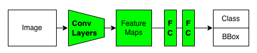

YOLO has many versions (variants). Joseph Redmon developed the first three versions of YOLO: YOLOv1, v2, and v3. Then, he quit. 

<blockquote class="twitter-tweet"><p lang="en" dir="ltr">I stopped doing CV research because I saw the impact my work was having. I loved the work but the military applications and privacy concerns eventually became impossible to ignore.<a href="https://t.co/DMa6evaQZr">https://t.co/DMa6evaQZr</a></p>&mdash; Joseph Redmon (@pjreddie) <a href="https://twitter.com/pjreddie/status/1230524770350817280?ref_src=twsrc%5Etfw">February 20, 2020</a></blockquote> <script async src="https://platform.twitter.com/widgets.js" charset="utf-8"></script>

After YOLOv3, different groups of people developed their versions of YOLO:

- [YOLOv4](https://arxiv.org/abs/2004.10934?) by Alexey Bochkovskiy, et al.
- [YOLOv5](/blog/2022-05-08-yolov5-pytorch/) by [Ultralytics](https://ultralytics.com/)
- [YOLOv6](https://github.com/meituan/YOLOv6) by Meituan
- [YOLOX](https://arxiv.org/pdf/2107.08430.pdf) by Zheng Ge et al.
- [YOLOv7](https://arxiv.org/abs/2207.02696) by Chien-Yao Wang et al. (The same people from YOLOv4)

The YOLOv4 team, including Alexey Bochkovskiy, published the YOLOv7 paper in July 2022. So, people are still making improvements on YOLO to this date. What makes it so attractive?

I believe it's the simplicity of the architecture.

## YOLO Architecture

### Single-stage Object Detection

<blockquote>
We reframe object detection as a single regression problem, straight from image pixels to bounding box coordinates and class probabilities. Using our system, you only look once (YOLO) at an image to predict what objects are present and where they are.
<cite>Source: [paper](https://arxiv.org/abs/1506.02640v5)</cite>
</blockquote>

The YOLO pipeline is simple.

](images/figure-1.png)

1.   It resizes input images to 448 x 448.
2.   It runs a single convolutional network on the input images.
3.   It thresholds the resulting detections by the model's confidence.

The feed-forward process extracts convolutional features and regresses them into bounding box values and class probabilities. The training is also end-to-end via back-propagation. 

### Feature Extractor

YOLO has 24 convolutional layers, processing input images of 448 x 448 (3 channels) to produce 7 x 7 (1024 channels) feature maps (the third last box in the below diagram).

](images/figure-3.png)

In other words, YOLO divides an input image into 7 x 7 grid cells, each having a 1024-dimensional vector. 

](images/figure-2-left.png){width="50%"}

YOLO's detector processes the feature maps to generate bounding boxes and class probabilities for each grid cell.

### Object Detector

YOLO flattens the feature maps and uses the detector (two fully-connected layers) to regress object positions (bounding boxes) and class probabilities. 

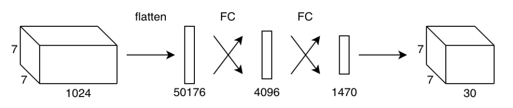{.width-50}

Unlike region-based detectors, YOLO's detector sees the features from the entire image. It learns to use global features to encode contextual information on classes and object appearance. YOLO makes fewer mistakes about the background than region-based detectors, as it can access the whole context of an image.

<blockquote>
Fast R-CNN, a top detection method [14], mistakes background patches in an image for objects because it can’t see the larger context. YOLO makes less than half the number of background errors compared to Fast R-CNN.
<cite>Source: [paper](https://arxiv.org/abs/1506.02640)</cite>
</blockquote>

The last fully-connected layer outputs a 1470-dimensional vector, which has the layout shown below: 

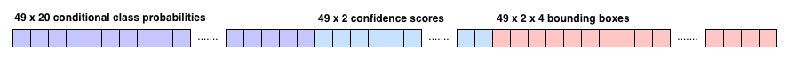

At a glance, this may not make any obvious sense. But if you look closely, there are 49 sets of values. 49 is the number of grid cells (= 7 x 7). In other words, each cell contains 30 (= 1470 / 49) values. So, YOLO can treat the 1470-dimensional vector like a 7 x 7 x 30 tensor of predictions.

As a side note, the YOLO implementation ([Darknet](https://github.com/pjreddie/darknet)) copies the predicted values into an array of below C struct, a C programming language construct representing a collection of variables under a single name.

```C++
typedef struct detection{
    box bbox;
    int classes;
    float *prob;
    float *mask;
    float objectness;
    int sort_class;
} detection;
```

However, we don't need to go that route to understand YOLO. In short, the detector converts the feature maps (7 x 7 x 1024) into predictions (7 x 7 x 30). The paper says the same thing without programming details:

<blockquote>
The final output of our network is the 7 × 7 × 30 tensor of predictions.
<cite>Source: [paper](https://arxiv.org/abs/1506.02640)</cite>
</blockquote> 

And each grid cell contains predicted values as a 30-dimensional vector:

- Two confidence scores (2 values)
- Two bounding boxes (8 values)
- 20 conditional class probabilities (20 values)

For the sake of visualization, we assume the layout of the 7 x 7 x 30 tensor as follows:

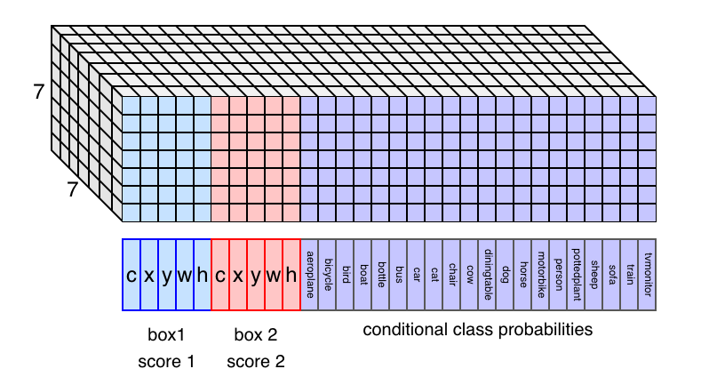

Note: there are 20 classes because the Pascal VOC object detection dataset defines the 20 classes.

So, if we understand what those values mean, we understand how YOLO works.

### Bounding Boxes and Confidence Scores

If the center of an object falls into a grid cell, that grid cell is responsible for detecting that object. 

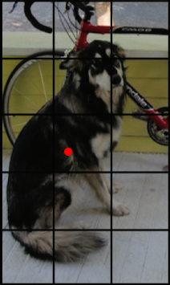

The center location (x, y) is relative to a grid cell width and height. So, x and y range between 0 and 1. 

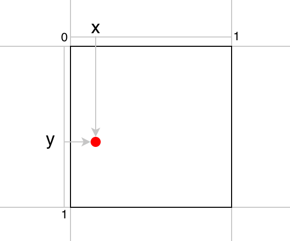{width="50%"}

The bounding box size (w, h) is relative to the image size. So, w and h range between 0 and 1.

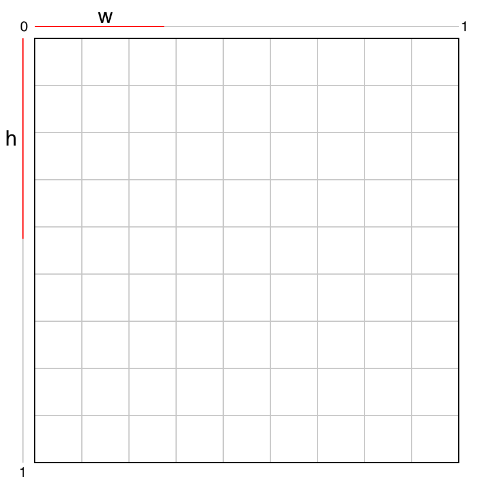{width="50%"}

Given those four values, we can calculate the location and size of the bounding box within the image.

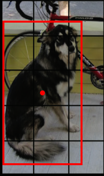

YOLO predicts the confidence score for each bounding box. The confidence score represents how confident the model thinks about the object's location and size predictions. It consists of two parts:

- The probability of an object having the center in the grid cell: Pr(Object)
- The overlap of the bounding box with the ground truth: [IoU](/blog/2022-05-24-object-detection-intersection-over-union/)(bbox, gt)

Both values are predictions. If __Pr(Object)__ is closer to 1, the model is more confident that an object's center exists within the grid cell. If __IoU(bbox, gt)__ is closer to 1, the model is more confident that the bounding box well approximates the ground truth. Mathematically, the confidence score is defined as follows:

$$
\text{confidence\_score} = \text{Pr}(\text{Object}) \times \text{IoU}\_{\text{pred}}^{\text{truth}}
$$

Therefore, when the Pr(Object) and IoU(bbox, gt) are close to 1, the confidence score becomes close to 1. When Pr(Object) is closer to zero, the model is less confident that an object's center exists within the grid cell. In other words, it doesn't think any object has the center in the grid cell. In this case, IoU does not matter at all. So, it makes sense to multiply these two values and call it the confidence score. Both values must be closer to 1 to have high confidence.

YOLO predicts two bounding boxes per grid cell, and each bounding box accompanies a confidence score. The below figure shows an example of two bounding boxes and confidence scores for a grid cell. 

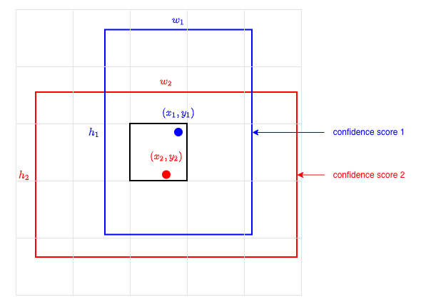

One bounding box requires five values (x, y, w, h, c). So, two bounding boxes account for 10 out of 30 values.

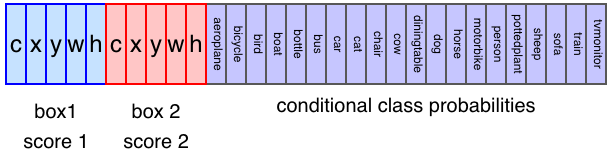

Note: YOLO is configurable on how many bounding boxes per grid cell it predicts. We assume the same setting the paper uses for PASCAL VOC, two bounding boxes per grid cell (also 7 x 7 grid cells and 20 labeled classes).

Drawing all 49 predicted bounding boxes may look like the below. Bolder lines indicate higher confidence scores.

](images/figure-2-top-middle.png){width="50%"}

It looks messy, but YOLO only predicts 98 (= 49 x 2) bounding boxes per image, far less than 2000 region proposals by Fast R-CNN's Selective Search.

### Conditional Class Probabilities

YOLO predicts 20 class probabilities per grid cell. It tells what kind of object is most likely to exist in a grid cell. The below image shows an example of class detections. Each grid cell color indicates the most probable class for that cell.

](images/figure-2-bottom-middle.png){width="50%"}

A class probability in a grid cell only matters when an object's center locates in the grid cell. In other words, the class probabilities are conditional on the grid cell's objectness score Pr(Object).

$$
\text{class\_conditional\_probability} = \text{Pr}(\text{Class}\_i|\text{Object})
$$

So, if a grid cell has a low objectness score, the probability of that cell being responsible for any class will be low, which we can see in the following formula:

$$
\text{class\_probability} = \text{Pr}(\text{Class}\_i) = \text{Pr}(\text{Class}\_i|\text{Object}) \times \text{Pr}(\text{Object})
$$

This value should be high (i.e., closer to 1) when the grid cell has a high objectness score and a high conditional class probability. For example, YOLO should output a high probability of the dog class for the grid cell that contains the center of a dog. 

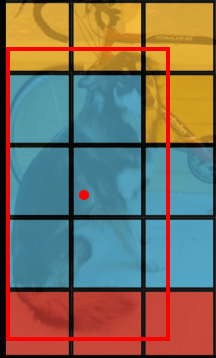

Furthermore, the model should predict a bounding box with high confidence, indicated by the expected IoU between the predicted bounding box and the ground truth. Altogether, we can calculate class-specific confidence scores for each box:

$$
\begin{align}  
\text{class\_confidence\_score} &= \text{Pr}( \text{Class}\_i | \text{Object} ) \times \text{Pr}(\text{Object}) \times \text{IoU}\_{ \text{pred} }^{ \text{truth} } \\
&= \text{Pr}( \text{Class}\_i ) \times \text{IoU}\_{ \text{pred} }^{ \text{truth} }  
\end{align}
$$

The class-specific confidence level indicates how confident the model thinks a particular class object appears within the bounding box and how well it fits the object.

### Confidence Score Thresholding and Non-Maximum Suppression

YOLO removes class probabilities lower than a certain threshold, reducing the load on post-processing (non-maximum suppression, [NMS](/blog/2022-06-01-object-detection-non-maximum-suppression/)) that eliminates lower score bounding boxes overlapping with more promising ones.

By now, we should have a good understanding of all the ingredients in the YOLO pipeline. I hope the below diagram makes good sense to you.

](images/figure-2.png)

## Experiment Results

### YOLO vs. Real-time Detectors

They compared YOLO with other real-time detectors on Pascal VOC 2007.

](images/YOLO-vs-real-time-detectors-1024x271.png){width="65%"}

YOLO is slower than 100Hz DPM, but the accuracy ([mAP](/blog/2022-05-27-object-detection-mean-average-precision/)) is way better. Fast YOLO uses nine convolutional layers (instead of 24), is faster than 100Hz DPM, and is way more accurate.

Since YOLO is so fast, they do not consider Faster R-CNN as a real-time detector.

### YOLO vs. Less-than Real-time Detectors

They trained YOLO with the VGG-16 backbone, which is more accurate but slower than the plain YOLO.

](images/YOLO-vs-less-than-real-time-detectors-1024x355.png){width="65%"}

YOLO VGG-16 scores well amongst this group of detectors while being faster than others. However, we should note that YOLO VGG-16's mAP is worse than Faster R-CNN VGG-16. So, there is some room for improvement in YOLO.

### YOLO vs. Fast R-CNN for Error Analysis

They compared the type of errors by Fast R-CNN and YOLO.

](images/figure-4.png){width="65%"}

Each prediction is either correct or classified based on the type of error:

|Category    |Class        |IoU Threshold           |
|---         |---          |:-:                     |
|Correct     |Correct class|0.5 < IoU               |
|Localization|Correct class|0.1 < IoU < 0.5         |
|Similar     |Similar class|0.1 < IoU               |
|Other       |Wrong class  |0.1 < IoU               |
|Background  |Background   |IoU < 0.1 for any object|

YOLO struggles to localize objects correctly. YOLO’s localization error (19.0%) is much more than Fast R-CNN (8.6%). YOLO produces fewer background errors (4.75%) than Fast R-CNN (13.6%).

### Generalizability: Person Detection in Artwork

YOLO seems to be particularly good at detecting people. They compared the performances of YOLO and other models with person class from VOC2007, Picasso paintings, and the People-Art dataset.

](images/figure-5b.png){width="65%"}

They also posted experimental results using images from the Internet.

](images/figure-6.png)

## Limitations of YOLO

In the paper, Joseph Redmon explains the limitations of YOLO.

- __Strong Spatial Constraints__: 
  - Each grid cell only predicts two bounding boxes and can only have one class.
  - YOLO struggles with small objects that appear in groups, like flocks of birds.

- __Relatively Coarse Features__:
  - YOLO has many downsampling layers.
  - It struggles to generalize to objects in new or unusual aspect ratios or configurations.
 
- __Small-Object Localization__:
  - YOLO's primary source of errors is incorrect localization.
  - YOLO can not localize small objects very well.

As for the last point, YOLO uses sum-squared error as the loss function for localization. A small error in a large box is not critical, but a small error in a small box has a much more significant effect on IoU.

## Towards YOLOv2

YOLO was not as accurate in predicting bounding boxes as region-based detectors like Fast R-CNN and Faster R-CNN. The specialized region proposal step may increase the latency but results in higher mAP. 

[YOLOv2](/blog/2022-08-10-yolo-v2-yolo9000/) has several improvements to address YOLOv1's shortcomings. They introduced the anchor mechanism found in Faster R-CNN. Anchors make it easier for the model to predict bounding boxes. They also made YOLOv2 faster than YOLOv1. Furthermore, they developed YOLO9000, which can predict over 9000 classes.

As they said, YOLOv2 became "Better, Faster, Stronger".

## References

- [Faster R-CNN](/blog/2022-07-11-faster-r-cnn-rpn/)
- [Fast R-CNN](/blog/2022-06-21-fast-r-cnn-213/)
- [YOLO v2](/blog/2022-08-10-yolo-v2-yolo9000/)
- [IoU (Intersection over Union)](/blog/2022-05-24-object-detection-intersection-over-union/)
- [mAP (mean Average Precision)](/blog/2022-05-27-object-detection-mean-average-precision/)
- [Non-Maximum Suppression](/blog/2022-06-01-object-detection-non-maximum-suppression/)
- [You Only Look Once (Paper)](https://arxiv.org/abs/1506.02640) \
  Joseph Redmon,&nbsp;Santosh Divvala,&nbsp;Ross Girshick,&nbsp;Ali Farhadi
- [You Only Look Once (CVPR 2016 Presentation)](https://www.youtube.com/watch?v=NM6lrxy0bxs) \
  Joseph Redmon
- [How computers learn to recognize objects instantly (TED Presentation)](https://www.youtube.com/watch?v=Cgxsv1riJhI) \
  Joseph Redmon
- [Darknet (GitHub Repository)](https://github.com/pjreddie/darknet) \
  Joseph Redmon, Alexey Bochkovskiy
