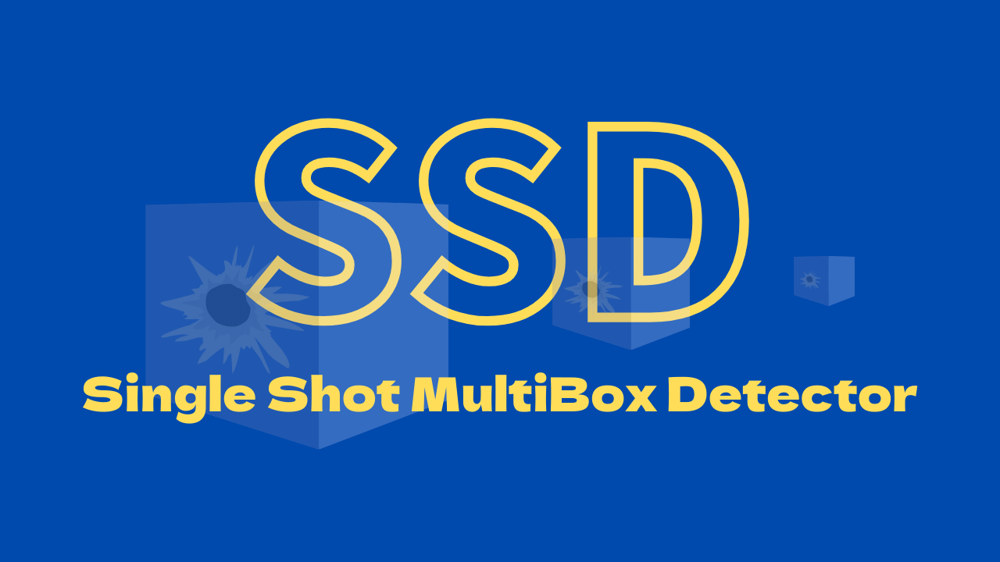
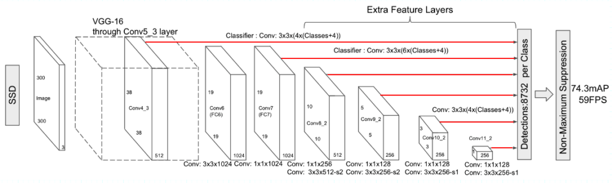
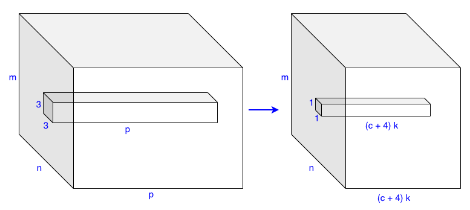

In 2015, Wei Liu et al. published a paper called [SSD: Single Shot MultiBox Detector](https://arxiv.org/abs/1512.02325). SSD is faster than YOLO v1 (the first version) and more accurate than Faster R-CNN. This article explains what made SSD so good.

## Background

### Motivation

The first author, [Wei Liu](https://www.linkedin.com/in/lwbiosoft/), was a North Carolina University student at Chapel Hill when they published the paper. Later, he joined [Nuro](https://www.nuro.ai/) and eventually became the head of machine learning research there. The second author, [Dragomir Anguelov](https://www.linkedin.com/in/dragomiranguelov/), was a senior staff engineer at Google and became a senior director of perception in [Zoox](https://zoox.com/) at the time of the paper. Later, he joined [Waymo](https://waymo.com/) and became the head of research. Interestingly, the founders of Nuro were ex-Waymo engineers. Those were the days when self-driving-related companies flooded.

It's not hard to imagine they were interested in building a fast and accurate perception system for autonomous vehicles. The paper talks about region-based detectors being too slow for real-time applications:

<blockquote>
While accurate, these approaches have been too computationally intensive for embedded systems and, even with high-end hardware, too slow for real-time applications.<cite>Source: [paper](https://arxiv.org/abs/1512.02325)</cite></blockquote>

At that time, the most accurate detector was Faster R-CNN. YOLO v1 was faster but not as accurate. So, they wanted an object detection model that is more accurate than Faster R-CNN and faster than YOLO v1.

### SSD vs. YOLO v1 vs. Faster R-CNN

Increasing speed would come with decreased detection accuracy. For example, YOLO v1 became faster than Faster R-CNN because it did not have a separate region proposal step and the subsequent feature resampling stage. So, a single-stage detector (aka single-shot detector) was the way to go for the speed. However, at the same time, YOLO v1 was not as accurate as Faster R-CNN. It seemed region-based detectors had more edge if you need better accuracy. 

Most authors (Christian Szegedy, Scott Reed, Dumitru Erhan, and Dragomir Anguelov) previously worked on [MultiBox](https://arxiv.org/abs/1412.1441) (2014), a region-based (two-stage) detector. However, they moved from region-based to single-shot detectors. The paper title says it all, "Single Shot MultiBox Detector".

Their new model SSD300 is faster than YOLO v1 and more accurate (higher [mAP](/blog/2022-05-27-object-detection-mean-average-precision/) than Faster R-CNN. Below are the results with the Pascal VOC2007 test dataset (batch size = 1):

|Model|FPS (Frames Per Second)|mAP|
|:-:|:-:|:-:|
|SSD300|46|74.3%|
|YOLO v1|45|63.4%|
|Faster R-CNN (VGG-16)|7|73.2%|

From here on, I'll use the word SSD to mean SSD300 and YOLO to mean YOLO v1 to avoid cluttering, except when explicit naming makes the context clearer.

Let's look at SSD architecture and compare it with YOLO.

## SSD Architecture

SSD, like YOLO, is a single-shot detector that uses feature maps of the entire input image to predict bounding boxes for each grid cell. However, the SSD architecture is significantly different, as shown in the below image:

](images/figure-2.png)

### VGG16 Backbone

YOLO used custom convolutional layers as the feature extractor (aka backbone). The accuracy was worse than Faster R-CNN. YOLO also had a variant that used a [VGG-16](https://arxiv.org/abs/1409.1556) backbone. The accuracy was better than the standard YOLO but not as accurate as Faster R-CNN (VGG-16). Moreover, YOLO (VGG-16) was six times slower than YOLO. So, YOLO (VGG-16) was mainly for an experiment only.

SSD uses a VGG-16 backbone and is faster than YOLO and more accurate than Faster R-CNN. Would that be because SSD uses a smaller input image size? They trained two models: SSD300 and SSD512, where input image sizes are 300 x 300 and 512 x 512, respectively. SSD512 is more accurate than SSD300. The below shows detection examples with SSD512 on [COCO](https://cocodataset.org/).

](images/figure-5.png){width="90%"}

SSD300 was much faster than SSD512. So, smaller input resolution makes the model faster but less accurate. However, we can only say this when comparing two models using the same architecture. The logic does not apply when comparing models using different architectures.

](images/figure-7.png)

SSD300 uses an input resolution of 300 x 300. YOLO uses 448 x 448. Faster R-CNN (VGG16) uses up to 1000 x 600. SSD300 is faster than the other two, but we cannot conclude that is due to the smaller input resolution. If anything, a smaller input resolution could be one factor. Most likely, that is not all.

As for accuracy, SSD300 uses the smallest input resolution but is more accurate than the other two. The speed and accuracy depend on various architectural choices, including input resolution and backbone. Since we are comparing the three models with VGG-16 backbones, the backbone is not the primary deciding factor.

It is actually due to what happens after the backbone, like how the model generates bounding boxes.

### More Bounding Boxes

The table suggests that the number of bounding boxes correlates with accuracy. SSD300 generates 8732 bounding boxes, Faster R-CNN (VGG 16) up to 6000, and YOLO only 98. So, SSD300 uses the smallest input resolution yet generates the highest number of bounding boxes. The table shows SSD300 is more accurate than Faster R-CNN (VGG 16).

YOLO produces the fewest bounding boxes, and the accuracy was the worst of the three. Then, the question is, can we change YOLO by reducing the input resolution and using more bounding boxes per grid cell to achieve a faster and better version?

That wouldn't improve the accuracy dramatically because YOLO uses single-scale feature maps.

### Single-scale Feature Maps

YOLO applies convolutional layers that reduce the resolution from 448 x 448 to 7 x 7. The feature maps are coarse. It may be suitable for detecting large objects and background, but it may lack the details required to detect small objects. Hence, YOLO was not good at predicting bounding boxes, especially for small objects.

YOLO generates 2 bounding boxes per grid cell, totaling only 98 (= 7 x 7 x 2) bounding boxes per image. It made YOLO's recall rates (the fraction of ground truth object predicted) poor. Even if we increased the number of bounding boxes per grid cell, it wouldn't improve the recall rate since the feature maps were coarse, and the detector would still miss smaller objects.

To generate higher-resolution features, they would need to either increase the input image size or reduce the number of feature-extracting convolutional layers (reducing the number of max-pooling operations). The former would slow down the model, and the latter would reduce the accuracy for larger objects. It is impossible to generate simultaneously coarse and fine features because YOLO uses feature maps on a single scale.

](images/figure-2-bottom.png)

### Multi-scale Feature Maps

SSD uses multi-scale feature maps to extract coarse and fine features and generates more bounding boxes without making the input resolution too large. It has extra feature layers for finer to coarser features. Below red lines show the connection from feature maps of various scales to the detector.

Larger feature maps represent finer features and smaller feature maps for coarser features. The last feature layer is 1 x 1, covering the entire image. SSD's detector can reason about larger objects with coarser features and smaller objects with finer features.

### Anchor Boxes

SDD uses anchor boxes similar to the ones found in Faster R-CNN. The anchors are a set of default bounding boxes at each grid cell location on which SSD regresses relative locations and sizes of objects. Unlike Faster R-CNN, SSD uses anchor boxes in feature maps of different resolutions. Each feature map can have a set of anchor boxes in different scales and aspect ratios. 

For example, the image below shows ground truth bounding boxes for a small object (cat) and a large object (dog).

](images/figure-1a.png){width="30%"}

Below is an 8 x 8 feature map suitable for detecting the cat (a small object).

](images/figure-1b.png){width="30%"}

Below is a 4 x 4 feature map suitable for detecting the dog (a big object).

](images/figure-1c.png){width="30%"}

The table below shows the number of bounding boxes generated for each feature map in SSD.

|Feature Map Sizes (Grid Cells)|Bounding Boxes per Grid Cell|Number of Bounding Boxes per Feature Layer|
|:-:|:-:|:-:|
|38 x 38|4|5776|
|19 x 19|6|2166|
|10 x 10|6|600|
|5 x 5|6|150|
|3 x 3|4|36|
|1 x 1|4|4|
||__Total Detections __|__8732__|

SSD generates more bounding boxes while keeping the input size smaller than YOLO and Faster R-CNN. Unlike YOLO, it can predict small and large objects well and does not suffer a low recall rate.

### Fully Convolutional Detectors

SSD is fully convolutional, including the detector, which uses a 3 x 3 x p kernel to generate __(c+4)k__ detections per grid cell.

*   p is the number of input channels.
*   c is the number of classes (confidence scores).
*   4 is for bounding box coordinates.
*   k is the number of bounding boxes per grid cell.

For a feature layer of size m x n with p channels, SSD generates __(c+4)kmn__ outputs. So, larger input resolutions (i.e., SSD512) require more processing time. However, the convolutional kernel weights do not depend on the input size. On the contrary, the YOLO detector uses fully-connected layers requiring more weights for a larger input size. So, SSD's detector executes faster and has fewer weights to train while having richer feature maps and producing more bounding boxes.

### Class Probabilities per Bounding Box

Another difference is that SSD predicts class probabilities for each bounding box, whereas YOLO does it per grid cell. In other words, SSD can predict multiple classes based on the same grid cell location like Faster R-CNN can (and YOLO can't).

Finally, SSD filters out most of the bounding boxes using a confidence threshold of 0.01. Then, it performs [NMS](/blog/2022-06-01-object-detection-non-maximum-suppression/) (non-maximum suppression) per class to eliminate less promising bounding boxes based on the [IoU](/blog/2022-05-24-object-detection-intersection-over-union/) (Intersection over Union) threshold of 0.45. It keeps the top 200 detections per image.

## SSD and YOLO v2

The authors published the SSD paper only six months after YOLO v1 and about one year earlier than [YOLO v2](/blog/2022-08-10-yolo-v2-yolo9000/). Yet, SSD already had similar ideas found in YOLO v2 that made the model faster and better. Some ideas came from their previous work on MultiBox. They probably got inspiration from YOLO v1 and Faster R-CNN, too. Researchers help each other improve their models by publishing papers and results.

SSD models generate more bounding boxes than Faster R-CNN and YOLO. It uses anchor boxes of various scales and aspect ratios for many grid cell locations from the multi-scale feature maps. SSD runs faster than YOLO and is more accurate than Faster R-CNN (VGG16). 

Later, YOLO v2 followed a similar approach to SSD, using anchors and fully convolutional detectors, and achieved better and faster detection results than SSD.

## References

- [YOLO: You Look Only Once (The 1st Version)](/blog/2022-07-26-yolo-version-1/)
- [YOLO v2: Better, Faster, Stronger](/blog/2022-08-10-yolo-v2-yolo9000/)
- [SSD: Single Shot MultiBox Detector](https://arxiv.org/abs/1512.02325) \
  Wei Liu, Dragomir Anguelov, Dumitru Erhan, Christian Szegedy, Scott Reed, Cheng-Yang Fu, Alexander C. Berg
- [Scalable High Quality Object Detection](https://arxiv.org/abs/1412.1441) \
  Christian Szegedy, Scott Reed, Dumitru Erhan, Dragomir Anguelov, Sergey Ioffe
