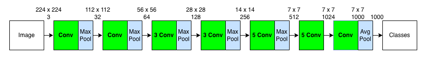
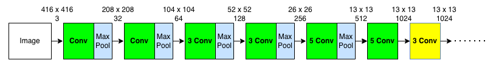
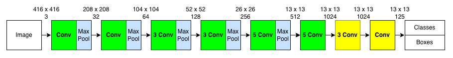
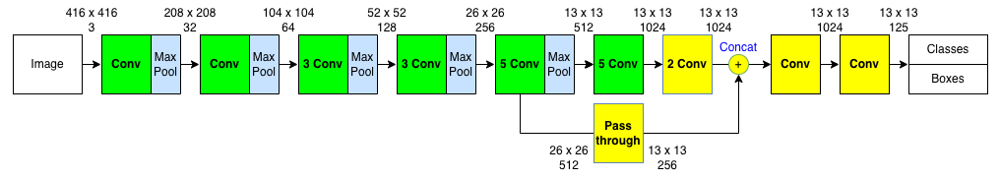
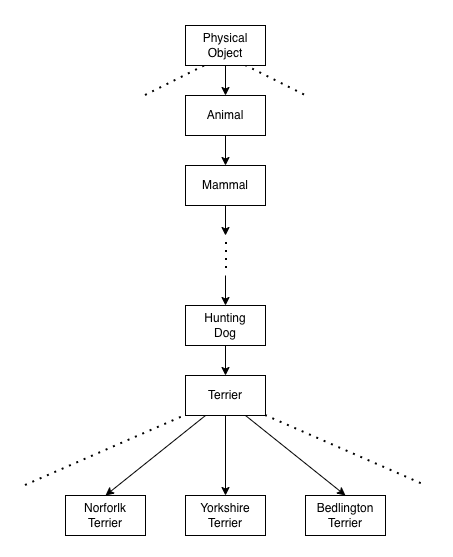

Joseph Redmon and Ali Farhadi made various improvements to [YOLO v1](/blog/2022-07-26-yolo-version-1/). The resulted model YOLO v2 became __better__ (more accurate) and __faster__ than [Faster R-CNN](/blog/2022-07-11-faster-r-cnn-rpn/) and [SSD](/blog/2022-07-31-ssd-single-shot-multibox-detector/). They trained a __stronger__ model (YOLO9000) with a new method, making it capable of detecting over 9000 object categories. So, the paper title reads "YOLO9000: Better, Faster, Stronger". This article explains what changed since YOLO v1.

## The Aim of YOLO v2 and YOLO3000

YOLO v1 was faster than Faster R-CNN, but it was less accurate. YOLO v1's weakness was the bounding box accuracy. It didn't predict object locations and sizes well, particularly bad at spotting small objects. It seemed that region-based detectors had the edge over single-shot detectors for object localization. However, SSD, another single-stage detector, broke the record by being better (more accurate) than Faster R-CNN and even faster than YOLO v1. 

Eventually, Joseph Redmon and Ali Farhadi developed YOLO v2, which is better and faster than SSD and Faster R-CNN. They made a series of changes, and the paper details how much improvement each incremental change brought. However, they didn't stop there.

They wanted to make their object detector recognize a wide variety of objects. The Pascal VOC object detection dataset contains only 20 classes. They wanted their model to recognize much more classes of objects. The problem was that building an object detection dataset with millions of labeled images would take too much time. Labeling images for object detection is far more expensive than image classification. So, they devised a new method to train YOLO9000, simultaneously taking advantage of [MS COCO](https://cocodataset.org/) and [ImageNet](https://www.image-net.org/) datasets. As a result, YOLO9000 can detect over 9000 object categories.

](images/YOLO3000-485x1024.png){width="50%"}

The following sections discuss how YOLO became better, faster, and stronger.

## Better

In the below table, the paper summarizes each change made to YOLO (v1) with the accuracy measured in [mAP](/blog/2022-05-27-object-detection-mean-average-precision/).

](images/YOLOv2-mAP-changes-1024x425.png)

You'd probably notice some ideas came from [SSD](/blog/2022-07-31-ssd-single-shot-multibox-detector/) and [Faster R-CNN](/blog/2022-07-11-faster-r-cnn-rpn/). Joseph Redmon says the following in the paper:

> We pool a variety of ideas from past work with our own novel concepts to improve YOLO’s performance.
<cite>Source: [the paper](https://arxiv.org/abs/1612.08242)</cite>

Researchers help each other improve their models by publishing papers and results, which is why reading a series of related papers is insightful.

<hr/>

Let's look at each improvement.

### Batch Normalization

In YOLO v2, they added Batch Normalization to all convolutional layers.

- It improved mAP by 2%.
- It helped the model avoid overfitting.
- They removed dropout as Batch Normalization regularized the model well.

### High-Resolution Classifier

In YOLO v1, they trained a classifier with ImageNet images of size 224 x 224. Then, they increase the image resolution to 448 x 448 to train their object detection models. Hence, the network had to simultaneously adjust to the new input resolution and learn object detection.

](images/YOLOv1_overview.png)

In YOLOv2, they made the following changes to make learning easier:

- First, they trained the classifier on images of size 224 x 224.
- Next, they fine-tuned the classifier on images of size 448 x 448 for ten epochs on ImageNet.
- Then, they trained the object detection model using the convolutional layers of the classifier.
- It improved mAP by almost 4%.

### Convolutional with Anchor Boxes

They introduced anchor boxes similar to Faster R-CNN and SSD to increase the recall rate (the fraction of ground truth object predicted) to detect more objects in an image. 

#### Problem with Bounding Box Predictions

YOLO v1 only predicted two bounding boxes per grid cell, which means a total of 49 (= 7 x 7 x 2) bounding boxes per image, much lower than Faster R-CNN and SSD (see the fifth column below).

 (I put the red box)](images/SSD-table7-modified.png)

Therefore, YOLO v1 suffered from a low recall rate. Furthermore, due to the coarse resolution of 7 x 7, the model didn't recognize small objects very well. However, increasing the grid cells would cause other problems because the model used fully-connected layers for detection. Larger resolution means more weights, slower inference speed, and longer training time.

](images/YOLO-two-FCs.png)

Another issue with YOLO v1 was that it predicted class probabilities per grid cell location. In other words, two bounding boxes had to share the same class probabilities. As such, increasing the number of bounding boxes would not benefit much. On the contrary, Faster R-CNN and SSD predicted class probabilities for each bounding box, making it easier to predict multiple classes sharing a similar center location.


So, they fixed these issues in YOLO v2.

#### Increasing Feature Map Resolution

They removed one max-pooling layer, leaving five of them for downsampling input images by a factor of 32. It would convert the original input size of 448 x 448 into 14 x 14 feature maps, four times more grid cell locations than the original feature map of 7 x 7. 

However, the even number of locations in the feature maps means there is no single central location, which is not ideal. 

> Objects, especially large objects, tend to occupy the center of the image so it’s good to have a single location right at the center to predict these objects instead of four locations that are all nearby.
<cite>Source: [the paper](https://arxiv.org/abs/1612.08242)</cite>

So, they changed the input image size from 448 x 448 to 416 x 416, resulting in the feature maps of size 13 x 13. It is much finer than the original 7 x 7 feature maps. But they needed to avoid having more weights in the fully-connected layers.

#### Going Fully Convolutional

They replaced the fully-connected layers with convolutional layers. The number of weights became negligible since the kernel size is small and fixed no matter the input resolution. It allowed them to use more bounding boxes per grid cell. As such, they introduced anchor boxes similar to Faster R-CNN and SSD:

- The total number of bounding box predictions dramatically increased.
- The model predicts objectness and class probabilities per anchor box.
- The recall rate increased from 81% to 88%.

The recall rate increased thanks to the increased feature map resolution and more bounding boxes. However, the accuracy went down from 69.5 mAP to 69.2 mAP. So, why did they still make this change?

> Even though the mAP decreases, the increase in recall means that our model has more room to improve.
<cite>Source: [the paper](https://arxiv.org/abs/1612.08242)</cite>

A higher recall rate means more opportunities to spot objects. Improving IoU between predicted bounding boxes and ground truths can increase overall mAP.

### Dimension Clusters

#### Better Priors for Bounding Boxes

The model can start with reasonable priors if we use appropriate sizes and aspect ratios for anchor boxes. However, it'd be challenging to hand-pick good values. So, they used k-means clustering on the training set bounding boxes. k-means clustering would start with randomly generated k-bounding boxes as centroids (cluster centers). Then, it assigns each bounding box from the training dataset to one of the k centroids by a distance metric. They used __1 - IoU__ as the distance metric, assigning each bounding box to a centroid having the largest overlap. 

$$
\text{d}(\text{box}, \text{centroid}) = 1 \ - \ \, \text{IoU}(\text{box}, \text{centroid})
$$

Then, it recalculates each centroid as the average of bounding boxes within the cluster. Then, it reassigns all bounding boxes to their closest centroid. It repeats the process until the centroids stop changing or the change becomes tiny. The question is how to determine the number of centroids k.

#### Clustering Box Dimensions

Increasing the number of centroids k would fit the dataset better. For example, k=10 would fit the dataset better than k=5. However, more boxes may cause an overfit. Also, increasing k does not mean IoU increases linearly. As shown in the below diagram (left), the IoU return on k diminishes as k increases. We must balance good recall (more anchor boxes) and detection model complexity (slow and harder to train). They found that k=5 gave a good trade-off for recall vs. complexity of the model.

 (on the right, grey boxes are for VOC 2007, purple boxes are for MS COCO)](images/k-means.png){width="75%"}

The right side shows the five anchor box sizes and aspect ratios (gray boxes are for VOC 2007, and purple boxes are for MS COCO). For both datasets, thinner and taller boxes are more common. In other words, bounding boxes are not entirely random, supporting the idea of choosing reasonable priors to help the detection model learn more efficiently.

Let's do a thought experiment on how choosing bad priors may adversely affect detection performance. Suppose we use transfer learning for an object detection model to count the number of giraffes in a safari park. Anchor boxes calculated from a vehicle detection dataset would probably make it more difficult for the model to reason about long-neck giraffes. So, we should always choose priors from the target domain.

Overall, going convolutional with anchor boxes brought many benefits. However, the anchor box approach caused another issue: model instability, especially during early iterations of training. They had to make a change in location prediction.

### Direct Location Prediction

#### Unconstrained Location Prediction

Faster R-CNN allows an object's center to go outside the grid cell. The region proposal network predicts the following unbounded values:

$$
t_x, \quad t_y
$$

The model calculates (x, y) center coordinates as follows:

$$
\begin{align}
x &= (t_x \times w_a) \ + \ x_a \\
y &= (t_y \times h_a\,) \ + \ y_a
\end{align}
$$

where $(x_a, y_a)$ is the anchor box center and $w_a$ and $h_a$ are anchor box width and height. The location prediction was indirect and relative to an anchor box size. $t_x = 1$ means shifting the center towards the left by the width of the anchor box. Also, x and y can be inside or outside the grid cell. A predicted bounding box may end up anywhere.

This formulation was not working well with YOLO, especially during the initial stage of training. Since the model had to start with randomly initialized weights and predicted bounding boxes could be anywhere, the model took a long time to converge to stable predictions. They decided to constrain an object's center position prediction within a grid cell using the sigmoid function, as in YOLO v1.

#### Constrained Location Prediction

YOLO v2 predicts five coordinates per bounding box.

$$
t_x, \quad t_y, \quad t_w, \quad t_h, \quad t_o
$$

The first two predicted values are for the center location of a bounding box. They are unbounded values. The model applies the sigmoid function to constrain them in the range between 0 and 1. So, the bounding box center is as follows:

$$
\begin{align}  
b_x &= \sigma(t_x) + c_x \quad (c_x \text{ is the offset from the left of the image}) \\
b_y &= \sigma(t_y) + c_y \quad (c_y \text{ is the offset from the top of the image})
\end{align}
$$

It also means that the model directly predicts the location (not relative to an anchor box size).

The third and fourth predicted values are unbounded, too. The model uses the exponential function to constrain them in the range between 0 and positive infinity.

$$
\begin{align}
b_w &= p_w e^{t_w} \quad (p_w \text{ is the width of anchor box}) \\
b_h &= p_h e^{t_h} \quad (p_h \text{ is the height of anchor box})
\end{align}
$$ 

Note: the image size also constrains any bounding box width and height.

Finally, the last predicted value represents the objectness score times the predicted IoU. The value is unbounded. The model applies the sigmoid function to constrain it between 0 and 1.

$$
\text{Pr}(\text{object}) \times \text{IoU}(b, \text{object}) = \sigma(t_o)
$$

The below diagram summarizes the formulation.

](images/figure-3.png){width="75%"}

The direct location prediction with constraints made the model's learning stable. Together with dimension clusters, mAP improved by almost 5%.

### Find-Grained Features

YOLO v1 had trouble detecting small objects. Anchor boxes provided part of the solution to improving the recall rate. It also needed more fine features while keeping the 13 x 13 (coarser) feature maps. SSD used the [multi-scale feature maps](/blog/2022-07-31-ssd-single-shot-multibox-detector/#multi-scale-feature-maps) to incorporate various fine-to-coarse features. In YOLO v2, they took a different approach.

The idea is similar to the skip connections in ResNet. They turned the 26 x 26 x 512 feature maps from the earlier convolutional layers into 13 x 13 x 2048 by stacking adjacent features into different channels. In this way, the detector can have access to fine-grained features. It gave a 1% performance increase.

### Multi-Scale Training

They trained YOLO v2 with various input resolutions to make the model robust. The multi-scale training randomly chooses an input resolution for every ten batches. Being fully convolutional does not require us to adjust network weights for different input resolutions. They used input resolution multiples of 32: {320, 352, ..., 608} since the convolutional layers downsample by 32.

> This regime forces the network to learn to predict well across a variety of input dimensions. This means the same network can predict detections at different resolutions. The network runs faster at smaller sizes so YOLOv2 offers an easy tradeoff between speed and accuracy.
<cite>Source: [the paper](https://arxiv.org/abs/1612.08242)</cite>

The idea was similar to SSD, having two versions (SSD300 and SSD500) based on input resolutions. YOLO v2's multi-scale training was more exhaustive, so YOLO v2 became capable of handling a wide range of speed-accuracy trade-offs from low to high resolution. The below table shows the test results with Pascal VOC 2007.

](images/table-3.png){width="75%"}

With 288 x 288, YOLO v2 runs at 91 FPS while being fairly accurate (almost as good as the Fast R-CNN). It is suitable for high-framerate video running on less powerful GPUs. With 544 x 544, YOLO v2 is a high-resolution detector with state-of-art accuracy while maintaining a real-time speed of 40 FPS. The below chart clearly shows the accuracy and speed trade-off.

](images/figure-4.png){width="75%"}

<hr/>

We have discussed all the improvements that made YOLO more accurate. Once again, the below table summarizes the changes and their improvements.

](images/better.png)

There is one item we haven't explicitly discussed. YOLO v2 introduced a new base network called Darknet-19. It made the model better and also faster.

## Faster

Faster R-CNN and SSD used convolutional layers from VGG-16 for feature extraction. The network provided good accuracy but required 30.69 billion floating-point calculations. On the other hand, YOLO v1 used a custom model based on GoogLeNet, and the amount of computation remained at 8.52 billion. So, YOLO v1's base network was faster. However, its top-5 accuracy on ImageNet (at 224 x 224) was 88%, worse than 90.0% by VGG-16.

Therefore, they improved the base network for YOLO v2.

### Darknet-19

They proposed a new image classifier, Darknet-19, as the base network for YOLO v2. We've seen some of the features of the network in the previous section. In this section, we'll see the internals. 

Darknet-19 has a total of 19 convolutional layers and five max pooling operations, as shown below:

](images/table-6.png){width="60%"}

The network repeats 3 x 3 convolutions to double filters (channels) and max-pooling to downsample feature map resolutions, similar to the VGG models. In addition, it incorporated methods from "[Network in network](https://arxiv.org/abs/1312.4400)" (that inspired GoogLeNet's Inception module), such as 1 x 1 convolution to compress the channel dimensions (in between 3 x 3 convolutions) and global average pooling to make predictions.

They used batch normalization to stabilize training, speed up convergence, and regularize the model. First, they trained Darknet-19 for image classification to ensure that the network has good accuracy.

### Training for Classification

They trained Darknet-19 using ImageNet's 1000 classes (image size: 224 x 224).

|Hyper-parameters|Value|
|---|---|
|Epochs|160|
|Optimizer|SGD (Stochastic Gradient Descent)|
|Initial Learning Rate|0.1|
|Learning Rate Decay|Polynomial rate decay with a power of 4|
|Weight Decay (L2 Regularization)|0.0005|
|Momentum|0.9|

The polynomial rate decay reduces the learning rate at every batch.

$$
\text{Learning Rate} \times \left(1 \ - \ \frac{\text{Batch Step}}{\text{Max Batch Steps}} \right)^4
$$

Other than that, they used data augmentation tricks by randomly adjusting the following values:

*   Crops
*   Rotations
*   Hue, Saturation, and Exposure Shifts

Darknet-19 achieved the top-5 accuracy of 91.2% (top-1 accuracy of 72.9%) with only 5.58 billion floating-point computations. After that, they fine-tuned the classifier with an increased input resolution of 448 x 448 for ten epochs using a lower learning rate of 0.001. The adjusted model achieved the top-5 accuracy of 93.3% (top-1 accuracy of 76.5%).

### Training for Detection

The below shows a simplified architecture of Darknet-19.



We'll see how they modified Darknet-19 for object detection. First, they removed the classification head (the last convolutional layer and the layers after that) and added three additional 3 x 3 x 1024 convolutional layers to enrich features for detection further. 



Then, they added one 1 x 1 convolution layer with 125 channels for five bounding boxes, each of which consists of the following values:

- Four coordinate values
- One objectness score
- 20 conditional class probabilities

Therefore, the total number of values is 125 (= 5 x (4 + 1 + 20)) per grid cell. The below image shows the model architecture when the input resolution is 416 x 416. The last yellow box is for the 1 x 1 convolution layer.



Further, they added a passthrough layer to intake high-resolution features (26 x 26 x 512). The below image shows where the concatenation happens:



According to the YOLO v2 configuration for Pascal VOC ([GitHub link](https://github.com/pjreddie/darknet/blob/master/cfg/yolov2-voc.cfg)), the passthrough is a 1 x 1 x 64 convolutional layer. So, 26 x 26 x 256 becomes 26 x 26 x 64. Then, there is a reorganization (`reorg`) with a stride of 2, turning 26 x 26 x 64 feature maps into 13 x 13 x 256 by stacking adjacent features into channels.

```bash
[convolutional]
batch_normalize=1
size=1
stride=1
pad=1
filters=64
activation=leaky

[reorg]
stride=2
```

The below table shows the hyperparameters used in training for Pascal VOC and MS COCO.

|Hyper-parameters|Value|
|---|---|
|Epochs|160|
|Optimizer|SGD (Stochastic Gradient Descent)|
|Initial Learning Rate|0.001|
|Learning Rate Decay|Divide the learning rate by 10 at 60 and 90 epochs|
|Weight Decay (L2 Regularization)|0.0005|
|Momentum|0.9|

## Stronger

They proposed a new method to train a __stronger__ model, enabling it to detect far more classes than Pascal VOC and MS COCO datasets can offer. Their method mixes images labeled for detection and classification datasets. For a detection image, they back-propagate based on the full YOLO v2 loss function. For a classification image, they back-propagate loss from the classification-specific parts of the architecture.

### Problems with Combining Datasets

Mixing detection and classification datasets had a few challenges:

- Detection datasets have only common objects and general labels (i.e., "dog", "boat").
- Classification datasets have a much broader and deeper range of labels.

For example, ImageNet has more than a hundred breeds of dog (i.e., "Norfolk terrier", "Yorkshire terrier", "Bedlington terrier", etc.). Usually, classification models assume the classes are mutually exclusive. Hence, they use a softmax layer across all possible categories to compute the final probability distribution. Therefore, if we combined ImageNet and MS COCO, assuming classes were mutually exclusive, classifying a "Norfolk terrier" image as "dog" would be a wrong prediction, even though "Norforkl terrier" is a kind of "dog".

So, they came up with a hierarchical classification approach.

### Hierarchical Classification

ImageNet labels came from WordNet:

> ImageNet is an image dataset organized according to the WordNet hierarchy. Each meaningful concept in WordNet, possibly described by multiple words or word phrases, is called a "synonym set" or "synset". 
<cite>Source: [About ImageNet](https://www.image-net.org/about.php)</cite>

In WordNet, "Norfolk terrier" and "Yorkshire terrier" are __specific kinds__ (hyponyms) of "terrier".

- "terrier" is a type of "hunting dog".
- "hunting dog" is a type of "dog".
- "dog" is a type of "canine".

WordNet structure is a directed graph in that multiple words or phrases may describe one concept. For example, a "dog" is simultaneously a type of "canine" and a type of "domestic animal", which is not convenient for labeling. Instead, they simplified the problem by building a tree structure (where one node has only one parent node).

They examined the classes in ImageNet and looked at their paths through the WordNet graph to the root node ("physical object"). They chose the shortest path for a class having more than one path to the root. As a result, they created a tree structure called WordTree.

### Classification with WordTree

To perform classification with WordTree, a model predicts conditional probabilities at every node in WordTree.



For example, at the "terrier" node, the model predicts:

$$
\begin{align}
\text{Pr}(\text{Norfork terrier} &| \text{terrier} ) \\
\text{Pr}(\text{Yorkshire terrier} &| \text{terrier} ) \\
\text{Pr}(\text{Bedlington terrier} &| \text{terrier} ) \\
\dots &
\end{align}
$$

So, the probability of a Norfolk terrier is:

$$
\begin{align}
P(\text{Norfolk terrier}) = &\ P(\text{Norfolk terrier}|\text{terrier})\ \times \\
 &\ P(\text{terrier}|\text{hunging dog})\ \times \\
 &\quad \dots \\
 &\ P(\text{mammal}|\text{animal})\ \times \\
 &\ P(\text{annimal}|\text{physical object})\ \times \\
 &\ P(\text{physical object})
\end{align}
$$

We assume Pr(physical object) = 1 for classification since any classification image has a physical object. As for detection, Pr(physical object) is the objectness score of a bounding box predicted by YOLO v2.

### WordTree 1k

To validate the approach, they trained Darknet-19 on WordTree, built using the 1000 classes from ImageNet. The tree has 1000 leaves, and there are 369 higher-level concepts. So, the model outputs a vector of 1369 values. However, as discussed earlier, we can't simply apply the softmax over all 1369 classes.

In the multi-label hierarchical classification, if an image is a "Norfolk terrier", it is also a "hunting dog", ..., a "mammal", an "animal", and a "physical object". So, the model must predict all of them correctly. As such, the model performs the softmax operation at each level. For example, the softmax predicts the most likely class under "physical object" is "animal". Then, another softmax predicts the most likely class under "animal" is "mammal", and so on, until it reaches the leaf node class like "Norfolk terrier".

](images/wordtree.png){width="75%"}

The hierarchical Darknet-19 classification model achieved the top-5 accuracy of 90.4% (top-1 accuracy of 71.9%).

One benefit of multi-label classification is that the performance degrades gracefully on unknown object categories. For example, suppose the model sees a new picture and is sure it is a dog but is uncertain what type of dog it is (possibly because it has never seen such a dog). In that case, it still predicts “dog” with high confidence while having lower confidence scores among the sub-classes.

The same formulation works for detection. The model predicts objectness, giving the root probability Pr(physical object), and predicts conditional class probabilities, helping traverse the tree down, taking the highest confidence path at every split until it reaches some threshold. So, it may predict “dog” instead of a specific type when the confidence is not high at the specific nodes.

### Dataset Combination with WordTree

WordTree allows us to incorporate labels from multiple datasets into a hierarchical structure. They used the top 9000 labels from the full version of ImageNet and layered them with MS COCO object detection data in a WordTree structure. They also added classes from the ImageNet detection dataset into the tree for evaluation purposes. The corresponding WordTree has 9418 classes.

](images/imagenet_coco_wordtree.png){width="75%"}

ImageNet is much larger than MS COCO, so they adjusted the size ratio to 4:1 by oversampling from MS COCO. They trained the model on the ImageNet classification and MS COCO detection datasets and evaluated it on the ImageNet detection dataset.

### Joint Classification and Detection

YOLO9000's architecture is the same as YOLO v2, except it uses three anchor boxes per grid cell (instead of five) to limit the number of outputs. 

When the model sees an image from a **detection dataset**, it back-propagates localization loss and classification loss. It ignores any sub-classes that are not part of the detection dataset. For example, given the label "dog", it calculates loss at and above the "dog" level. It does not assign any error to sub-classes like "German Shepherd" because the dataset has no information.

When the model sees an image from a **classification dataset**, it only back-propagates classification loss (no localization loss) by finding a bounding box with the highest probability for the label class. Although there is no ground truth bounding box for any classification image, they assume the bounding box has at least 0.3 IoU with (hypothetical) ground truth to allow objectness loss to be back-propagated.

With the above, YOLO9000 learns to:

- detect objects in images using the detection data in MS COCO
- classify a wide variety of objects using data from ImageNet.

They evaluated YOLO9000 on the ImageNet object detection dataset, which shares only 44 object categories with MS COCO. As they trained the model on the ImageNet classification and MS COCO detection datasets (not using images from the ImageNet detection dataset), the model had no chance to localize many classes from the ImageNet detection dataset during the training. Still, YOLO9000 achieved 19.7 mAP. Also, it achieved 16.0 mAP for the 156 object classes, for which it had never seen labeled detection data.

## Towards YOLO v3

The paper ends with a very hopeful outlook about future work.

> For future work we hope to use similar techniques for weakly supervised image segmentation. We also plan to improve our detection results using more powerful matching strategies for assigning weak labels to classification data during training.
<cite>Source: [the paper](https://arxiv.org/abs/1612.08242)</cite>

They made YOLO better, faster, and stronger. Supporting more data sources would make the model even more robust. Joseph Redmon thought the computer vision world was full of great opportunities.

> Computer vision is blessed with an enormous amount of labelled data. We will continue looking for ways to bring different sources and structures of data together to make stronger models of the visual world.
<cite>Source: [the paper](https://arxiv.org/abs/1612.08242)</cite>

<hr/>

However, the hopeful tone changes significantly in the YOLOv3 paper.

## References

- [YOLO: You Look Only Once (The 1st Version)](/blog/2022-07-26-yolo-version-1/)
- [SSD: Single Shot MultiBox Detector](/blog/2022-07-31-ssd-single-shot-multibox-detector/)
- [YOLO9000: Better, Faster, Stronger](https://arxiv.org/abs/1612.08242) \
  Joseph Redmon, Ali Farhadi
- [YOLO v2 Video Demo](https://www.youtube.com/watch?v=VOC3huqHrss) \
  Joseph Redmon
