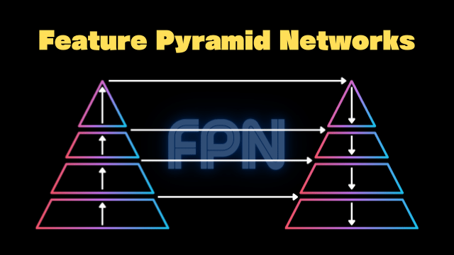
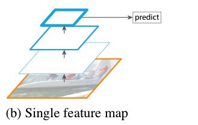
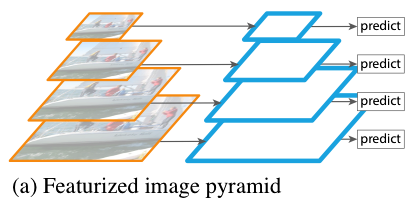
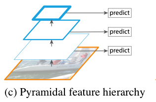
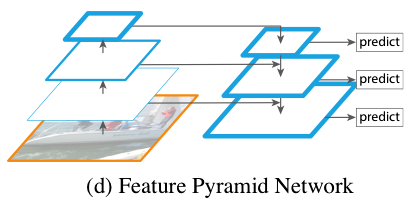
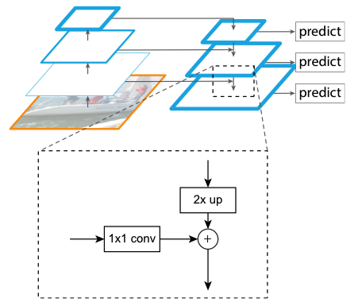
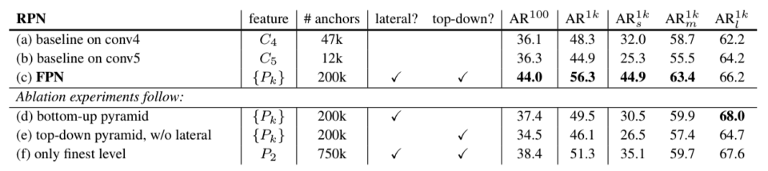
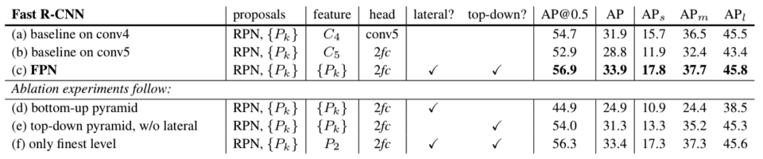
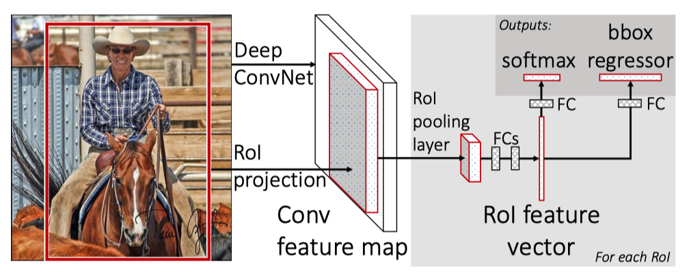
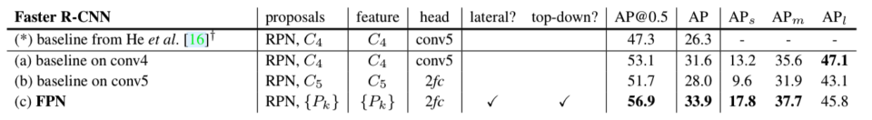

In 2016, Tsung-Yi Lin et al. published a paper on Feature Pyramid Network (FPN). The team includes Ross Girshick and Kaiming He, well-known for the work of [Faster R-CNN](/blog/2022-07-11-faster-r-cnn-rpn/). They developed FPN as a multi-scale feature extractor. Then, they used it with Faster R-CNN, significantly improving detection accuracy. This article explains how FPN works.

## Image Pyramid to Feature Pyramid

### Single Feature Map

The original Faster R-CNN uses the last feature map of convolutional layers to extract features.

<figure class="wp-block-image size-full"><figcaption>Figure 1 (b) of the <a href="https://arxiv.org/abs/1612.03144" rel="noopener nofollow" target="_blank" title="paper">paper</a></figcaption></figure>

However, it may not serve well for object detection, where images contain objects on multiple scales. 

<figure class="wp-block-image size-full is-resized"></figure>

Detecting a small object requires details within a small area, and detecting a large object requires features that cover a wide area. 

<blockquote>
Recognizing objects at vastly different scales is a fundamental challenge in computer vision.<cite>Source:  <a href="https://arxiv.org/abs/1612.03144" rel="noopener nofollow" target="_blank" title="paper">paper</a></cite></blockquote>

So, the question is how to simultaneously extract fine and coarse features from an input image.

### Featurized Image Pyramid

One workable solution is to resize an input image into multiple scales and build a pyramid of scaled images, as shown below:

<figure class="wp-block-image size-full"><figcaption>Figure 1 (a) of the <a href="https://arxiv.org/abs/1612.03144" rel="noopener nofollow" target="_blank" title="paper">paper</a></figcaption></figure>

Then, we can extract features from each scale to perform predictions at each scale. For example, 3 x 3 convolution would cover a wider receptive field on small-scale images and a smaller area on large-scale images. The approach works but is not very efficient because it costs memory and is slow for both training and inference.

### Pyramidal Feature Hierarchy

Instead of using an image hierarchy, we could use the hierarchy of bottom-up feature maps. [SSD](/blog/2022-07-31-ssd-single-shot-multibox-detector/) (Single Shot Detector) uses this approach by taking convolutional features at different scales for object detection.

<figure class="wp-block-image size-full is-resized"><figcaption>Figure 1 (c) of the <a href="https://arxiv.org/abs/1612.03144" rel="noopener nofollow" target="_blank" title="paper">paper</a></figcaption></figure>

The low-resolution feature maps are semantically robust and contain global features. The high-resolution feature maps are semantically weak and contain local features. So, at each level, SDD can predict object locations on different scales. However, it does not mix high-level and low-level features, which could provide enhanced context for object detection.

It's not hard to imagine that features from a wide area may help detect small objects, and features from a small area may help classify object types. For example, imagine a white bird in an image with different backgrounds, like a lake or an aviary. They'd give different contexts. And fine details like a yellow beak or a red comb would drive final classification decisions. Although we do not know how a neural network uses such mixtures of features, we can imagine they would be helpful. 

### Feature Pyramid Network (FPN)

FPN combines low-resolution and high-resolution features through:

*   A top-down pathway
*   Lateral connections

So, at each level, features contain a mixture of features from all levels.

<figure class="wp-block-image size-full is-resized"><figcaption>Figure 1 (d) of the <a href="https://arxiv.org/abs/1612.03144" rel="noopener nofollow" target="_blank" title="paper">paper</a></figcaption></figure>

The top-down pathway uses nearest neighbor upsampling on feature maps to expand the spatial resolution by a factor of 2. The lateral connections apply 1 x 1 convolution to compress channel dimensions. FPN concatenates upsampled feature map and compressed bottom-up feature map at each scale.

<figure class="wp-block-image size-full is-resized"><figcaption>Figure 3 of the <a href="https://arxiv.org/abs/1612.03144" rel="noopener nofollow" target="_blank" title="paper">paper</a></figcaption></figure>

## Region Proposal with RPN + FPN

In Faster R-CNN, RPN (Region Proposal Network) is a 3 x 3 convolutional layer to propose candidate areas for object detection. They applied RPN on each level of multi-scale features from FPN. They use anchors of a single scale as each level is already at a different scale. Each pixel at a different scale corresponds to the following areas in the original input resolution:

*   32 x 32
*   64 x 64
*   128 x 128
*   256 x 256
*   512 x 512

They used three aspect ratios (as in the original Faster R-CNN):

*   1:2
*   1:1
*   2:1

Detectors at all levels share the same parameters since using different parameters at each level didn't prove better. Overall, FPN is much more efficient than the featurized image pyramid approach.

### Ablation Experiments

They used ResNet-50 as the backbone feature extractor and evaluated RPN with and without FPN. They used the COCO `` minival `` set. The metric is average recall (AR), the fraction of ground truth object predicted. For example, if RPN detects 100 object locations out of 100 ground truth objects, AR is 100%. They reported the results for 100 and 1000 (1k) proposals per image (AR^100 and AR^1k). They also evaluated it for small, medium, and large objects (ARs^1k, ARm^1k, and ARl^1k).

<figure class="wp-block-image size-large"><figcaption>Table 1 of the <a href="https://arxiv.org/abs/1612.03144" rel="noopener nofollow" target="_blank" title="paper">paper</a></figcaption></figure>

The baseline on conv4 and conv5 means the feature maps from the 4th and 5th convolution blocks of ResNet-50. We can see that FPN's AR is much higher than baseline results. Although it appears that the number of anchors largely contributes to the performance, RPN with 750k anchors on the only finest (highest-resolution) level does not perform that better. So, a larger number of anchors alone is not enough to improve accuracy. We need multi-scale feature maps.

We can also see the results without lateral connections or the top-down pathway. They perform worse than both included. So, both lateral connections and the top-down pathway are important.

## Object Detection with Fast R-CNN + FPN

Originally, Fast R-CNN used the Selective Search method for region proposals. Here, they evaluated the Fast R-CNN detector on the proposals by RPN + FPN for all cases. In other words, they fixed the candidate regions using the outputs from RPN + FPN. They used those regions to evaluate detection performance using different features, as shown in the below table:

<figure class="wp-block-image size-large"><figcaption>Table 2 of the <a href="https://arxiv.org/abs/1612.03144" rel="noopener nofollow" target="_blank" title="paper">paper</a></figcaption></figure>

The head with `` 2fc `` means two fully-connected layers in the Fast R-CNN (after the RoI pooling layer). So, the (a) case connects the conv5 features without the two full-connected layers.

<figure class="wp-block-image size-full is-resized"><figcaption><a href="/blog/2022-06-21-fast-r-cnn-213/#fast-r-cnn" rel="noopener" target="_blank" title="Fast R-CNN">Fast R-CNN</a></figcaption></figure>

The table clearly shows that FPN improves the performance of Fast R-CNN.

## Object Detection with Faster R-CNN + FPN

They also evaluated Faster R-CNN with FPN. Here, both RPN and the detector use multi-scale features from the FPN. The baseline models use single-scale feature maps for region proposals (RPN) and object detection. Faster R-CNN + FPN use multi-scale feature maps for region proposals (RPN) and object detection, which outperforms baseline models.

<figure class="wp-block-image size-large"><figcaption>Table 3 of the <a href="https://arxiv.org/abs/1612.03144" rel="noopener nofollow" target="_blank" title="paper">paper</a></figcaption></figure>

## Conclusion

Robustness to scale variation is crucial in object detection. FPN is a clean and simple framework for building feature pyramids inside convolutional layers. The paper focuses on the results with ResNet-50, but FPN can work with other backbones. It even influenced YOLOv3, which uses different backbone layers to extract multiple-level features.

## References

- [Faster R-CNN](/blog/2022-07-11-faster-r-cnn-rpn/)
- [Feature Pyramid Networks for Object Detection](https://arxiv.org/abs/1612.03144) \
  Tsung-Yi Lin, Piotr Dollár, Ross Girshick, Kaiming He, Bharath Hariharan, Serge Belongie
