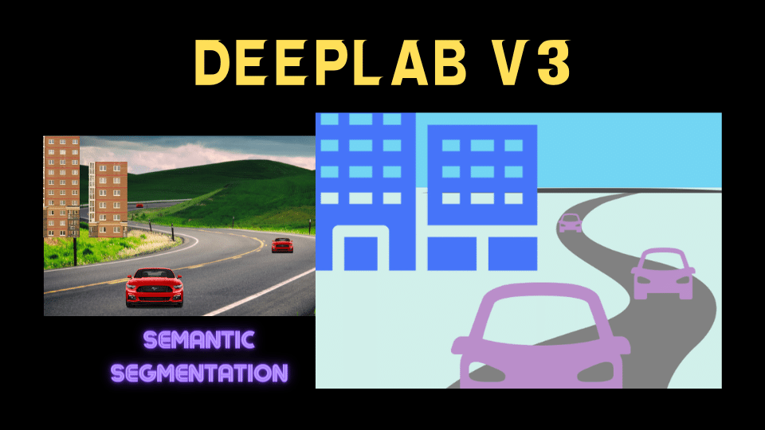
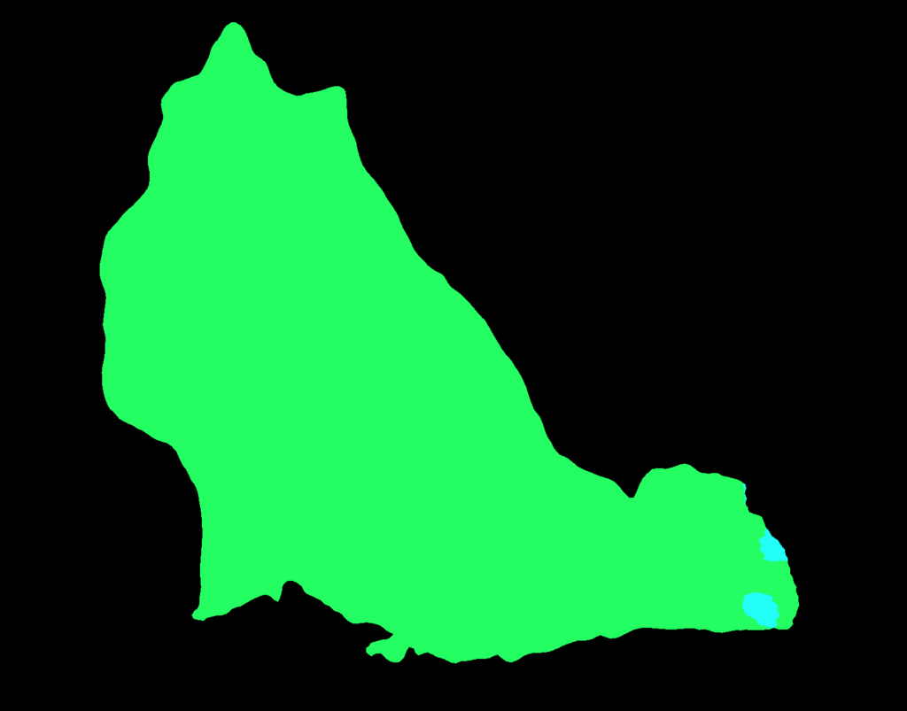

<a href="https://pytorch.org/hub/pytorch_vision_deeplabv3_resnet101/" rel="noopener nofollow" target="_blank">DeepLab v3</a> is a semantic segmentation model that can use ResNet-50, ResNet-101 and MobileNet-V3 backbones. This hands-on article explains how to use DeepLab v3 with PyTorch.

## A Quick Introduction to Semantic Segmentation

Semantic segmentation divides an image into semantically different parts, such as roads, cars, buildings, the sky, etc. Below is an example of an image from the <a href="https://cs.stanford.edu/~roozbeh/pascal-context/" rel="noreferrer noopener" target="_blank">PASCAL-Context Dataset</a> and its semantic segmentation ground truth.

](images/pascal-voc-1.png)

](images/pascal-voc-2.png)

In other words, a semantic segmentation model classifies each pixel in an image. It does not distinguish between different instances of the same type. For example, person A and person B belong to the same person class, and there is no more distinction between them. So, we can not distinguish each person when they overlap each other.

In addition to semantic segmentation, there is a task called __instance segmentation__, which not only classifies but can also distinguish each instance of objects belonging to the same class. For example, in the image above, an instance segmentation model would distinguish each person as a separate object (instance). However, DeepLab v3 is a semantic segmentation model and handles only class-level classifications.

## Python Environment Setup

Here, I'm using virtualenv to set up a Python environment. If you prefer other tools like <a href="https://docs.conda.io/en/latest/" rel="noopener nofollow" target="_blank" title="Conda">Conda</a> or <a href="https://docs.conda.io/en/latest/miniconda.html" rel="noopener nofollow" target="_blank" title="mini Conda">mini Conda</a>, that should work well as long as the same dependencies are available.

```bash
# Create a project folder and move there
mkdir deeplab-v3
cd deeplab-v3

# Create and activate a Python environment using venv
python3 -m venv venv
source venv/bin/activate

# We should always upgrade pip as it's usually old version
# that has older information about libraries
pip install --upgrade pip

# Also, install the dependencies
pip install torch torchvision
```

At the time of writing this article, I installed the following versions.

```bash
torch==1.12.1
torchvision==0.13.1
```

You can put the above lines into `requirements.txt` and execute `pip install -r requirements.txt` to install the dependencies. It may be handy to do this if you are experimenting on multiple computers and need the same dependencies on all machines.

Next, let's download a test image.

## Image Download

We'll download a dog image from the PyTorch hub site as follows:

```python
from urllib import request

url = "https://github.com/pytorch/hub/raw/master/images/dog.jpg"
filename = "dog.jpg"

request.urlretrieve(url, filename)
```

It saves the downloaded image to the file name "dog.jpg". We can programmatically open the image as follows:

```python
from PIL import Image

input_image = Image.open(filename)

# in case alpha channel exists
input_image = input_image.convert("RGB")
input_image.show()
```

Converting the image to RGB eliminates the alpha (transparency) channel in case such a channel exists.

](images/dog.png){width="75%"}

## DeepLab v3 Model Download

Let's download the DeepLab v3 model with the ResNet-101 backbone. The below code is from the PyTorch hub's <a href="https://pytorch.org/hub/pytorch_vision_deeplabv3_resnet101/" rel="noopener nofollow" target="_blank" title="sample code">sample code</a>.

```python
import torch

model = torch.hub.load(
    'pytorch/vision:v0.10.0',
    'deeplabv3_resnet101',
    weights=DeepLabV3_ResNet101_Weights.DEFAULT)

model.eval() # evaluation mode
```

When downloading the model for the first time, it saves the downloaded model to `~/.cache/torch/hub/checkpoints/`. So, the next time we call `torch.hub.load`, it will load from the local cache, which is much faster. 

`DeepLabV3_ResNet101_Weights.DEFAULT` means we are downloading the most up-to-date weights for this model.

Note: DeepLab v3 ResNet-101 is a reasonably big model running slowly on the CPU. If it's too slow, you may consider using a smaller backbone like ResNet-50.

## Preprocessing for DeepLab v3

Let's create a transform that preprocesses the image. Since we use the ResNet backbone (trained on ImageNet images), the normalization values are the same as for the original ResNet image classification model. We normalize all pixel values by the mean RGB value of the ImageNet images and their standard deviations.

```python
from torchvision import transforms

preprocess = transforms.Compose([
    transforms.ToTensor(),
    transforms.Normalize(
        mean=[0.485, 0.456, 0.406],
        std=[0.229, 0.224, 0.225]
    ),
])

input_tensor = preprocess(input_image)
print('input_tensor', input_tensor.shape)
```

The shape of the input tensor is `torch.Size([3, 1213, 1546])`, which means the input image has three channels (RGB), and the image size of 1213 x 1546.

Next, we create a mini-batch using the preprocessed image. Since we have one image only, the batch size is 1. So, we add a new dimension to the input image tensor by calling the unsqueeze function.

```python
input_batch = input_tensor.unsqueeze(0)

print('input_batch', input_batch.shape)
```

Now, the shape of the input batch is `torch.Size([1, 3, 1213, 1546])`, which means a batch of size 1, three color channels (RGB), and the image size is 1213 x 1546.

We are ready to perform inference with DeepLab v3 ResNet-101.

## Inference with DeepLab v3 ResNet-101

If you have a computer with NVIDIA GPU (CUDA) or Apple's Metal Performance Shaders (<a href="https://pytorch.org/docs/stable/notes/mps.html" rel="noopener nofollow" target="_blank" title="MPS">MPS</a>), you should move the batch and the model to the device for faster processing. The following code should work for any device: CUDA, MPS, or CPU. 

```python
if torch.cuda.is_available():
    device = torch.device('cuda')
elif torch.backends.mps.is_available():
    device = torch.device('mps')
else:
    device = torch.device('cpu')

input_batch = input_batch.to(device)
model.to(device)
```

We don't need the above code when experimenting on a computer with a CPU only. However, having such a code block is handy when switching between computers with different devices.

Let's run the model for inference:

```python
with torch.no_grad():
    output = model(input_batch)
```

We use `with torch.no_grad():` as it is not necessary to calculate the gradients for inference. It should use fewer computer resources (and potentially a little faster).

## Understanding the Inference Output

The output is a dictionary with keys "out" and "aux". We can ignore "aux" since it's for the loss value calculation during training. The "out" value contains a batch of output images. Since the batch size is 1, we take the first item from it.

```python
out = output['out'][0]

print('out', out.shape)
```

The shape of "out" is `torch.Size([21, 1213, 1546])`, which means the model predicts 21 classes for each pixel in the image of size 1213 x 1546. The 21 values per pixel is an unnormalized probability. So, the bigger the value, the higher the probability for the class. We can check the maximum value per pixel to see the most probable predicted classes.

```python
prediction = out.argmax(0)

print(prediction.shape)
```

The shape of the prediction is `torch.Size([1213, 1546])`, which means it selected one class (with the biggest value) per pixel.

The class definition is from the <a href="https://paperswithcode.com/dataset/pascal-voc" rel="noopener nofollow" target="_blank" title="Pascal VOC 2012 semantic segmentation dataset.">Pascal VOC 2012 semantic segmentation dataset.</a>

```markdown
0,background
1,aeroplane
2,bicycle
3,bird
4,boat
5,bottle
6,bus
7,car
8,cat
9,chair
10,cow
11,diningtable
12,dog
13,horse
14,motorbike
15,person
16,pottedplant
17,sheep
18,sofa
19,train
20,tvmonitor
255,ignore label (excluded from the ground truth for training/evaluation)
```

## Visualizing the Inference Output

Following the sample code in <a href="https://pytorch.org/hub/pytorch_vision_deeplabv3_resnet101/" rel="noopener nofollow" target="_blank">PyTorch Hub</a>, we color the predicted classes in the image as a semantic segmentation result.

```python
# Assign a color for each of 21 classes
palette = torch.tensor([2 ** 25 - 1, 2 ** 15 - 1, 2 ** 21 - 1])
colors = torch.as_tensor([i for i in range(21)])[:, None] * palette
colors = (colors % 255).numpy().astype("uint8")

# Converts the result to Numpy and show the result with PIL Image
prediction_numpy = prediction.byte().cpu().numpy()
r = Image.fromarray(prediction_numpy)
r.putpalette(colors)
r.show()
```

{width="80%"}

It seems to classify the dog well, except for some parts of the tail. Let's print the unique values of the predicted classes.

```python
print(torch.unique(prediction, return_counts=True))
```

The output gives the following:

```markdown
(tensor([0, 8, 12]), tensor([1241642, 4433, 629223]))
```

The first element indicates classes: "background", "cat", and "dog", and the second element shows the count for each class. So, most of the pixels are "background" (black), the second most are "dog" (green), and the rest are "cat" (cyan). As such, the model thought some parts of the tail were "cat", possibly due to the fluffy white hairs.

I hope it's clear that semantic segmentation classifies each pixel, unlike [image classification and object detection](/blog/2022-05-23-object-detection-vs-image-classification/).

## Source Codes

```python
import torch
from urllib import request
from PIL import Image
from torchvision import transforms
from torchvision.models.segmentation import DeepLabV3_ResNet101_Weights

# Download the dog image from PyTorch hub
url = "https://github.com/pytorch/hub/raw/master/images/dog.jpg"
filename = "dog.jpg"
request.urlretrieve(url, filename)

# Open the image
input_image = Image.open(filename)
input_image = input_image.convert("RGB")
input_image.show()

# Download the model
model = torch.hub.load(
    'pytorch/vision:v0.10.0',
    'deeplabv3_resnet101',
    weights=DeepLabV3_ResNet101_Weights.DEFAULT)
model.eval() # evaluation mode

# Preprocessing the image
preprocess = transforms.Compose([
    transforms.ToTensor(),
    transforms.Normalize(
        mean=[0.485, 0.456, 0.406],
        std=[0.229, 0.224, 0.225]
    ),
])
input_tensor = preprocess(input_image)
print('input_tensor', input_tensor.shape)

# Create a batch (of size 1)
input_batch = input_tensor.unsqueeze(0)
print('input_batch', input_batch.shape)

# Choose a device for faster processing
if torch.cuda.is_available():
    device = torch.device('cuda')
elif torch.backends.mps.is_available():
    device = torch.device('mps')
else:
    device = torch.device('cpu')
print('device', device)

input_batch = input_batch.to(device)
model.to(device)

# Run inference
with torch.no_grad():
    output = model(input_batch)

# Output shape
out = output['out'][0]
print('out', out.shape)

# Predicted class per pixel
prediction = out.argmax(0)

# Unique predicted class values
print(torch.unique(prediction, return_counts=True))

# Assign a color for each of 21 classes
palette = torch.tensor([2 ** 25 - 1, 2 ** 15 - 1, 2 ** 21 - 1])
colors = torch.as_tensor([i for i in range(21)])[:, None] * palette
colors = (colors % 255).numpy().astype("uint8")

prediction_numpy = prediction.byte().cpu().numpy()
r = Image.fromarray(prediction_numpy)
r.putpalette(colors)
r.show()
```

## References

- [Rethinking Atrous Convolution for Semantic Image Segmentation](https://arxiv.org/abs/1706.05587) \
  Liang-Chieh Chen,&nbsp;George Papandreou,&nbsp;Florian Schroff,&nbsp;Hartwig Adam
