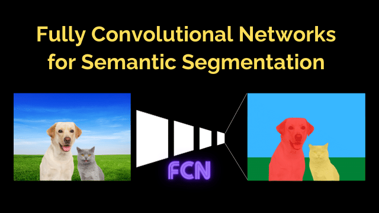
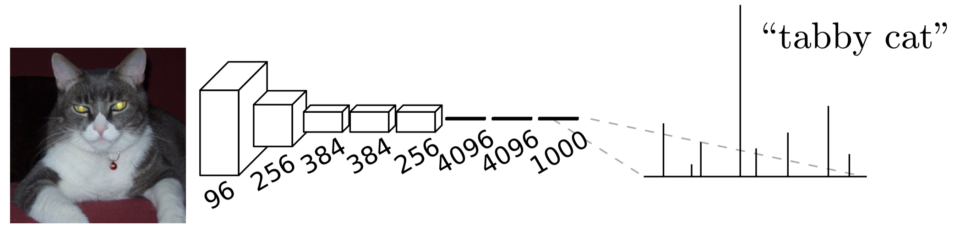
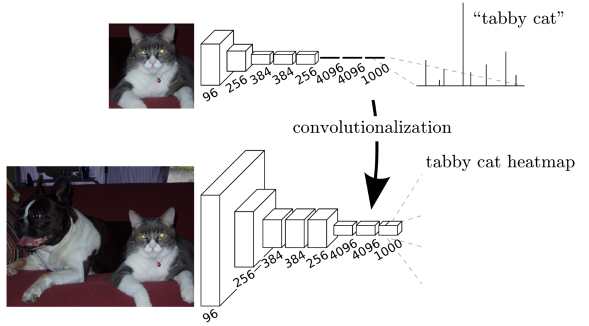
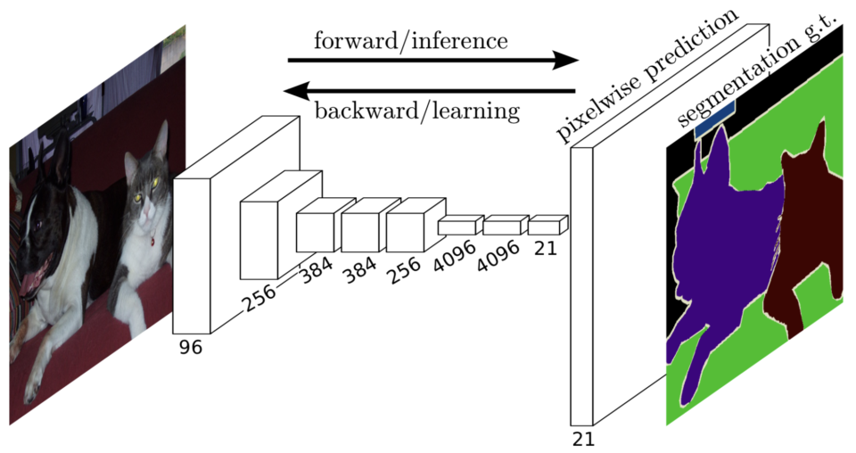
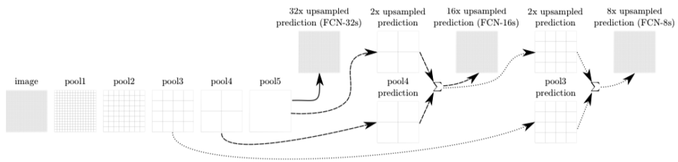
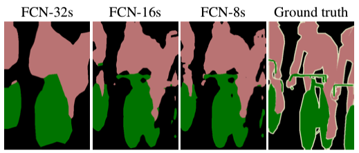
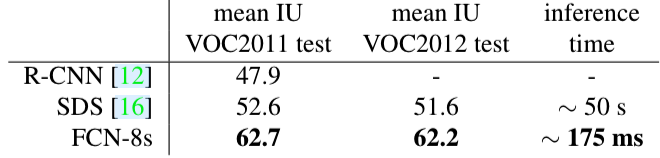
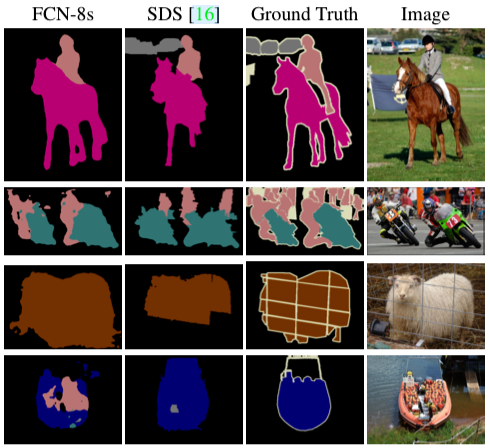

In 2014, Jonathan Long et al. from UC Berkeley published a paper on FCN (Fully Convolutional Networks), a semantic segmentation model that classifies each pixel in an image. 

As the name suggests, FCN uses convolutional layers and has no fully-connected layers, which was innovative then. This article explains the architecture of FCN.

## FCN Architecture

### From Image Classification to Semantic Segmentation

They transformed image classification networks into __fully-convolutional__ networks for segmentation tasks. They used networks like AlexNet, VGG, and GoogLeNet (pre-trained on ImageNet) because those image classification models could extract features from input images very well. Below is a typical image classification network architecture:

<figure class="wp-block-image size-large is-resized"><figcaption>Figure 2 (upper) of <a href="https://arxiv.org/abs/1411.4038" rel="noopener nofollow" target="_blank" title="the paper">the paper</a></figcaption></figure>

The convolutional layers process input images to extract features, and the last few fully-connected layers transform extracted features into class predictions for each image. In the case of ImageNet, there are 1000 classes, so models produced 1000 predictions per image.

As fully-connected layers expect fixed-sized inputs, the input image size has to be pre-adjusted before being given to the network. Many image classifiers trained on ImageNet assume the input size of 224 x 224 (i.e., we must resize images to the expected size). So, image classification networks take fixed-size inputs and produce non-spatial outputs.

However, semantic segmentation networks need to accept variable-size inputs and produce per-pixel predictions in the original input size. For example, Pascal VOC 2012 dataset defines 12 classes, which means a semantic segmentation model needs to predict 21 values for each pixel in the original input size. So, the fixed input size requirement is not convenient for semantic segmentation tasks.

Therefore, they transformed image classification networks into fully convolutional, making them capable of working with any input size. As such, they call the transformation __convolutionalization__.

### FCN Convolutionalization

They replaced fully-connected layers with 1 x 1 convolutional layers. As shown in the below diagram, convolutionalization makes the model work with the original image size.

<figure class="wp-block-image size-large is-resized"><figcaption>Figure 2 of the <a href="https://arxiv.org/abs/1411.4038" rel="noopener nofollow" target="_blank" title="paper">paper</a></figcaption></figure>

Although a fully convolutional network works with various input sizes, we still have a coarse feature map, which is not convenient for producing pixel-wise predictions in the original input size. We need to upsample the coarse outputs to dense pixels.

### Upsampling for Pixel-wise Predictions

They used simple bilinear interpolation to upsample the final feature map to the original input size.

<figure class="wp-block-image size-large is-resized"><figcaption>Figure 1 of the <a href="https://arxiv.org/abs/1411.4038" rel="noopener nofollow" target="_blank" title="paper">paper</a></figcaption></figure>

Bi-linear upsampling is simple and fast. However, as mentioned in the paper, we could also use other upsampling methods like transposed convolution. 

<blockquote>
Note that the deconvolution filter in such a layer need not be fixed (e.g., to bilinear upsampling), but can be learned. A stack of deconvolution layers and activation functions can even learn a nonlinear upsampling.
In our experiments, we find that in-network upsampling is fast and effective for learning dense prediction.<cite>Source: the <a href="https://arxiv.org/abs/1411.4038" rel="noreferrer noopener" target="_blank">paper</a></cite></blockquote>

As we can see in the above image, the final feature map has 21 channels (as for 21 classes in Pascal VOC), and the upsampled feature map has the same size as the original input. So, we have pixel-wise predictions in the original input size, which allows us to calculate loss and back-propagate it through the network for end-to-end training.

However, upsampling from a coarse feature map to the original size does not convey fine details. So, they fused finer feature maps from earlier convolutional layers into the final feature map.

### FCN-32s, FCN-16s, FCN-8s

Since we need to 32x-upsample the final feature map to match the original input size, we call the base version FCN-32s. The FCN-16s model 2x-upsamples the final feature map and adds it to the feature map from a previous layer, then 16x-upsamples the fused feature map to the original input size. The FCN-8s model 2x upsamples the final feature map of the FCN-16s model and adds it to the feature map from an even earlier layer, then 8x upsamples the fused feature map to the original input size.

<figure class="wp-block-image size-large"><figcaption>Figure 3 of the <a href="https://arxiv.org/abs/1411.4038" rel="noopener nofollow" target="_blank" title="the paper">paper</a></figcaption></figure>

The images below show that fusing finer details into the final feature map improves performance.

<figure class="wp-block-image size-full"><figcaption>Figure 4 of the <a href="https://arxiv.org/abs/1411.4038" rel="noopener nofollow" target="_blank" title="the paper">paper</a></figcaption></figure>

## Conclusion

FCN was faster and outperformed other segmentation models, thanks to the fully convolutional approach.

<figure class="wp-block-image size-full"><figcaption>Table 3 of the <a href="https://arxiv.org/abs/1411.4038" rel="noopener nofollow" target="_blank" title="the paper">paper</a></figcaption></figure>

<figure class="wp-block-image size-full"><figcaption>Figure 6 of the <a href="https://arxiv.org/abs/1411.4038" rel="noopener nofollow" target="_blank" title="the paper">paper</a></figcaption></figure>

From today's standpoint, FCN's outputs are still rough compared with later models like <a href="semantic-segmentation-with-deeplab-v3/" rel="noopener" target="_blank" title="DeepLab">DeepLab v3</a>. We can use FCN with better image classification networks like <a href="https://pytorch.org/hub/pytorch_vision_fcn_resnet101/" rel="noopener nofollow" target="_blank" title="ResNet">ResNet</a> backbone to improve the performance. However, we should remember that the main contribution of the FCN paper is that it proposed a simple way to adopt robust image classification networks into segmentation tasks and paved the way for others to follow.

## References

- [Fully Convolutional Networks for Semantic Segmentation](https://arxiv.org/abs/1411.4038) \
  Jonathan Long, Even Shelhamer, Trevor Darrell (UC Berkeley)
- [FPN: Feature Pyramid Networks (2016)](/blog/2022-08-21-fpn-2016)
- [DeepLab v3: Semantic Segmentation (2017)](/blog/2022-09-04-semantic-segmentation-with-deeplab-v3/)
- [Upsampling with Transposed Convolution](/blog/2017-11-14-up-sampling-with-transposed-convolution/)
- [PyTorch FCN with ResNet-50 and ResNet-101 backbones](https://pytorch.org/hub/pytorch_vision_fcn_resnet101/)
