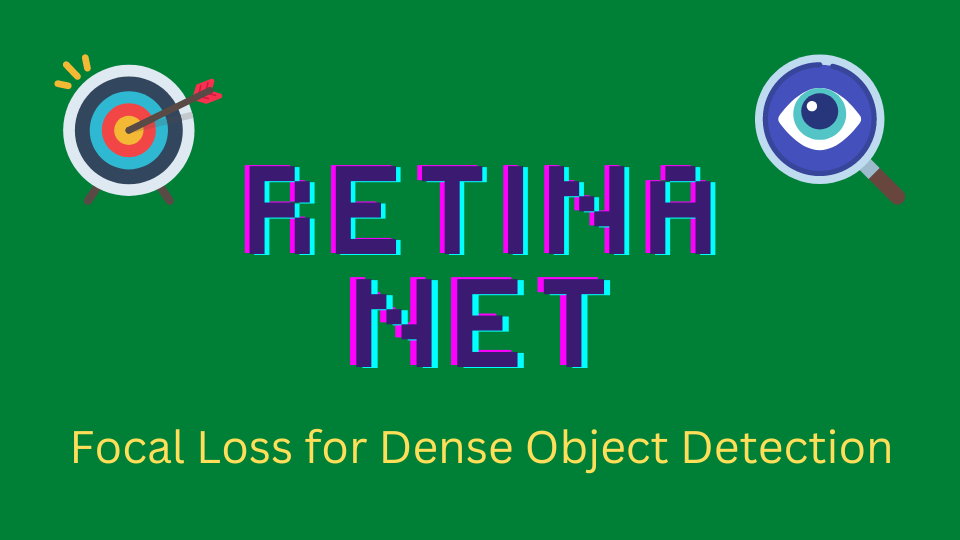
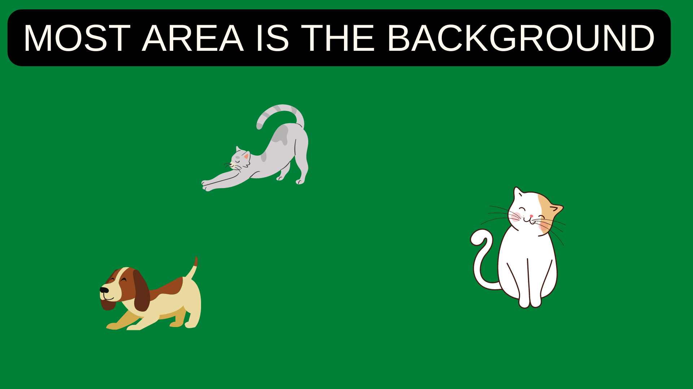

Why are two-stage detectors more accurate than one-stage detectors? Can we build a one-stage detector that is faster and more accurate than two-stage detectors? To answer the question, Tsung-Yi Lin et al. developed **RetinaNet**: a one-stage detector trained with Focal Loss. The co-authors include Ross Girshick and Kaiming He, who published papers on two-stage detectors, most notably Faster R-CNN. They analyzed why one-stage detectors like [YOLO](/blog/2022-08-10-yolo-v2-yolo9000/) and [SSD](/blog/2022-07-31-ssd-single-shot-multibox-detector/) (while being faster) do not achieve better accuracy than two-stage detectors.

They concluded that the significant imbalance between the object and background classes is the main culprit as to why one-stage detectors do not perform as well as two-stage detectors. So, they developed a new loss function called Focal Loss which focuses training on objects instead of overwhelming background areas.

This article explains why the class imbalance degrades the one-stage detectors and discusses how RetinaNet with Focal Loss overcomes the issue.

## Issue: Class Imbalance

When easily classified background examples dominate training images, the learning process becomes inefficient. Also, easy negatives overwhelm the model to degenerate, like predicting the background more often than not.

{width="75%"}

Both one-stage and two-stage detectors see the same input images. Yet, two-stage detectors perform better. Faster R-CNN and variants of it, such as [Feature Pyramid Network](/blog/2022-08-21-fpn-2016/) and [Mask R-CNN](/blog/2022-10-18-mask-r-cnn-faster-r-cnn-mask-branch-2017/), are all two-stage detectors and achieve top accuracy on the COCO benchmark.

The class imbalance appears to cause more issues for one-stage detectors. In other words, two-stage detectors are less susceptible to the extreme foreground-background class imbalance. R-CNN-like detectors must somehow address the class imbalance differently.

### Faster R-CNN: Region Proposal

The first stage of two-stage detectors generates candidate object locations, and the second stage classifies each location as one of the foreground classes or background. The region proposal eliminates most of the background, and the classifier sees more objects.

](images/Faster-R-CNN-fig-2.png){width="75%"}

### Faster R-CNN: Biased Sampling

When training the classifier, they use __biased sampling__ to construct mini-batches that ensure a specific ratio of positive examples. For example, there is one object per every three background samples.

### YOLO and SSD: Dense Prediction

On the contrary, one-stage detectors must classify every spatial location with various scales and aspect ratios, most of which are false positives.

](images/YOLO-fig-2-top-middle.png){width="50%"}

Therefore, easily classified background examples still dominate the training procedure.

## Solution: Focal Loss

The focal loss function dynamically scales cross-entropy loss, where the scaling factor decays to zero as confidence in the correct class increases. As it's easy to classify the background, the scaling factor tends to be smaller for them, and the loss has less impact. For the object classes, the loss becomes relatively more significant. Therefore, the training focuses on object classes than the background. It effectively works like region proposal and biased sampling combined.

### Binary Cross-Entropy

The paper explains the formulation of the focal loss using a binary classification case:

$$
\begin{equation}
\text{CE}(p, y) =
 \begin{cases}
 −\log(p) \qquad \quad \text{if} \ y = 1 \\
 − \log(1 − p) \quad \ \text{if} \ y = -1
 \end{cases}  
\end{equation}
$$

- y is the ground truth class (label), and it's either y = 1 or y = -1
- p is an estimated probability for label y = 1 with the range of [0, 1].

### Balanced Cross-Entropy

We can introduce a weighting factor α for class 1 and (1 - α) for class -1.

$$
\begin{equation}
\text{Balanced CE}(p, y) =
 \begin{cases}
 −\alpha \log(p) \qquad \qquad \quad \ \ \text{if} \ y = 1 \\
 −(1- \alpha) \log(1 − p) \quad \ \text{if} \ y = -1
 \end{cases}
\end{equation}
$$

The range of α is [0, 1]. When α is more than 0.5, class 1 has more weight than class -1. Hence, the loss value for class -1 becomes less overall. For example, we can think of class -1 as an easy-to-classify class like the background and use α to reduce the loss values on it. They used the balanced cross-entropy as an experimental baseline for Focal Loss.

### Notation Simplification

For simplicity, we define $p_t$ as the estimated probability of ground truth:

$$
\begin{equation}
p_t =
 \begin{cases}
 −\log(p) \qquad \quad \text{if} \ y = 1 \\
 − \log(1 − p) \quad \ \text{if} \ y = -1
 \end{cases}
\end{equation}
$$

So, $p\_t$ gives the probability of class 1 when the ground truth is 1 and the probability of class -1 when the ground truth is -1.

Then, we can rewrite the cross-entropy as follows:

$$
\text{CE}(p, y) = \text{CE}(p_t) = − \log(p_t)
$$

Also, we can rewrite the balanced cross-entropy as follows:

$$
\begin{equation}
\alpha_t =
 \begin{cases}
 \alpha \qquad \ \ \text{if} \\ y = 1 \\
 1 - \alpha \quad \ \text{if} \ y = -1
 \end{cases}
\end{equation}
$$

Therefore, 

$$
\text{Balanced CE}(p, y) = \text{Balanced CE}(p_t) = −\alpha_t \, \log(p_t)
$$

### Focal Loss

The idea of Focal Loss is to dynamically put less weight on easy-to-classify classes. So, they incorporate the estimated probability to modulate the weighing factor.

$$
\alpha_t = (1 - p_t)^\gamma
$$

When the estimated probability is high ($p_t \gt 0.5$), the model is more confident about the prediction (i.e., easier-to-classify examples like the background), and the weighting factor becomes smaller.

The focusing parameter γ≥0 is a hyper-parameter and allows us to adjust the rate at which easy examples are down-weighted smoothly. When γ, Focal Loss is equivalent to the plain cross-entropy. Increasing γ increases the effect of the modulating factor. They found γ = 2 to work best in their experiments.

Now, we can define Focal Loss as follows:

$$
\text{FL}(p_t) = −(1 − p_t)^\gamma \log(p_t)
$$

The below figure visualizes the focal loss for several values of γ in \[0, 5\].

](images/fig-1.png){width="75%"}

The blue line (γ = 0) is the plain cross-entropy. As γ increases, the loss reduction curve over the probability of the ground truth class becomes steeper. For well-classified (high-confidence) examples (i.e., more than 0.6 probability), the loss values are closer to zero.

## RetinaNet

### RetinaNet Architecture

They developed and trained RetinaNet to prove the effectiveness of the Focal Loss with the one-stage detector. RetinaNet consists of a backbone network and two task-specific sub-networks.

*   The backbone computes convolutional feature maps over an entire input image.
*   The first subnet classifies anchor boxes.
*   The second subnet regresses anchor boxes (toward ground truth bounding boxes).

The backbone is an FPN (Feature Pyramid Network) on top of ResNet. Both subnets are convolutional.

](images/fig-3.png)

### Object Detection Results

Object detection results on the COCO test dataset show that the RetinaNeXt-101-FPN model achieves top results, outperforming both one-stage and two-stage models.

](images/tab-2.png)

The below figure shows the speed vs. accuracy of RetinaNet and other models on the COCO test dataset. RetinaNet models outperform all previous one-stage and two-stage detectors. Also, RetinaNet models are faster than other models with similar accuracy.

](images/fig-2.png){width="80%"}

Interestingly, this figure does not show the area where YOLOv2 resides, as the paper explains:

> Ignoring the low-accuracy regime (AP&lt;25), RetinaNet forms an upper envelope of all current detectors, and an improved variant (not shown) achieves 40.8 AP.
<cite>Source: Figure 2 of [the paper](https://arxiv.org/abs/1708.02002)</cite>

I wonder what Joseph Redmon (who developed the original YOLO) thought about the figure when he read the paper that indicates YOLOv2 is a lot faster but not accurate enough to be included in the comparison. I can't read his mind, but if you read [the YOLOv3 paper](https://arxiv.org/abs/1804.02767), the exact figure appears with YOLOv3 on it. 

## References

- [Faster R-CNN](/blog/2022-07-11-faster-r-cnn-rpn/)
- [YOLOv2: Better, Faster, Stronger](/blog/2022-08-10-yolo-v2-yolo9000/)
- [SSD: Single Shot MultiBox Detector](/blog/2022-07-31-ssd-single-shot-multibox-detector/)
- [Focal Loss for Dense Object Detection](https://arxiv.org/abs/1708.02002) \
  Tsung-Yi Lin, Priya Goyal, Ross Girshick, Kaiming He, Piotr Dollár
- [YOLOv3: An Incremental Improvement](https://arxiv.org/abs/1804.02767) \
  Joseph Redmon, Ali Farhadi
