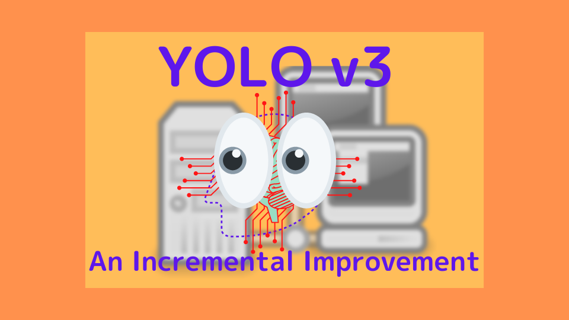
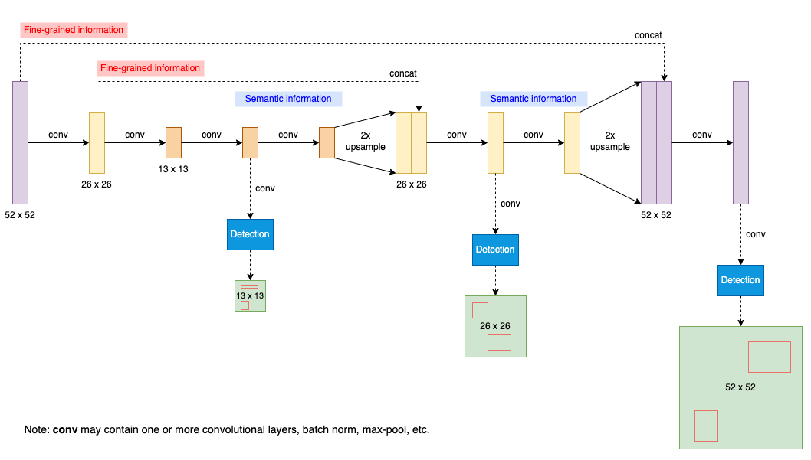

YOLOv3 is the last version of YOLO on which Joseph Redmon worked. After this, he abandoned YOLO and computer vision research altogether. We can read some of his reasoning for his decision in this paper. 

This article visits each section of the YOLOv3 paper and summarizes what he has to say.

## Abstract and Introduction

The YOLOv3 paper has a bit of a desperate vibe to it. The abstract starts with the following happy but somewhat melancholy tone:

> We present some updates to YOLO! We made a bunch of little design changes to make it better. We also trained this new network that’s pretty swell. It’s a little bigger than last time but more accurate. It’s still fast though, don’t worry.
<cite>Source: [the paper](https://arxiv.org/abs/1804.02767)</cite>

The same tone continues into the introduction:

> Sometimes you just kinda phone it in for a year, you know? I didn’t do a whole lot of research this year. Spent a lot of time on Twitter. Played around with GANs a little.
<cite>Source: [the paper](https://arxiv.org/abs/1804.02767)</cite>

He does not sound very positive about his work on YOLOv3.

> I managed to make some improvements to YOLO. But, honestly, nothing like super interesting, just a bunch of small changes that make it better.
<cite>Source: [the paper](https://arxiv.org/abs/1804.02767)</cite>

## The Deal

In section 2: **The Deal**, Joseph Redmon explains what YOLOv3 is:

> So here’s the deal with YOLOv3: We mostly took good ideas from other people. We also trained a new classifier network that’s better than the other ones. We’ll just take you through the whole system from scratch so you can understand it all.
<cite>Source: [the paper](https://arxiv.org/abs/1804.02767)</cite>

### Bounding Box Prediction

As in YOLOv2, YOLOv3 predicts four coordinates for each bounding box. The central location is offset from the top-left corner of the image (c\_x and c\_y) plus offset from the top-left corner of the cell, which is calculated using a sigmoid function:

$$
\begin{align}
b_x &= \sigma(t_x) + c_x \\
b_y &= \sigma(t_y) + c_y
\end{align}
$$

Note: $t_x$ and $t_y$ are the outputs of the model.

Again, as in YOLOv2, YOLOv3 calculates the width and height of the bounding box based on the anchor box size ($p_w$ and $p_h$). Anchor boxes are bounding box priors from the k-means cluster centroids (nothing changes here as well).

$$
\begin{align}
b_w &= p_w e^{t_w} \\
b_h &= p_h e^{t_h}
\end{align}
$$

Note: $t_w$ and $t_h$ are the outputs of the model.

 (the same as Figure 4 of the YOLOv2 paper)](images/fig-2.png)

You can read more details on YOLOv2's bounding box prediction [here](/blog/2022-08-10-yolo-v2-yolo9000/).

### Class Prediction

YOLOv3 predicts class probabilities for each bounding box using multi-label classification in that they use logistic classifiers (one sigmoid per class). During training, they calculate binary cross-entropy loss for class predictions. This approach allows overlapping labels like those found in the Open Image Datasets (i.e., Woman and Person).

### Predictions Across Scales

YOLOv3 predicts bounding boxes at three different scales, using a similar concept to feature pyramid networks to combine semantic features with earlier finer-grained features:

The detection layers are all convolutional, taking features at different scales to produce 3-D tensors, encoding bounding box (4 offsets), objectness (1 value), and class predictions (80 classes for COCO). As YOLOv3 predicts three bounding boxes at each scale, the output 3-D tensor has the following shape:

$$
N \times N \times [3 \times (4 + 1 + 80)]
$$

N x N is one of the scales from 13 x 13, 26 x 26, and 52 x 52. For larger scales, YOLOv3 upsamples the previous feature map and concatenates the earlier feature map of equivalent size. The method gets more semantic information from the upsampled features and finer-grained information from the earlier feature map. As such, the last and largest scale benefits from all prior computation and fine-grained features early on in the network.

### Feature Extractor

They introduced a new network called Darknet-53. It has successive 3 x 3 and 1 x 1 convolutional layers with shortcut connections (to support more layers).

](images/tab-1.png)

More layers make it more accurate than Darknet-19 from YOLOv2 and more efficient than ResNet-101 / 152 with comparable accuracy. The below table shows the ImageNet result comparison:

](images/tab-2.png)

Darknet-53 achieves the highest measured floating-point operations per second (billion floating-point operations&nbsp;per second; BFLOPS/s). The network structure better utilizes the GPU, making it more efficient to evaluate (faster).

### Training

Their training does not change since YOLOv2. They train on full images with no hard-negative mining, data augmentation, batch normalization, etc.

## How We Do

### YOLOv3 Performance Comparison

Joseph Redmon shows the below table explaining how YOLOv3 performs:

](images/tab-3.png)

>In terms of COCOs weird average mean AP metric it is on par with the SSD variants but is 3× faster. It is still quite a bit behind other models like RetinaNet in this metric though.
<cite>Source: [the paper](https://arxiv.org/abs/1804.02767)</cite>

<h3>The Updated COCO AP</h3>

He's talking about the AP metric, which is the updated COCO average AP between .5 and .95 IoU metric (mAP@\[.5:.95\]). It is an average mAP over different IoU thresholds, from 0.5 to 0.95, step 0.05 (0.5, 0.55, 0.6, 0.65, 0.7, 0.75, 0.8, 0.85, 0.9, 0.95). For higher IoU thresholds, estimated bounding boxes must be very close to the ground truth locations. With the mAP@\[.5:.95\] benchmark, YOLOv3 does not perform as well as the results with the AP@.5 (the original COCO AP benchmark).

> This indicates that YOLOv3 is a very strong detector that excels at producing decent boxes for ob- jects. However, performance drops significantly as the IOU threshold increases indicating YOLOv3 struggles to get the boxes perfectly aligned with the object.
<cite>Source: [the paper](https://arxiv.org/abs/1804.02767)</cite>

### Tables and Figures from the Focal Loss Paper

He adopted the above table from the Focal Loss paper shown below:

](images/RetinaNet-tab-2.png)

> I’m seriously just stealing all these tables from [9] they take soooo long to make from scratch. Ok, YOLOv3 is doing alright. Keep in mind that RetinaNet has like 3.8× longer to process an image. YOLOv3 is much better than SSD variants and comparable to state-of-the-art models on the AP50 metric.
<cite>Source: [the paper](https://arxiv.org/abs/1804.02767)</cite>

He also adapted the below figure from the Focal Loss ([RetinaNet](/blog/2022-10-22-retinanet-focal-loss/)) paper. It shows that YOLOv3 runs significantly faster than other object detection models, but the accuracy is not as good as RetinaNet models (based on the updated AP metric).

](images/fig-1.png)

Below is the original chart from the Focal Loss paper. The right-side table mentions YOLOv2 but does not show the area where YOLOv2 resides in the figure.

](images/RetinaNet-fig-2.png){width="80%"}

The Focal Loss paper explains why they don't show YOLOv2 in the figure.

> Ignoring the low-accuracy regime ($AP \lt 25$), RetinaNet forms an upper envelope of all current detectors, and an improved variant (not shown) achieves 40.8 AP.
<cite>Source: [the Focal Loss paper](https://arxiv.org/abs/1708.02002)</cite>

It means YOLOv2 is not accurate enough to be included in the comparison (again, this is with the mAP@[.5:.95] metric). 

Joseph Redmon is not happy with the updated metric. He included the figure below to show that YOLOv3 models are faster and more accurate with the mAP-50 (mAP@0.5) benchmark. In this figure, YOLOv3 models are faster than equally accurate RetinaNet models with the original benchmark.

](images/fig-3.png){width="80%"}

## Things We Tried That Didn't Work

They tried the following when working on YOLOv3:

### Anchor Box x,y Offset Predictions

They tried the anchor box prediction mechanism, predicting the x and y offset as a multiple of the box width/height using a linear activation. This formulation decreased model stability and didn't work well.

### Linear x, y Predictions instead of Logistic

They tried a linear activation to predict the x and y offset directly, which caused a few-point drop in mAP.

### Focal Loss

They tried Focal Loss, and it dropped mAP by about 2 points. Perhaps, YOLOv3 is already robust against the class imbalance problem ([here](/blog/2022-10-22-retinanet-focal-loss/#solution-focal-loss) is the detail). They are not sure why this is the case.

> YOLOv3 may already be robust to the problem focal loss is trying to solve because it has separate objectness predictions and conditional class predictions. Thus for most examples there is no loss from the class predictions? Or something? We aren’t totally sure.
<cite>Source: [the paper](https://arxiv.org/abs/1804.02767)</cite>

### Dual IoU Threshold and Truth Assignment

Faster R-CNN uses two IoU thresholds during training. If a prediction overlaps the ground truth by 0.7, they treat it as a positive example. If a prediction overlaps the ground truth by less than 0.3 for all ground truth objects, they treat it as a negative example. They ignore everything else. Joseph Redmon tried a similar strategy but didn't produce any good results.

## What This All Means

### COCO benchmark change

In section 5, **What This All Means**, Joseph Redmon complains about the switch to the updated COCO AP metric.

> YOLOv3 is a good detector. It’s fast, it’s accurate. It’s not as great on the COCO average AP between .5 and .95 IOU metric. But it’s very good on the old detection metric of .5 IOU.
<cite>Source: [the paper](https://arxiv.org/abs/1804.02767)</cite>

He questions why they updated the COCO metric:

> Why did we switch metrics anyway?
<cite>Source: [the paper](https://arxiv.org/abs/1804.02767)</cite>

> Russakovsky et al report that that humans have a hard time distinguishing an IOU of .3 from .5! “Training humans to visually inspect a bounding box with IOU of 0.3 and distinguish it from one with IOU 0.5 is surprisingly difficult.” [18] If humans have a hard time telling the difference, how much does it matter?
<cite>Source: [the paper](https://arxiv.org/abs/1804.02767)</cite>

### Social Media and the Military

He extends his complaints towards Google and Facebook.

> But maybe a better question is: “What are we going to do with these detectors now that we have them?” A lot of the people doing this research are at Google and Facebook. I guess at least we know the technology is in good hands and definitely won’t be used to harvest your personal information and sell it to.... wait, you’re saying that’s exactly what it will be used for?? Oh.
<cite>Source: [the paper](https://arxiv.org/abs/1804.02767)</cite>

Then, he complains about the military.

> Well the other people heavily funding vision research are the military and they’ve never done anything horrible like killing lots of people with new technology oh wait.....
<cite>Source: [the paper](https://arxiv.org/abs/1804.02767)</cite>

Ironically, the footnote says:

> The author is funded by the Office of Naval Research and Google.
<cite>Source: [the paper](https://arxiv.org/abs/1804.02767)</cite>

The below seems to be the main reason why he quits.

> I have a lot of hope that most of the people using computer vision are just doing happy, good stuff with it, like counting the number of zebras in a national park [13], or tracking their cat as it wanders around their house [19]. But computer vision is already being put to questionable use and as researchers we have a responsibility to at least consider the harm our work might be doing and think of ways to mitigate it. We owe the world that much.
<cite>Source: [the paper](https://arxiv.org/abs/1804.02767)</cite>

He closes the paper with this sentence:

> In closing, do not @ me. (Because I finally quit Twitter).
<cite>Source: [the paper](https://arxiv.org/abs/1804.02767)</cite>

Though, it doesn't seem that he altogether quit Twitter.

<blockquote class="twitter-tweet">
Brief return for some personal news: while you may know I don’t do CV research anymore, you may not know that I’m a performing circus artist. Check out our show this weekend in person if you happen to live in Bellingham, WA or on the live stream Saturday!<a href="https://t.co/N2exTwan8h">https://t.co/N2exTwan8h</a>
&mdash; Joseph Redmon (@pjreddie) <a href="https://twitter.com/pjreddie/status/1504180525656801280?ref_src=twsrc%5Etfw">March 16, 2022</a></blockquote> 

## Rebuttal

On the last page of the paper, Joseph Redmon put a point-by-point rebuttal for Reddit commenters and the like. You may find it insightful and entertaining. Here is one example:

> Reviewer #4 AKA JudasAdventus on Reddit writes “Entertaining read but the arguments against the MSCOCO metrics seem a bit weak”. 
<cite>Source: [the paper](https://arxiv.org/abs/1804.02767)</cite>

Joseph Redmon replies with sarcasm and humor:

> Well, I always knew you would be the one to turn on me Judas. You know how when you work on a project and it only comes out alright so you have to figure out some way to justify how what you did actually was pretty cool? I was basically trying to do that and I lashed out at the COCO metrics a little bit. But now that I’ve staked out this hill I may as well die on it.
<cite>Source: [the paper](https://arxiv.org/abs/1804.02767)</cite>

## References

- [YOLO: You Look Only Once (The 1st Version)](/blog/2022-07-26-yolo-version-1/)
- [YOLOv2: Better, Faster, Stronger](/blog/2022-08-10-yolo-v2-yolo9000/)
- [YOLOv5: Object Detection Made Easy with PyTorch Hub](/blog/2022-05-08-yolov5-pytorch/)
- [YOLOv5 Transfer Learning In Simple Steps Without Losing Your Mind](/blog/2022-05-10-yolov5-transfer-learning-dogs-cats/)
- [YOLOv3: An Incremental Improvement](https://arxiv.org/abs/1804.02767) \
  Joseph Redmon, Ali Farhadi
