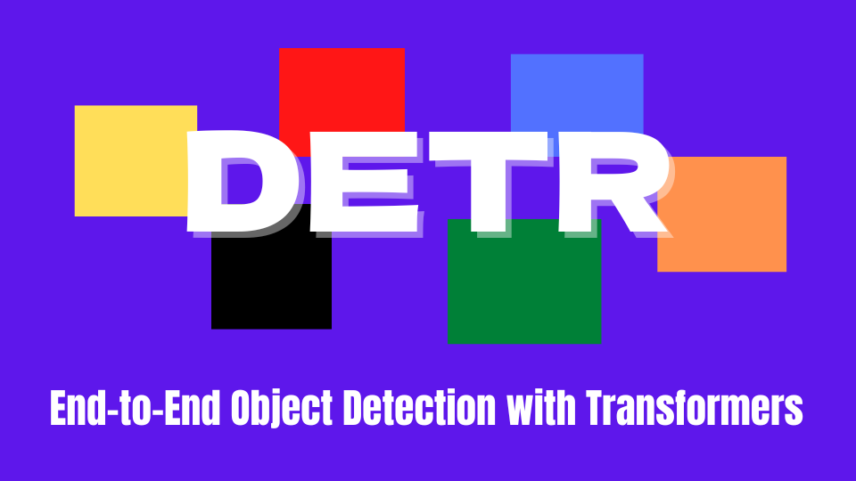
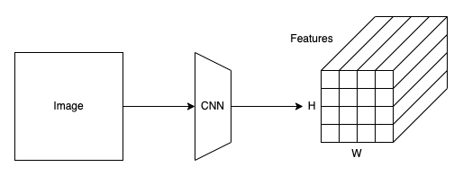
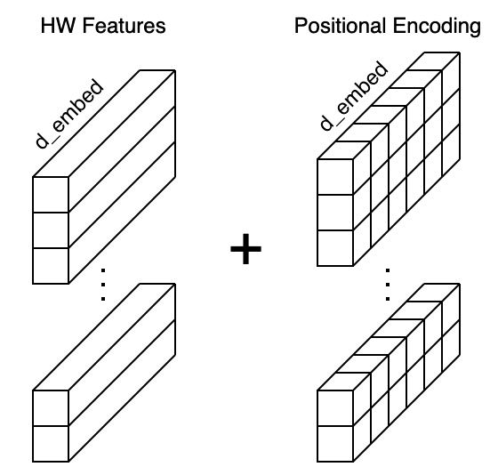
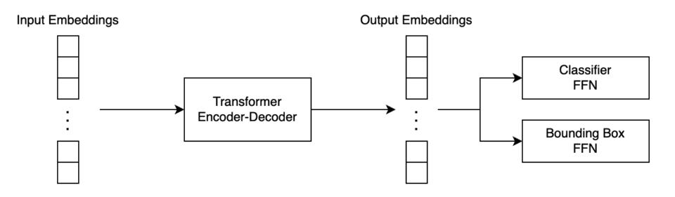
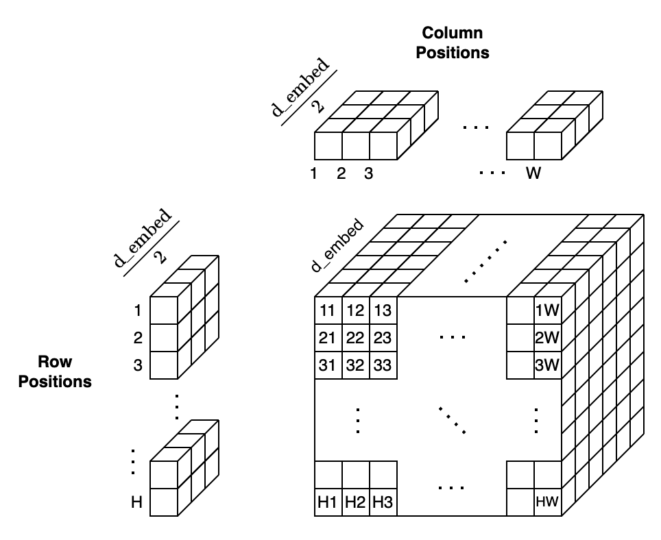

In 2020, Meta (Facebook) AI built a new object detection model using [the Transformer's encoder and decoder architecture](/blog/2021-12-13-transformers-encoder-decoder/). They named it **DETR**(**DE**tection **TR**ansformer). Unlike [YOLO](/blog/2022-10-24-yolov3-2018/) and [Faster R-CNN](/blog/2022-07-11-faster-r-cnn-rpn), it does not require box priors ([anchors](/blog/2022-07-11-faster-r-cnn-rpn/#anchor-boxes)) and post-processing ([NMS](/blog/2022-06-01-object-detection-non-maximum-suppression/)). However, DETR performs on par with Faster R-CNN on the COCO object detection dataset.

This article explains how DETR works.

## DETR Architecture

### Overview of the Pipeline

DETR has three major components:

- A Convolutional Neural Network (CNN) Backbone
- A Transformer's Encoder-Decoder
- Feed-forward Networks (FFN)

Note: I ignore the batch dimension in what follows to keep the discussion simple.

Like YOLO and Faster R-CNN, DETR extracts image features using a CNN backbone. 



Suppose an input image shape is 3 x 800 x 960 (C x H x W), and the backbone is ResNet50. Then, this step would produce a 2048 x 25 x 30 tensor. The resulting feature map size is reduced by 32 from the image size since the backbone has five max-pooling layers. After this, DETR uses a 1 x 1 convolution to reduce the feature dimension from 2048 to 256. So, each grid cell location in the feature map has a vector of 256 values. In the following discussion, I'll call the number of elements in a feature vector __d\_embed__.

DETR flattens the H x W feature map to HW feature vectors and adds positional encodings to each feature vector. Since the Transformer's encoder is permutation invariant and does not have a built-in structure to handle positional information, we must enrich each feature vector with the positional encoding (more details later).

{width="50%"}

Then, DETR passes the input embeddings to the Transformer's encoder-decoder, which generates output embeddings. Finally, DETR passes each output embedding to classifier FFN and bounding box FFN for producing the final predictions.



Therefore, as you can see, there are no anchors or NMS, unlike YOLO and Faster R-CNN, and the pipeline is pretty simple. However, I explained here a zoomed-out overview as I skipped details like how DETR performs 2D positional encoding, which we'll see in the next section.

### 2D Positional Encoding

DETR uses a fixed positional encoding similar to the one used in the original Transformer, which you can read about [here](/blog/2021-10-31-transformers-positional-encoding/). However, the original Transformer handles word sequences where the word positions are one-dimensional. On the contrary, DETR handles a grid of feature vectors where the grid cell positions are two-dimensional. 

DETR encodes row and column positions separately in the half-size $d_\text{embed} / 2$. Then, it creates permutations of row and column position encodings. A pair of a row position and a column position is a concatenation of the row positional encoding and the column positional encoding.

{width="75%"}

As a result, DETR encodes H x W positions into positional encodings and can add them to the input embeddings.

{width="50%"}

Accordingly, figure 2 from the paper (below) shows the entire pipeline. We can see that the backbone generates a set of image features, and DETR adds positional encoding to them.

](images/fig-2.png)

The Transformer's encoder enriches embeddings through the multi-head self-attention layers. If you are unfamiliar with that, you may want to read the related article [here](/blog/2021-11-15-transformers-self-attention/). One notable difference from the original encoder is that DETR adds the positional encodings to the input of each multi-head attention layer, which is not clear from the above diagram, so I quote the below from the paper:

> Since the transformer architecture is permutation-invariant, we supplement it with fixed positional encodings [31,3] that are added to the input of each attention layer.
<cite>Source: [the paper](https://arxiv.org/abs/2005.12872)</cite>

Moreover, the decoder also has a notable difference from the original Transformer. We see __object queries__ in the above figure, for which we should first discuss parallel decoding.

### Parallel Decoding

The original Transformer is a translator, and the decoder is auto-regressive, meaning it processes a series of embeddings in order, one embedding at a time, using outputs from previous ones as input to predict the next. 

For example, suppose it translates an English sentence to French. It first produces a French output given the SOS (start-of-sentence) marker and the embeddings from the English sentence. The next iteration produces the second French output, given all the previous inputs and the first French output. Then, it produces the third French output, given all the previous inputs and the second French output. The process repeatedly iterates until it spits out the EOS (end-of-sentence) marker.


However, this approach has a very high inference cost (proportional to output length and hard to batch). Moreover, object detection is not a sequence prediction problem. Instead, it's a set prediction problem. Therefore, DETR's decoder uses parallel decoding, handling all input embeddings in parallel. As such, DETR performs a direct set prediction, producing a set of object predictions (bounding boxes and classes) from the input image features (embeddings from the encoder).

Then, the question is how to ask the decoder to produce output embeddings for different objects. Suppose we want the decoder to generate output embeddings for 100 objects, and we are not sequentially feeding one feature embedding at a time to it. We are asking the decoder to do it all at once.

It is where object queries come in.

### Object Queries

In the English-French translation example, the original Transformer's decoder receives all previous inputs and the final output from the decoder. These input embeddings are nothing but hints for the decoder to produce the subsequent output. Similarly, DETR's decoder needs hints to product output embeddings.

Intuitively speaking, those hints should work like how anchors give priors for bounding box locations, size, and aspect ratios in Faster R-CNN and YOLO. It's like we are querying the decoder to find objects with some prior knowledge of how to look for them. As such, we call input embeddings to the decoder __object queries__. 

Hence, the decoder receives the object queries as inputs and the image features (embeddings) from the encoder as contexts to produce output embeddings for the final detection stage. However, we don't know precisely how to formulate object queries. So, DETR needs to learn such embeddings.

Moreover, we must ensure all object queries are different since the decoder is permutation invariant, just like the encoder. In other words, we need some positional encoding in object queries. However, it does not seem easy to hand-engineer a mathematical formula to achieve that.

Then, we should make the network learn such encoding.

### Learned Positional Encoding

In DETR, they use learned embeddings, letting the network figure out how to differentiate N input embeddings and helping it produce the final predictions for multiple objects.

> These input embeddings are learned positional encodings that we refer to as object queries, and similarly to the encoder, we add them to the input of each attention layer.
<cite>Source: [the paper](https://arxiv.org/abs/2005.12872)</cite>

The DETR defines the object queries as an embedding layer. Below is an excerpt from the [DETR's source code](https://github.com/facebookresearch/detr). 

```python
class DETR(nn.Module:)
    """ This is the DETR module that performs object detection """
    def __init__(self, backbone, transformer, num_classes, num_queries, aux_loss=False):
        """ Initializes the model.
        Parameters:
            ...
            num_queries: number of object queries, ie detection slot. This is the maximal number of objects DETR can detect in a single image. For COCO, we recommend 100 queries.
            ...
        """
        super().__init__()
        ...
        self.query_embed = nn.Embedding(num_queries, hidden_dim)
        ...
```

Note: the hidden\_dim parameter in the source code is the same as what I call dim\_embed, and the query\_embed object is the embedding that learns how to handle object queries.

DETR adds object queries to the input of each multi-head attention layer, as shown in the below figure from the paper.

](images/fig-10.png)

All in all, the decoder reasons all objects together using pair-wise relations between them, using the whole image as context via embeddings from the encoder.

## DETR Training

### Direct Set Prediction

DETR infers a fixed-size set of N predictions in a single pass through the decoder. We must set N large enough to accommodate various numbers of objects in each image. This hyper-parameter encodes prior knowledge about the training images. 

DETR's direct set prediction approach means it must find one-to-one matching between a predicted set of objects and the ground truth set. In other words, we need to uniquely assign each prediction to a ground truth object. DETR defines the matching loss to find the best matches between predicted and ground truth objects.

](images/fig-1.png)

The matching process is similar to the heuristic assignment rules used to match proposals to ground truth objects in Faster R-CNN. However, DETR finds one-to-one matching for direct set prediction without duplicates and does not require post-processing to eliminate overlapping predictions.

### Matching Process

To assign each prediction to the closest ground truth, we define the matching loss and minimize the overall matching loss:

$$
\hat{\sigma} = \arg\min\limits_{\sigma \in \mathfrak{S}\_N} \sum_i^N \mathcal{L}_\text{match}(y_i, \hat{y}_{\sigma(i)})
$$

*   $y_i = (c_i, b_i)$: a ground truth object.
*   $c_i$ is a target class label which may be Ø.
*   $b_i$ is a vector for ground truth box coordinates (center x, center y, height, and width relative to the image size).
*   $\{y_i\}$ is a set of ground truth objects padded with ∅ (no object) when N > the number of objects.
*   $\hat{y}_i = (\hat{c}_i, \hat{b}_i)$: a predicted object.
*   $\hat{c}_i$ is a predicted class.
*   $\hat{b}_i$ is a predicted bounding box vector.
*   $\sigma(i)$ is an index within a particular permutation of N elements.

We search for a permutation of N elements $\sigma \in \mathfrak{S}_N$ that best matches the ground truth set. The matching loss between a pair of a ground truth object and a predicted object is defined as follows:

$$
\mathcal{L}_\text{match}(y_i, \hat{y}_{\sigma(i)}) = -\mathbb{1}_{\{c_i \ne Ø\}} \hat{p}_{\sigma_i}(c_i) + \mathbb{1}_{\{ c_i \ne Ø\}} \mathcal{L}_{\text{box}} (b_i, \hat{b}_{\sigma(i)})
$$

*   $\mathbb{1}_{\{c_i \ne Ø\}}$ is 1 when $c_i$ is not ∅.
*   $\hat{p}_{\sigma_i}(c_i)$ is probability of class $c_i$.
*   $\mathcal{L}_{\text{box}}(b_i, \hat{b}_{\sigma(i)})$ is a bounding-box loss.

The bounding box loss is a linear combination of the L1 loss and [the generalized IoU loss](https://arxiv.org/abs/1902.09630):

$$
\mathcal{L}_{\text{box}}(b_i, \hat{b}_{\sigma(i)}) = \lambda_\text{iou} \mathcal{L}_{\text{iou}} (b_i, \hat{b}_{\sigma(i)}) + \lambda_{L1} \| b_i - \hat{b}_{\sigma(i)} \|_1
$$

L1 loss is commonly used but has different scales for small and large boxes, even when their relative errors are similar. As such, they added the IoU loss to mitigate the issue. The two lambdas are hyper-parameters to balance the two losses. Also, DETR training uses normalized losses (by the number of objects inside the batch).

The matching loss uses [the Hungarian algorithm](https://arxiv.org/abs/1506.04878) to optimally assign predictions to ground truth objects.

### Hungarian Loss

Once we find the best match permutation of predicted objects, we compute the Hungarian loss function. The Hungarian loss is a linear combination of a negative log-likelihood for class prediction and a box loss defined above:

$$
\mathcal{L}_{\text{Hungarian}}(y, \hat{y}) = \sum_{i=1}^{N} \left[ -\log \hat{p}_{\hat{\sigma}(i)} (c_i) + \mathbb{1}_{c_i \ne Ø} \mathcal{L}_{\text{box}} (b_i, \hat{b}_{\hat{\sigma}}(i)) \right]
$$

In practice, they down-weight the log-probability term when $c_i = ∅$ by a factor of 10 to account for class imbalance. It is analogous to how the Faster R-CNN training procedure balances positive and negative proposals by subsampling.

Note: in the previous section, the matching loss uses probabilities instead of log probabilities to keep the class prediction term commensurable to the box loss, and they observed better empirical performances.

## DETR Performance

The below images are DETR's sample outputs from the paper.

](images/fig-6.png)

The below table compares DETR with Faster R-CNN with a ResNet-50 and ResNet-101 backbones on the COCO validation set.

](images/tab-1.png)

*   The top section shows results for Faster R-CNN models in Detectron2.
*   The middle section shows results for Faster R-CNN models with:
    *   GIoU (Generalized IoU)
    *   Random crops train-time augmentation
    *   Long 9x training schedule
*   The bottom section shows DETR models:
    *   DETR (ResNet-50)
    *   DETR-DC5 (ResNet-50 with dilated C5 stage)
    *   DETR-R101 (ResNet-101)
    *   DETR-DC5-R101 (ResNet-101 with dilated C5 stage)

So, Faster R-CNN in the middle section is a heavily tuned version and performs better than the Detectron2 version. DC5 stands for dilated C5 stage, which increases the feature resolution, improving performance for small objects. Models with R101 use ResNet-101, and other models use ResNet-50. Overall, DETR achieved comparable results with the heavily tuned Faster R-CNN.

## References

- [Transformer’s Encoder-Decoder](/blog/2021-12-13-transformers-encoder-decoder/)
- [Faster R-CNN](/blog/2022-07-11-faster-r-cnn-rpn/)
- [YOLOv3](/blog/2022-10-24-yolov3-2018/)
- [End-to-End Object Detection with Transformers](https://arxiv.org/abs/2005.12872) \
  Nicolas Carion, Francisco Massa, Gabriel Synnaeve, Nicolas Usunier, Alexander Kirillov, Sergey Zagoruyko
- [End-to-end people detection in crowded scenes](https://arxiv.org/abs/1506.04878) \
  Russell Stewart, Mykhaylo Andriluka
- [Generalized Intersection over Union: A Metric and A Loss for Bounding Box Regression](https://arxiv.org/abs/1902.09630) \
  Hamid Rezatofighi, Nathan Tsoi, JunYoung Gwak, Amir Sadeghian, Ian Reid, Silvio Savarese
