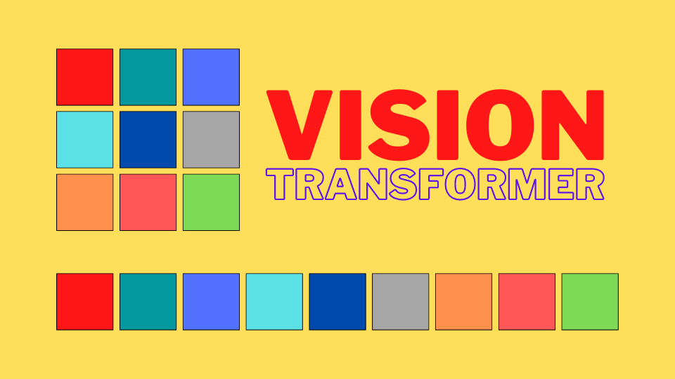

In 2020, the Google Brain team developed **Vision Transformer (ViT)**, an image classification model without a CNN (convolutional neural network). ViT directly applies a Transformer Encoder to sequences of image patches for classification. So, **ViT eliminated CNN from image classification tasks**.

This article explains how ViT works.

## Vision Transformer Architecture

### Vision Transformer Overview

The idea is simple: ViT splits an image into a sequence of image patch embeddings mixed with positional encoding and feeds them into a Transformer Encoder. ViT has a classification head (MLP - multi-layer perception), which produces the final prediction. The below figure shows an overview of Vision Transformer architecture.

](images/fig-1.png)

More concretely, ViT reshapes an image of shape H x W x C (height, width, channel) into a sequence of flattened patches: N x (P^2 C), where P is the patch size, and N is the number of patches:

$$
N = \frac{HW}{P^2}
$$

According to the paper, ViT does the following:

- ViT uses a trainable linear project to map flattened patches from P^2 C to P^2 D, where D is an embedding vector size that the Transformer Encoder uses throughout its layers. They call them "**patch embeddings**"".
- ViT prepends a learnable embedding (similar to [BERT’s [CLS]](/blog/2022/2022-02-07-bert-bidirectional-encoder-representation-from-transformers/)), and the final hidden state of that is the aggregate representation of image patches used for classification tasks.
- ViT adds 1D position embeddings (learned) to the patch embedding to retain positional information. They didn’t use more advanced 2D position embeddings as they did not observe better performance gains.

In [the official implementation](https://github.com/google-research/vision_transformer/blob/60104c1e50b9847c0b476ed783b4e84dbc64e77a/vit_jax/models_vit.py#L259) (below), they use a convolution layer with kernel size = patch size (say, 16 for 16 x 16), strides to the same size (= 16), and the output channels (features) to the hidden size (D). In other words, the convolution layer creates a grid of embeddings that is flattened later.

```python
# We can merge s2d+emb into a single conv; it's the same.
x = nn.Conv(
        features=self.hidden_size,
        kernel_size=self.patches.size,
        strides=self.patches.size,
        padding='VALID',
        name='embedding')(x)
```

### Transformer Encoder as a Feature Extractor

So, the encoder plays the role of a feature extractor instead of a CNN backbone. However, it has much less image-specific inductive bias than CNNs. Convolutional kernels have built-in structures to handle two-dimensional neighborhood relationships and ensure translation equivariance. In ViT, self-attention layers are global. They even use 1D position embeddings, not 2D. The only time ViT considers 2D structure is at the beginning while cutting the image into patches.

I find it very interesting that ViT does not rely on 2D much. Also, as we'll see in the next section, ViT performs better when pre-trained on larger datasets. Therefore, a global attention mechanism and pre-training with massive datasets can perform better than human-engineered structures like a convolutional kernel and max-pooling. Similarly, humans can guess the original image from image patches thanks to the flexible brain system (which we don't fully understand) and prior experiences observing many objects.

## Vision Transformer Experiments

### Performance Comparison with Baseline Models

ViT has the following variants:

](images/tab-1.png)


In the below table, ViT-Huge performs better than [BiT-L ResNet152x4](https://arxiv.org/abs/1912.11370) and [Noisy Student EffcientNet-L2](https://arxiv.org/abs/1911.04252) on most of the datasets. ViT-Large and ViT-Huge also perform comparably with those two baseline models. 

Note: ViT-L/16 means the "Large" variant with a 16 × 16 input patch size.

](images/tab-2.png)

### The Effect of Pre-training on Large Datasets

They pre-trained ViT models on ImageNet, ImageNet-21K, or Google's proprietary JFT-300M datasets and then fine-tuned for downstream datasets to measure performance. They found that ViT performs better when pre-trained on larger datasets. It's similar to how BERT performs better when pre-trained on larger datasets.

](images/tab-6.png)

### Attention Visualization

Below are examples of attention from the output token to the input space. We can see that ViT can capture the main object in images (especially for the first two examples).

](images/fig-6.png)

### Self-Supervised Masked Patch Prediction

They experimented with ViT on masked patch prediction, similar to how BERT used masked language modeling tasks for self-supervised training. The smaller ViT-B/16 model achieved 79.9% accuracy on ImageNet, a 2% improvement compared with training from scratch. However, it is 4% behind supervised pre-training. It is an area for further research.<hr class="wp-block-separator has-alpha-channel-opacity"/>
Finally, the author mentions that further scaling (to billions of parameters) of ViT would likely lead to improved performance, which we can see in the [Scaling Vision Transformers](https://arxiv.org/abs/2106.04560) paper in 2021.

## References

- [Transformer's Encoder-Decoder](/blog/2021/2021-12-13-transformers-encoder-decoder/)
- [BERT — Bidirectional Encoder Representation from Transformers](/blog/2022/2022-02-07-bert-bidirectional-encoder-representation-from-transformers/)
- [An Image is Worth 16x16 Words: Transformers for Image Recognition at Scale](https://arxiv.org/abs/2010.11929) \
   Alexey Dosovitskiy, Lucas Beyer, Alexander Kolesnikov, Dirk Weissenborn, Xiaohua Zhai, Thomas Unterthiner, Mostafa Dehghani, Matthias Minderer, Georg Heigold, Sylvain Gelly, Jakob Uszkoreit, Neil Houlsby
- [Big Transfer (BiT): General Visual Representation Learning](https://arxiv.org/abs/1912.11370) \
   Alexander Kolesnikov, Lucas Beyer, Xiaohua Zhai, Joan Puigcerver, Jessica Yung, Sylvain Gelly, Neil Houlsby
- [Self-training with Noisy Student improves ImageNet classification](https://arxiv.org/abs/1911.04252) \
   Qizhe Xie, Minh-Thang Luong, Eduard Hovy, Quoc V. Le
- [Scaling Vision Transformers](https://arxiv.org/abs/2106.04560) \
   Xiaohua Zhai, Alexander Kolesnikov, Neil Houlsby, Lucas Beyer
