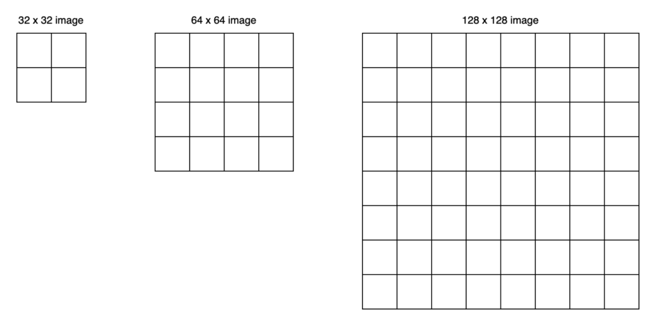
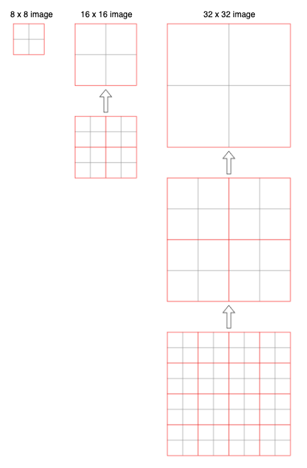

In 2021, Microsoft announced a new Vision Transformer called Swin Transformer, which can act as a backbone for computer vision tasks like image classification, object detection, and semantic segmentation.

The word Swin stands for **S**hifted **win**dows that provide the Transformer with hierarchical vision, which is the main topic of this article.

## Swin Transformer Architecture

### ViT is NOT Suitable for Dense Prediction

[ViT](/blog/2022/2022-11-02-vit-vision-transformer-image-classifier-2020/) (the original Vision Transformer from Google) uses fixed-scale image patches (i.e., 16 x 16) as inputs to the encoder to extract features. Although ViT works well for image classification, it is unsuitable for more dense vision tasks, such as object detection and semantic segmentation, which require finer visual details than 16 x 16 patches. Moreover, images in those tasks are typically larger than those in image classification datasets. Using smaller image patches on larger images will increase the number of patches that self-attention layers must process.

For example, if we use 32 x 32 images, a 16 x 16 patch will produce four patches per image. For 64 x 64 images, a 16 x 16 patch means 16 patches per image. Therefore the attention mechanism must deal with four times more patches. For 128 x 128 images, the number of patches becomes 64.

Swin Transformer uses a patch size of 4 x 4, so the number of patches would be much more than the above. ViT's global attention approach is impractical for semantic segmentation on high-resolution images.

So, we face the dilemma:

- We need finer details for pixel-level prediction, so we want to use smaller patches.
- The computation complexity of the attention mechanism increases quadratically to the number of image patches.

### Hierarchical Feature Maps by Swin Transformer

Swin Transformer builds hierarchical feature maps by starting from small-sized patches and gradually merging neighboring patches in deeper Transformer layers. For example, Swin Transformer starts with non-overlapping 16 (= 4 x 4) local windows (the red squares at the bottom of figure 1-(a) below). Each local window has 16 (= 4 x 4) image patches. As self-attention layers compute within each local window, they only handle the relationships between 16 image patches.

Contrary to that, ViT’s attention layers work on the entire image patches (figure 1-(b) below). If it used the same small patch size, the attention layers would need to deal with 256 patches. Since ViT is an image classification model, it is okay with larger patches (coarser features). However, Swin Transformer needs both fine and coarse features.

](images/fig-1.png){width="90%"}

At the next level in the hierarchy, Swin Transformer merges neighboring patches to form 4 (= 2 x 2) local windows. Again, self-attention layers compute within each local window. Therefore, those layers only deal with 16 feature patches. In other words, the number of patches in each window is the same at any level. Eventually, one local window covers the entire image with 16 feature patches.

So, the computation complexity is linear to the input image size. The below figure illustrates the point with various image sizes processed by a patch size of 4 x 4. Merging of neighboring patches reduces the image size while increasing the receptive field of each patch, like how ResNet’s convolution and max-pool layers reduce feature map size while increasing the receptive field.

The idea of hierarchical feature maps is similar to [FPN (Feature Pyramid Network)](/blog/2022/2022-08-21-fpn-2016/), which provides fine and coarse features useful for all image-related tasks.

### Patch Merging Layers

Swin Transformer’s patch-merging reduces the number of patches by concatenating features of 4 (= 2 x 2) neighboring patches and applying a linear layer to reduce the feature dimensions.

The below figure shows the overall architecture of Swin Transformer, including patch merging layers.

](images/fig-3a.png)

The image shape is H x W x 3 (height, width, three channels), on which Swin Transformer uses a patch size of 4 x 4. As such, we have H/4 x W/4 patches, and each patch’s feature dimension is 48 (= 4 x 4 x 3). In stage 1, the linear layer projects the raw-valued features to an arbitrary dimension C.

Then, in stage 2, the patch merging concatenates the features of each group of 2 x 2 neighboring patches. Each patch’s feature dimension becomes 4C, on which it applies a linear layer, reducing the output dimension to 2C. So, we have H/8 x W/8 patches, each of which has 2C-dimensional features. The process repeats in stages 3 and 4, reducing the size by 4 (= 2 x 2) and increasing the feature dimension by 2.

Again, it’s like how ResNet reduces the image size while increasing the feature dimension with its alternating convolution and max-pooling layers. As a result, Swin Transformer can conveniently replace the backbone networks in existing methods for various vision tasks.

Next, let’s look at the details of the Swin Transformer Blocks.

### Shifted Window Multi-head Self-Attention (SW-MSA)

The window-based self-attention module lacks connections across windows. While it reduces the computation complexity, it limits its modeling power. Therefore, they proposed a shifted window approach to overcome the limitation while maintaining the efficiency benefit of non-overlapping windows. It alternates between two partitioning configurations in consecutive Swin Transformer blocks.

](images/fig-2.png)

As illustrated in the above figure, layer 1 uses regular partitioning, and layer 2 uses a windowing configuration shifted by half of the window size. Therefore, it introduces connections between neighboring windows while keeping the local computation within each non-overlapping window.

This approach has an issue because the number of local windows increased from 4 (= 2 x 2) to 9 (= 3 x 3), which makes batch computation tricky. As such, Swin Transformer uses cyclic shifting of image patches toward the top-left direction and then applies a masking mechanism to limit self-attention within adjacent patches. Also, it uses reverse cyclic shifting to cover the other areas.

](images/fig-4.png)

Note: MSA stands for Multi-head Self-Attention.

As a result, shifted windows introduce connections across windows while masking prevents the attention computation from processing across the image boundary. This approach is efficient since we always have the same number of windows.

The below shows two successive Swin Transformer blocks:

](images/fig-3b.png)

Note:

- W-MSA and SW-MSA stand for regular and shifted windowing configurations, respectively.
- MLP is a multi-layer (2-layer) perception with GELU non-linearity in between.
- LN is a LayerNorm layer.

## Swin Transformer Experiments

### Classification Results with ImageNet-1K Regular Training

With regular (from scratch) training on ImageNet-1K, Swin Transformer models perform better than other vision Transformers (DeiT and ViT) and are comparable with EfficientNet and RegNet models. Moreover, the Swin Transfomer models achieve a slightly better speed-accuracy trade-off than EfficientNet and RegNet models.

](images/tab-1a.png)

While both EfficientNet and RegNet models are the results of extensive architecture searches, Swin Transformer is a modification of the standard Transformer and has some potential for further improvement.

Note:

- Google's research team with Quoc V. Le, well-known in Neural Architecture Search (NAS) research, developed EfficientNet models.
- RegNet models are also the results of NAS by Meta's FAIR team with Ross Girshick and Kaiming He, who are well-known for Faster R-CNN and related works.

### Classification Results with ImageNet-22K Pre-training

They pre-trained the larger models (Swin-B and Swin-L) on ImageNet-22K and fine-tuned them on ImageNet-1K for image classification. Swin-B achieves 1.8% to 1.9% gains over training on ImageNet-1K from scratch. The larger Swin-L model achieves 87.3% top-1 accuracy, +0.9% better than the Swin-B model. Similarly, ViT models perform better with pre-training but not as better than Swin Transformer models.

](images/tab-1b.png)

In short, larger Swin Transformer models with pre-training on massive datasets can bring better performance. Transformer-based models generally scale better with pre-training, as we have seen with ViT and BERT, while CNN-based models may not scale that well.

### Object Detection Results

The below table compares Swin Transformer and ResNe(X)t as backbones with various capacities for the Cascade Mask R-CNN object detection model.

](images/tab-2b.png)

Swin Transformer backbones perform better than other models, proving they are better alternative backbones.

### Semantic Segmentation Results

They used Swin Transformer as a backbone for semantic segmentation tasks on the ADE20K dataset. Swin-L model with ImageNet-22K pre-training achieves 53.5 mIoU (mean IoU) on the validation set, which is better than the previous best model (SETR) by +3.2 mIoU, even though the Swin-L model has fewer parameters (234M) than SETR (308M).

](images/tab-3.png)

Note: ‡ in the table indicates that the model is pre-trained on ImageNet-22K.

### Performance Improvement by Shifted Windows

The below table compares the performance results on ImageNet classification, COCO object detection, and ADE20k semantic segmentation tasks, with and without shifted windows.

](images/tab-4-upper.png)

Swin Transformer performs better with shifted windows for all vision tasks.

---

There you have it. We have just witnessed that Transformer can handle typical vision tasks instead of convolutional neural networks and does it better.

## References

- [ViT: Vision Transformer](/blog/2022/2022-11-02-vit-vision-transformer-image-classifier-2020/)
- [Transformer's Encoder-Decoder](/blog/2021/2021-12-13-transformers-encoder-decoder/)
- [FPN: Feature Pyramid Network](/blog/2022/2022-08-21-fpn-2016/)
- [Swin Transformer: Hierarchical Vision Transformer using Shifted Windows](https://arxiv.org/abs/2103.14030) \
  Ze Liu, Yutong Lin, Yue Cao, Han Hu, Yixuan Wei, Zheng Zhang, Stephen Lin, Baining Guo \
  [GitHub](https://github.com/microsoft/Swin-Transformer)
- [EfficientNet: Rethinking Model Scaling for Convolutional Neural Networks](https://arxiv.org/abs/1905.11946) \
  Mingxing Tan, Quoc V. Le
- [Designing Network Design Spaces](https://arxiv.org/abs/2003.13678) \
  Ilija Radosavovic, Raj Prateek Kosaraju, Ross Girshick, Kaiming He, Piotr Dollár
