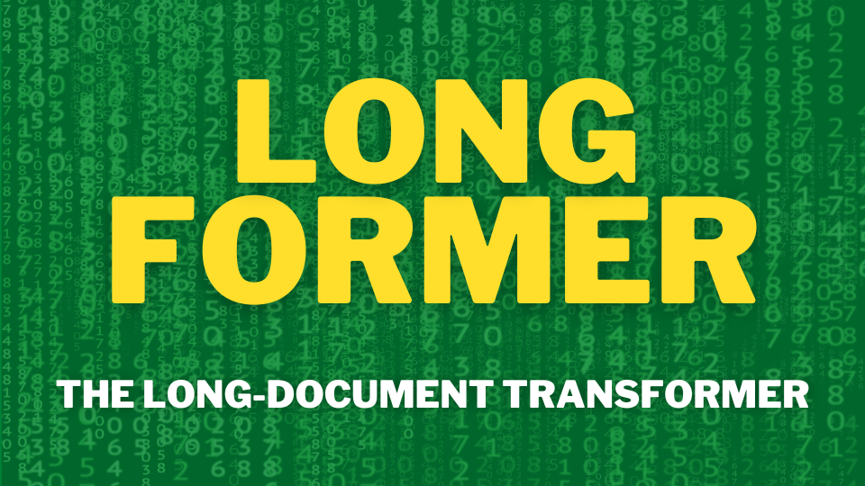
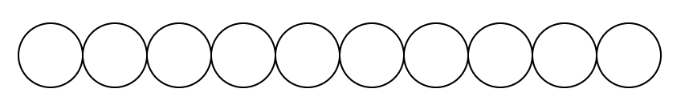
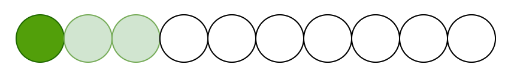
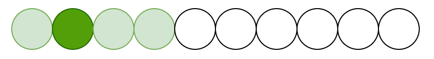
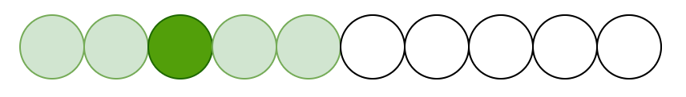
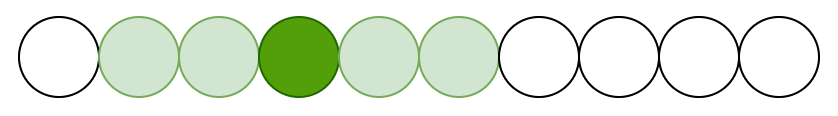
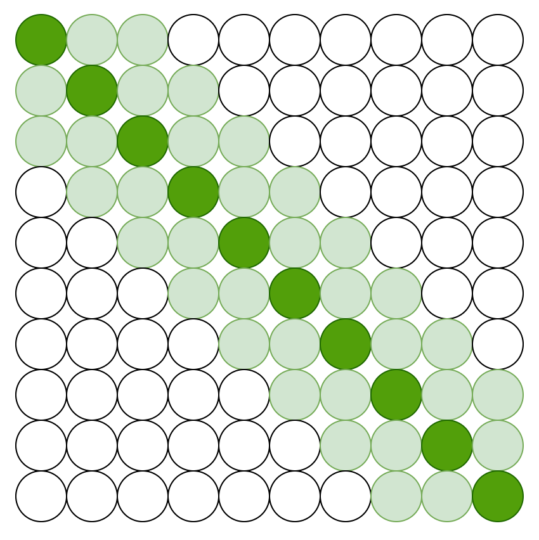
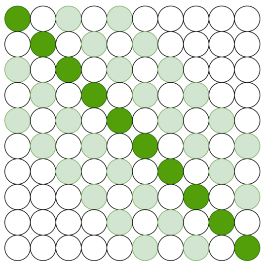
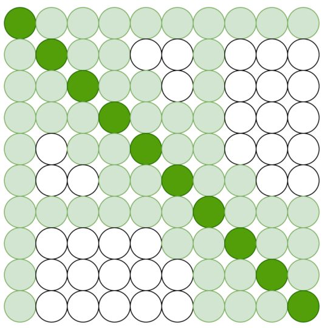

In 2020, researchers at Allen Institute for Artificial Intelligence (AI2) published [Longformer: The Long-Document Transformer](https://arxiv.org/abs/2004.05150).

AI2 is a non-profit research organization that hosts the [Semantic Scholar](https://www.semanticscholar.org/me/research) website providing AI-driven search and discovery tools for research publications. They crafted a new attention mechanism for processing long-document to overcome the issue with the original transformer architecture when scaling to long-form texts. 

Longformer is an important work that influenced later works that must process long sequences like steams of video frames. This article explains the Longformer's attention mechanism.

## Problem with Long Sequence

The transformer is well-known for its [self-attention mechanism](/blog/2021-11-15-transformers-self-attention/) in which each token in the input sequence refers to every token in the same sequence via dot-product operations. As such, the computation complexity in memory and space becomes $O(n^2)$, where n is the number of tokens.

So, the computational complexity quadratically increases with the sequence length, which makes it very expensive to process long sequences. We could divide a long sequence into smaller chunks, but then we would lose the global context with the sequence, reducing the quality of the language task.

On the contrary, Longformer scales linearly with sequence length and can process thousands of tokens, thanks to its attention patterns.

## Longformer Attention Patterns

Instead of full global attention, Longfomer uses a combination of different attention patterns.

- Sliding Window Attention
- Dilated Sliding Window
- Global + Sliding Window

](images/fig-2.png)

### Sliding Window Attention

Longformer uses sliding window attention to build local context, applying the attention mechanism on neighboring tokens. Let’s imagine we have a sequence of ten tokens and discuss what sliding window attention does.

{width="35%"}

Suppose each token attends to 2 tokens on each side. The first token attends to the following tokens:

{width="35%"}

The second token attends to the following tokens:

{width="35%"}

The third token attends to the following tokens:

{width="35%"}

The fourth token attends to the following tokens:

{width="35%"}

Continuing to the tenth token, we have the following sliding window attention pattern.

{width="35%"}

Multiple stacked layers of sliding window attention results in a large receptive field. The idea is similar to convolutional neural networks (CNNs) where top layers have access to all input locations, building global semantic representations. Through $l$ layers, the receptive field size of the topmost layer is $l \times w$, where $w$ is the window size (here, assuming the window size $w$ is fixed through all layers).

The computational complexity is $O(n \times w)$, which scales linearly with the input sequence length.

### Dilated Sliding Window Attention

Dilated sliding window increases the receptive field without increasing computation. It is analogous to dilated CNNs in that the sliding window has gaps of size dilation $d$.

{width="35%"}

The receptive field size of the topmost layer is $l \times d \times w$, which can reach lots of tokens even for small values of d (again, assuming the window size $w$ is fixed through all layers).

### Global plus Sliding Window Attention

Longformer uses local attention to build contextual representations, but that is not enough to perform task-specific prediction, which requires full sequence representations. As such, they add global attention to a few pre-selected input locations.

In the below example, the first and seventh tokens are pre-selected. Those selected tokens attend to all tokens across the sequence. Also, all tokens (pre-selected or not) attend to the pre-selected tokens, making the global attention symmetric.

{width="35%"}

Which token should be pre-selected for global attention depends on the language task. For example, a classification task aggregates the representation of the entire sequence into a special token (i.e., CLS in the case of BERT). So, we should pre-select the special token for global attention.

In the case of QA (question-answering), all question tokens use global attention since the number of question tokens is relatively small, and the computational complexity of the combined local and global attention is still $O(n)$.

### Linear Projection for Local and Global attention

Given the linear projections Q, K, and V, the original transformer computes attention scores as follows:

$$
\text{Attention}(Q, K, V) = \text{softmax}\left( \frac{QK^\top}{\sqrt{d_k}} \right) V
$$

Longformer uses two sets of projections: one for sliding window attention and the other for global attention:

$$
\begin{aligned}
Q_s, K_s, V_s \\\\
Q_g, K_g, V_g
\end{aligned}
$$

Therefore, Longformer has the flexibility to use different types of attention, which improves performance on downstream tasks.

### Sliding Window Size Consideration

Longformer uses small window sizes for the lower layers and increases window sizes towards higher layers. So, the lower layers collect local information, while higher layers learn higher-level representations of the entire sequence.

Also, Longformer does not use dilated sliding windows for lower layers to learn the local context well. For higher layers, it uses a small amount of increasing dilation only on two attention heads to attend to distant tokens, increasing the receptive fields.

## Experiment results

### Latency and Memory Usage

The below shows the runtime and memory of full self-attention and different implementations of Longformer’s self-attention.

](images/fig-1.png)

- Longformer-loop is a PyTorch implementation (non-vectorized) and supports dilation (but slow)
- Longformer-chunk is vectorized but does not support dilation (used for pretraining/finetuning)
- Longformer-cuda uses an optimized custom cuda kernel using [TVM](https://tvm.apache.org)

The memory usage of Longformer scales linearly with the sequence length, while the full self-attention mechanism runs out of memory for long sequences.

### Performance Comparison

Longformer outperforms [RoBERTa](/blog/2022-02-21-roberta-robustly-optimized-bert-apporach/) on long document tasks using datasets like [WikiHop](https://arxiv.org/abs/1905.07374).

](images/tab-7.png)

Longformer sets new state-of-the-art results on WikiHop and TriviaQA.

](images/tab-8.png){width="70%"}

### Longformer-Encoder-Decoder (LED)

Longformer-Encoder-Decoder (LED) is a variant of Longformer for generative sequence-to-sequence tasks. The encoder uses the efficient local+global attention pattern of the Longformer, while the decoder uses the full self-attention to the entire encoded tokens and previously decoded locations.

The below shows its effectiveness on the arXiv summarization dataset.

](images/tab-10.png){width="70%"}

- R-1 (ROUGE-1) metric uses the overlap of&nbsp;__unigram__&nbsp;with reference summaries.
- R-2 (ROUGE-2) metric uses the overlap of __bigram__ with reference summaries.
- R-L (ROUGE-L) metric uses the overlap of __n-gram__ with reference summaries.

## References

- [RoBERTa — Robustly optimized BERT approach](/blog/2022-02-21-roberta-robustly-optimized-bert-apporach/)
- [Longformer: The Long-Document Transformer](https://arxiv.org/abs/2004.05150) \
Iz Beltagy, Matthew E. Peters, Arman Cohan
