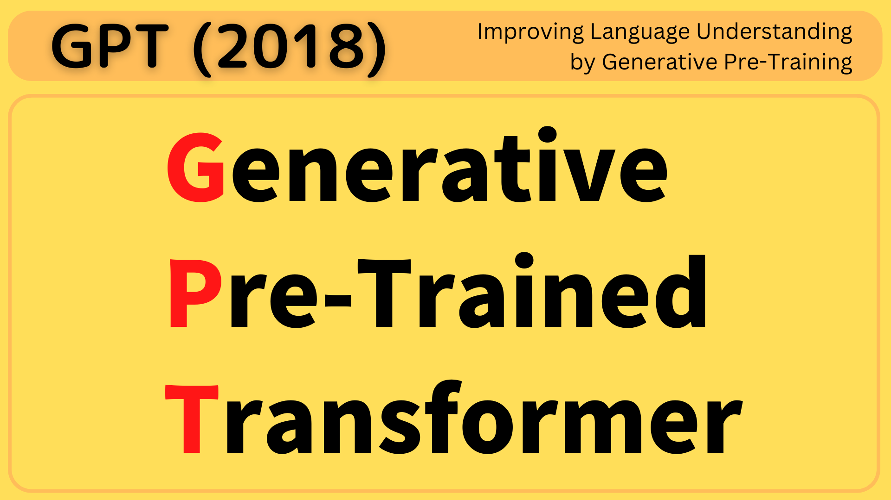

In 2018, OpenAI released the first version of GPT (Generative Pre-Trained Transformer) for generating texts as if humans wrote. The architecture of GPT is based on [the original transformer's decoder](/blog/2021/2021-12-13-transformers-encoder-decoder/).

They trained GPT in two stages:

1. **Unsupervised Pre-training** pre-trains GPT on unlabeled text, which taps into abundant text corpora.
2. **Supervised Fine-tuning** fine-tunes the pre-trained model for each specific task using labeled data.

This article gives an overview of each stage.

## Unsupervised Pre-training

The purpose of this stage is to train the model to learn about the structure of the language and to capture the statistical patterns present in the text dataset. In other words, it is not aiming at a specific language task but at improving the model’s understanding of the language itself. The model learns to predict the next word in the sequence based on the context from the previous words (aka. **generative pre-training**). It’s like a smartphone keyboard suggesting the next word to type.

More concretely, when pre-training the model with unlabelled texts, they feed a sequence of tokens (i.e., part of a sentence) to the model (a variant of the Transformer decoder) to predict the probabilities for the next token. It is shown as “**Text Prediction**” in the below diagram (“**Task Classifier**” is for the supervised fine-tuning).

](images/fig-1-left.png)

Mathematically, they use a common language modeling objective (i.e., predict the next token) to maximize the following likelihood 
$L_1(\mathcal{U})$ (the probability of the next token given the previous tokens as context):

$$
L_1(\mathcal{U}) = \sum\limits_{i} \log P(u_i | u_{i-k}, \dots, u_{i-1}; \Theta)
$$

- $\mathcal{U} = \{ u_1, \dots, u_n \}$ is an unlabeled corpus of tokens
- $P$ is the conditional probability, modeled by a neural network with parameters $\Theta$
- $k$ is the size of the context window

Since there are no labels or specific tasks to perform, they can use abundant text (previously hard-to-use) corpora. Given a huge amount of language data to learn from, the model can understand the language better, compared with supervised training, where we have much less text data available as it requires hand labeling.

## Supervised Fine-tuning

After unsupervised pre-training, they fine-tune the pre-trained model for each specific task using labeled data (aka. __discriminative fine-tuning__). For a simple classification task, each input consists of a sequence of tokens and a label. They pass through the inputs to the pre-trained model to obtain the final activations, which are fed into an additional linear (+softmax) output layer. The objective of the training is to maximize the following likelihood $L_2(\mathcal{C})$ (the probability of the label given the input sequence of tokens):

$$ L_2(\mathcal{C}) = \sum\limits_{(x, y)} \log P(y | x^1, \dots, x^m)$$

- $\mathcal{C}$ is the labeled dataset
- $x = \{ x^1, \dots, x^m \}$ is the input sequence of tokens
- $y$ is a label

Additionally, they include language modeling as an auxiliary objective. In other words, the model also learns to maximize the $L_1(\mathcal{C})$ objective where they apply unsupervised learning on the labeled data. As such, the combined objective becomes the following:

$$L_3(\mathcal{C}) = L_2(\mathcal{C}) + \lambda * L_1(\mathcal{C})$$

- $\lambda$ is a weight to balance between the two objectives

According to the paper, the auxiliary objective improves the following:

- Generalization of the supervised model (helping the model learn the dataset better)
- Convergence speed (reducing the loss faster)

## Input Transformations

More complex tasks (than simple classification) require task-specific input transformations.

](images/fig-1-right.png)

In all cases, inputs are processed by their pre-trained model, followed by a task-specific linear (+softmax) layer. The below explains each task-specific input transformation.

### Textual Entailment

The task of textual entailment&nbsp;is to classify the relationship between a pair of texts, whether one entails the other. If a typical person would infer that the hypothesis (a text) is true given the premise (a text), the relationship is classified as an __entailment__, that is, the hypothesis entails the premise. If there is an inconsistency between the two, the relationship is classified as a __contradiction__. If neither is true, the relationship is classified as __neutral__.

Therefore, the input of an entailment task consists of the following:

- Start token
- Premise (a text)
- Delimiter token ($)
- Hypothesis (a text)
- End (Extract) token

### Similarity

For similarity tasks, there is no directional relationship between the two sentences being compared. Therefore, the input sequence contains both possible ordering.

- Start, __Text 1__, Delimiter, __Text 2__, Extract
- Start, __Text 2__, Delimiter, __Text 1__, Extract

Both sequences are independently processed to produce two sequence representations, combined element-wise, before being fed into the linear output layer.

### Question Answering and Commonsense Reasoning

These tasks provide a context document $z$, a question $q$, and a set of possible answers $\{ a_k \}$. For each possible answer, there is one input sequence as follows:

- Start token
- Context document $z$ + Question $q$
- Delimiter token ($)
- One of the possible answers $\{ a_k \}$
- Extract

So, each input sequence looks like below:

- Start, Document $z$ and Question $q$, Delimiter, __Answer 1__, Extract
- Start, Document $z$ and Question $q$, Delimiter, __Answer 2__, Extract
- Start, Document $z$ and Question $q$, Delimiter, __Answer 3__, Extract
- ...

Each sequence is independently processed and all outputs are normalized via the softmax layer to produce a distribution over possible answers.

## Experimental Results

In summary, the training approach of GPT is to use unsupervised pre-training to boost performance on discriminative tasks. They trained a 12-layer decoder-only transformer.

For unsupervised pre-training, they used the BooksCorpus dataset, which contains over 7,000 unique unpublished books (Adventure, Fantasy, and Romance). 

For supervised fine-tuning, they used the following datasets:

- Natural Language Inference
    - SNLI
    - MultiNLI
    - Question NLI
    - RTE
    - SciTail
- Question Answsering
    - RACE
    - Story Close
- Sentence Similarity
    - MSR Paraphrase Corpus
    - Quora Question Pairs
    - STS Benchmark
- Classification
    - Stanford Sentiment Treebank-2
    - CoLA

The below are the results on natural language inference tasks. The bottom row shows the GPT's results, outperforming other models in most of tasks.

](images/tab-2.png)

The below are the results on question answering and commonsense reasoning. The bottom row shows the GPT's results, outperforming other models.

](images/tab-3.png)

## Analysis

The below left chart shows the performence improvement over the number of layers from pre-trained model (up to 12-layers) to transfer for supervised tasks. Each transformer layer provides more benefits, indicating eacy layer contains useful functionality for solving target tasks.

](images/fig-2.png)

The right plot shows __zero-shot behaviors__ where they designed a series of heuristic solutions to use the pre-trained model to perform tasks without supervised fine-tuning (therefore, it's zero-shot). As we can see, the performance of GPT (solid lines) improves over the course of generative unsupervised pre-training. In comparison, LSTM does not perform as much in such zero-shot experiment.

Their hypothesis is that GPT without fine-tuning can perform many of the tasks, thanks to its language modeling capability. GPT aquires such capability from the generative pre-training, using [the attention mechanism of the transformer](/blog/2021/2021-11-15-transformers-self-attention/), causing it to outperform LSTM in zero-shot experiments.

## References

- [Transformer’s Encoder-Decoder: Let’s Understand The Model Architecture](/blog/2021/2021-12-13-transformers-encoder-decoder/)
- [Transformer’s Self-Attention: Why Is Attention All You Need?](/blog/2021/2021-11-15-transformers-self-attention/)
- [Improving Language Understanding with Unsupervised Learning](https://openai.com/blog/language-unsupervised/) \
  [Github](https://github.com/openai/finetune-transformer-lm) \
  OpenAI
- [The Stanford Natural Language Inference (SNLI) Corpus](https://nlp.stanford.edu/projects/snli/)
