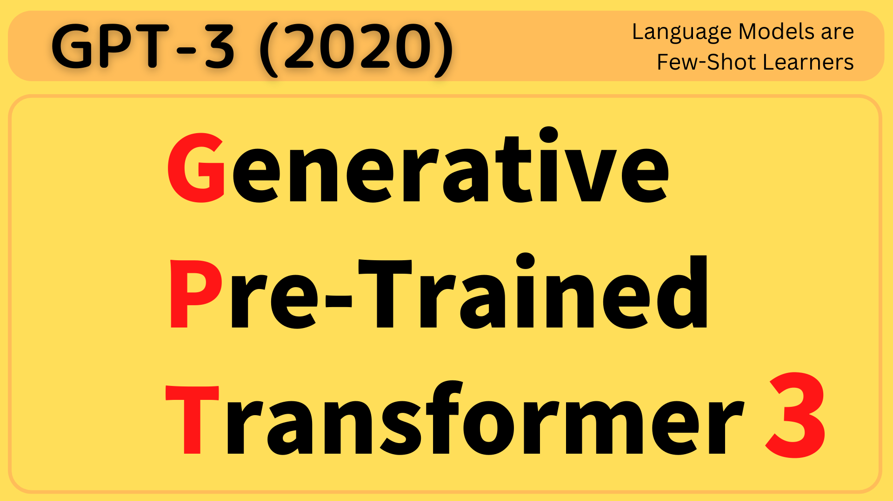

In 2020, OpenAI announced GPT-3. However, __it wasn't just another size upgrade__.

It's a generative language model with 175 billion parameters, 10x more than any previous language model. They published its performance on NLP benchmarks in that GPT-3 showed the improved capability to handle tasks __purely via text interaction__.

Those tasks include zero-shot, one-shot, and few-shot learning, where the model is given a task definition and/or a few examples and must perform the task without additional training. That is, no fine-tuning is used. __It is as though humans perform a new language task from only a few examples of simple instructions.__ Yet, in some cases, GPT-3 nearly matches the performance of SOTA (state-of-the-art) fine-tuned systems.

This article explains how in-context learning works.

## GPT3 and Meta-Learning

Kids build language capability by absorbing experiences without concrete tasks or instructions. They acquire skills like understanding the language structure and recognizing patterns in conversations and written texts. Eventually, they can predict what should come next, given the context. Furthermore, with enough language skills, they become proficient in performing tasks provided by simple instructions or demonstrations.

In comparison, a language model like GPT learns via pre-training and fine-tuning. Unsupervised pre-training with large datasets is akin to kids acquiring language skills. Supervised fine-tuning is like cramming for exams, requiring questions and answers. However, it demands large datasets for the model to understand and learn how to perform a specific task. 

In contrast, humans only need a brief directive and/or a few examples/demonstrations in a natural language. In other words, we learn to use skills acquired earlier to understand and achieve desired tasks. It makes humans __meta-learners__, enabling us to learn to combine predictions based on past experiences.

The question is, can a pre-trained language model become a meta-learner?

## In-Context Learning from GPT-2 to GPT-3

In the paper, they use __in-context learning__ to make their model learn by examples. They condition the model on natural language instructions and/or a few demonstrations of the task and expect it to predict what comes next to complete further instances of the task. Below is a demonstrative diagram of how in-context learning works, where the model develops a broad set of capabilities and learns to adapt them to perform tasks defined via natural language examples.

](images/fig-1.1.png)

The outer loop refers to the unsupervised pre-training where the model acquires language skills. On the other hand, the inner loop occurs when we feed forward a sequence of examples to the model, which learns the context from the sequence to predict what comes next. It is like a human reading a sequence of examples and thinking about the next instance. As the model uses the language skills learned during the pre-training phase to learn the context given in the sequence, no neural network parameter updates are involved in this learning phase. They call it in-context learning.

The diagram's first (left-most) example provides a context for performing arithmetic addition. Then, the second (middle) demonstrates how to correct spelling mistakes. The last (right-most) provides examples of English-to-French word translations. Given the respective context, the model must learn how to perform the intended task. They tried this approach with [GPT-2](/blog/2022-12-30-gpt-2-2019/), but the result wasn't good enough to be a practical method of solving language tasks. 

Since then, however, they saw a growing trend in the capacity of transformer language models in terms of the number of parameters, bringing improvements to text generation and other downstream NLP tasks. They hypothesized that in-context learning would show similarly substantial gains with scale.

Therefore, OpenAI researchers trained a 175 billion parameter language model (GPT-3) and measured its in-context learning abilities.

## Few-Shot, One-Shot, and Zero-Shot Learning

They evaluated GPT-3 on three different conditions.

- Zero-Shot allows no demonstrations and gives only instruction in natural language.
- One-Shot allows only one demonstration.
- Few-Shot (or in-context) learning allows as many demonstrations (typically 10 to 100).

The below diagram explains the three settings (on the left) of GPT-3 evaluations, compared with the traditional fine-tuning (on the right).

](images/fig-2.1.png)

The following graph shows the model performance on the learning task where it needs to remove extraneous (unnecessary) symbols from a word. The model performance improves over the number of in-context examples (K), with or without a prompt (natural language task description), where K = 0 is zero-shot, K = 1 is one-shot, and K > 1 is few-short learning. It makes sense that the model performs better with a larger K as it can learn from more examples. Moreover, a prompt would give more context, improving the model's accuracy, especially where K is smaller. In other words, no prompt means that the model must infer what is being asked (i.e., guess the prompt) from the examples.

](images/fig-1.2.png)

As we can see, the largest model with 175 billion parameters has the steepest improvement, proving that the larger capacity of the model increases the model's ability to recognize patterns from the in-context examples. It should be reiterated that __the accuracy improvement does not require gradient updates or fine-tuning__. The increasing number of demonstrations given as conditioning allows the model to learn more contexts to improve its prediction accuracy.

In the few-shot setting, GPT-3 achieved competitive performance with SOTA fine-tuned models or even occasionally surpassed them. Note: "ppl" stands for [perplexity](https://huggingface.co/docs/transformers/perplexity), and lower is better.

](images/tab-3.2.png)

So, a pre-trained language model with a large capacity can use its language abilities to understand and achieve desired tasks via natural language instructions and demonstrations.

## Size Does Matter To In-Context Learning

The figure below aggregates the various task results and gives a heuristic sense of the overall tendency for accuracy improvement over the model capacity.

](images/fig-1.3.png){width="90%"}

As we can see, the model performance often improves over the model capacity. The below figure shows GPT-3's few-shot accuracy per the number of parameters. With 175 billion parameters, it's getting closer to human performance on the Lambada (commonsense sentence completion) dataset.

](images/fig-3.2.png){width="90%"}

The below shows the performance of GPT-3 models in different sizes on arithmetic tasks in the few-shot settings.

](images/fig-3.10.png){width="90%"}

These results and more in the paper tell us that larger models are more proficient meta-learners.

## GPT-3 as a Synthetic Text Generator

GPT-3 excels as a synthetic text generator. The below table shows __mean human accuracy__, which is the ratio in detecting the short (~200 words) news articles that are model generated. With the 175 billion parameter model, the mean human accuracy is almost by chance (52%).

](images/tab-3.11.png)

They used such a detection rate to gauge the quality of GPT-3's text generation because the quality of news articles generated by GPT-3 depends on the quality of the conditioning examples. It also means that when we want GPT-3 to generate a good news article, we need to craft our prompt to sound quality (__Prompt Engineering__).

OpenAI uses GPT-3's text generation capability for OpenAI Codex, which translates natural language to programming code. It also powers __GitHub Copilot__, which assists programmers by autocompleting code in editors such as Visual Studio Code and other development environments. It is one of the first AI products based on a large language model.

## References

- [GPT: Generative Pre-Trained Transformer (2018)](/blog/2022-12-26-gpt-generative-pre-training-transformer-2018/)
- [GPT-2: Too Dangerous To Release (2019)](/blog/2022-12-30-gpt-2-2019/)
- [Language Models are Few-Shot Learners](https://arxiv.org/abs/2005.14165) OpenAI
- [How does in-context learning work?](https://ai.stanford.edu/blog/understanding-incontext/) \
  A framework for understanding the differences from traditional supervised learning \
  Sang Michael Xie, Sewon Min
- [OpenAI Codex](https://openai.com/blog/openai-codex/) \
- [About GitHub Copilot](https://github.com/features/copilot)
