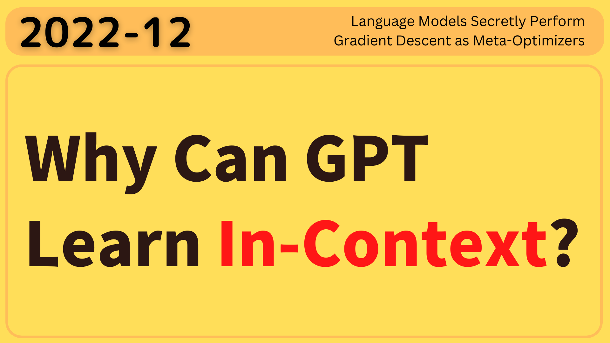

GPT-3 has shown surprising __In-Context Learning (ICL)__ ability, which [Why Can GPT Learn In-Context? Language Models Secretly Perform Gradient Descent as Meta-Optimizers](https://arxiv.org/abs/2212.10559) explains as a kind of __implicit fine-tuning__.

With ICL, GPT-3 can learn from a few demonstrations (input-label pairs) and predict the labels for unseen inputs. It can do so without additional parameter updates.

But how does it do that?

According to the paper, they hypothesize that:

- GPT first produces __meta-gradients__ according to the demonstration examples.
- Then, it applies the meta-gradients to the original GPT to __build an ICL model__.

So, let's dive into the paper to see how GPT learns in-context.

## Meta-Gradients

The paper explains that __ICL__ and __explicit fine-tuning__ are <u>both gradient descent</u>. The difference is that explicit fine-tuning uses __gradients__ while ICL uses __meta-gradients__. 

The below figure shows the difference and the similarity.

When we fine-tune a language model, we feed input-label pairs to the model to obtain a loss value. We then calculate the gradients of the loss by back-propagation. After that, we perform gradient descent to update the model parameters. 

The upper part of the below figure shows the fine-tuning process.

](images/fig-1.png){width="75%"}

The lower part of the above figure shows the ICL process that uses meta-gradients instead of gradients.

In ICL, we feed demonstration examples (input-label pairs) to the model, which calculates meta-gradients through forward computation. Then, it applies the meta-gradients to the original GPT to build an ICL model on the fly to answer the query in the last sentence.

In both fine-tuning and ICL, we use gradient descent to update the model parameters. The difference is that ICL does not modify the original model parameters. Instead, it builds a new model on the fly based on the original model. As such, ICL works like a kind of implicit fine-tuning. 

But so far, we don't exactly know what meta-gradients are. Also, what does it mean to build an ICL model through forward computation?

The paper mathematically formulates what ICL is and then explains why ICL works like an implicit fine-tuning.

## In-Context Learning Classification Formulation

The paper focuses on ICL for classification with GPT models, which consists of stacked _L_ identical Transformer decoder layers. Each decoder layer has an attention module and a feed-forward network.

Given a query input text _x_ and a candidate answer set _Y_ = {y1, y2, ..., ym}, the goal of the classification is to choose the correct answer $\hat{y} \in Y$ conditional on $n$ demonstration examples (the context) $C = \{(x'_1, y'_1), (x'_2, y'_2), \cdots, (x'_n, y'_n)\}$.

$(x'_i, y'_i)$ is a demonstration example (an input-label pair), where $x'_i$ is the input text, and $y'_i$ is the correct answer. The context $C$ __does not__ include the correct answer for the query input text $x$. As such, the query input text $x$ is __out-of-context__ (not seen in the context).

Let $\mathcal{M}$ be a GPT model, we compute the conditional probability of each answer $y_i$ as follows:

$$
P_\mathcal{M}(y_i \mid C, x)
$$

The final answer $\hat{y}$ is the one with the highest probability.

$$
\hat{y} = \arg \max_{y_i \in Y} P_\mathcal{M}(y_i \mid C, x)
$$

Also, let $\mathcal{T}(\cdot)$ be a function that takes an input text and a label to return a formatted example text for sentiment classification:

$$
\mathcal{T} = \text{Sentence: } x. \text{ Sentiment: } y.
$$

Therefore, a formatted input text $\mathcal{I}$ is as follows:

$$
\mathcal{I} = \mathcal{T}(x'_1, y'_1) \, \mathcal{T}(x'_2, y'_2) \, \cdots \, \mathcal{T}(x'_n, y'_n) \, \mathcal{T}(x, \_)
$$

The first $n$ input-label pairs are the context (demonstrations), and the last is the query.

We feed $\mathcal{I}$ to the GPT model $\mathcal{M}$ to get the conditional probability of each answer candidate $y_i$:

$$
\begin{align*}
\text{logit}_j &= \mathcal{M}(\mathcal{I}) \cdot \boldsymbol{e}_{y_j} \\
P_\mathcal{M}(y_j \mid C, x) &= \text{softmax}(\text{logit}_j)
\end{align*}
$$

- $\mathcal{M}(\mathcal{I})$ is the output hidden state at the last token position. 
- $\boldsymbol{e}_{y_j}$ is the word embedding of an candidate answer $y_j$.
- $\text{logit}_j$ is the logit corresponding to the j-th candidate answer.

So far, we've formally defined how ICL classification works. 

Next, let's see how we can understand gradient descent as a linear attention process.

## Gradient Descent as Attention Layer

The paper compares a linear layer optimized by gradient descent with an attention layer. 

A linear layer optimized by gradient descent is as follows:

$$
\mathcal{F}(\boldsymbol{x}) = (W_0 + \Delta W) \boldsymbol{x}
$$

- $\boldsymbol{x} \in \mathbb{R}^{d_\text{in}}$ be the input
- $W_0 \in \mathbb{R}^{d_\text{out} \times d_\text{in}}$ be the initial model parameters
- $\Delta W \in \mathbb{R}^{d_\text{out} \times d_\text{in}}$ be the parameter update

We compute $\Delta W$ by accumulating (summing) the outer products of the gradients $\boldsymbol{g}_i \in \mathbb{R}^{d_\text{out}}$ with respect to the output of the linear layer and the historic input representations ${\boldsymbol{x}'_i} \in \mathbb{R}^{d_\text{in}}$:

$$
\begin{align*}
\Delta W &= \sum\limits_{i} \boldsymbol{g}_i \otimes \boldsymbol{x}'_i \\
&= \sum\limits_{i} \boldsymbol{g}_i {\boldsymbol{x}'_i}^T
\end{align*}
$$

- $\boldsymbol{g}_i$ is the gradient of the loss with respect to the output of the linear layer at the i-th input.
- $\boldsymbol{x}_i^\top$ is the transpose of the i-th input.

If it helps, you can think of a linear layer with two neurons and one historic input vector with three values as follows:

$$
\begin{align*}
W_0 &= \begin{bmatrix} 
  w_{11} & w_{12} & w_{13} \\
  w_{21} & w_{22} & w_{23}
\end{bmatrix} \\
\boldsymbol{x} &= \begin{bmatrix} 
  x_1 \\
  x_2 \\
  x_3
\end{bmatrix}
\end{align*}
$$

We feed-forward the input $\boldsymbol{x}$ to the linear layer, and get the output $\boldsymbol{a}$:

$$
\begin{align*}
\boldsymbol{a} &= W_0 \boldsymbol{x} \\
&= \begin{bmatrix} 
  w_{11} & w_{12} & w_{13} \\
  w_{21} & w_{22} & w_{23}
\end{bmatrix} \begin{bmatrix} 
  x_1 \\
  x_2 \\
  x_3
\end{bmatrix} \\
&= \begin{bmatrix} 
  w_{11} x_1 + w_{12} x_2 + w_{13} x_3 \\
  w_{21} x_1 + w_{22} x_2 + w_{23} x_3
\end{bmatrix} \\
&= \begin{bmatrix} 
  a_1 \\
  a_2
\end{bmatrix}
\end{align*}
$$

Therefore, the gradient of the loss with respect to the initial weights $\boldsymbol{W_0}$ is as follows:

$$
\begin{align*}
\frac{\partial \mathcal{L}}{\partial W_0} &= \begin{bmatrix}
\frac{\partial \mathcal{L}}{\partial w_{11}} & \frac{\partial \mathcal{L}}{\partial w_{12}} & \frac{\partial \mathcal{L}}{\partial w_{13}} \\
\frac{\partial \mathcal{L}}{\partial w_{21}} & \frac{\partial \mathcal{L}}{\partial w_{22}} & \frac{\partial \mathcal{L}}{\partial w_{23}}
\end{bmatrix} \\
&= \begin{bmatrix}
\frac{\partial \mathcal{L}}{\partial a_1} \frac{\partial a_1}{\partial w_{11}} & \frac{\partial \mathcal{L}}{\partial a_1} \frac{\partial a_1}{\partial w_{12}} & \frac{\partial \mathcal{L}}{\partial a_1} \frac{\partial a_1}{\partial w_{13}} \\
\frac{\partial \mathcal{L}}{\partial a_2} \frac{\partial a_2}{\partial w_{21}} & \frac{\partial \mathcal{L}}{\partial a_2} \frac{\partial a_2}{\partial w_{22}} & \frac{\partial \mathcal{L}}{\partial a_2} \frac{\partial a_2}{\partial w_{23}}
\end{bmatrix} \\
&= \begin{bmatrix}
\frac{\partial \mathcal{L}}{\partial a_1} x_1 & \frac{\partial \mathcal{L}}{\partial a_1} x_2 & \frac{\partial \mathcal{L}}{\partial a_1} x_3 \\
\frac{\partial \mathcal{L}}{\partial a_2} x_1 & \frac{\partial \mathcal{L}}{\partial a_2} x_2 & \frac{\partial \mathcal{L}}{\partial a_2} x_3
\end{bmatrix} \\
&= \begin{bmatrix}
\frac{\partial \mathcal{L}}{\partial a_1} \\
\frac{\partial \mathcal{L}}{\partial a_2}
\end{bmatrix} 
\begin{bmatrix}
x_1 & x_2 & x_3
\end{bmatrix} \\
&= \boldsymbol{g} \, \boldsymbol{x}^\top \\
&= \boldsymbol{g} \otimes \boldsymbol{x}
\end{align*}
$$

where $\boldsymbol{g}$ is the gradient of the loss with respect to the output $\boldsymbol{a}$.

So, $\Delta W$ is an accumulation of the outer products of the gradients of the loss with respect to the outputs of the linear layer and the inputs to the linear layer.

Therefore, we can transform the gradient descent update as follows:

$$
\begin{align*}
\mathcal{F}(\boldsymbol{x}) &= (W_0 + \Delta W) \boldsymbol{x} \\
&= W_0 \boldsymbol{x} + \Delta W \boldsymbol{x} \\
&= W_0 \boldsymbol{x} + \sum\limits_{i} \left(\boldsymbol{g}_i {\boldsymbol{x}'_i}^\top \right) \boldsymbol{x} \\
&= W_0 \boldsymbol{x} + \sum\limits_{i} \boldsymbol{g}_i \left( {\boldsymbol{x}'_i}^\top \boldsymbol{x} \right) \\
&= W_0 \boldsymbol{x} + \text{LinearAttention}(G, X', \boldsymbol{x})
\end{align*}
$$

$\text{LinearAttention}(V, K, \boldsymbol{q})$ is an attention layer (without softmax) with value $V$, key $K$, and query $\boldsymbol{q}$.

- The historic output gradients $G$ are the values $V$.
- The historic inputs $X'$ are the keys $K$.
- The current input $\boldsymbol{x}$ is the query $\boldsymbol{q}$.

So, the gradient descent update on a linear layer is nothing but a linear attention operation, which takes more gradients from the demonstration inputs similar to the query input.

We can do a similar analysis on the Transformer attention layer to see how it performs gradient descent.

## Transformer Attention as Meta-Optimization

Now, we'll see how the Transformer attention mechanism performs meta-optimization.

In the ICL setting (defined earlier), the result of an attention operation from the query token $t$ is as follows:

$$
\begin{align*}
\mathcal{F}_{\text{ICL}}(\boldsymbol{q}) &= \text{Attention}(V, K, \boldsymbol{q}) \\
&= W_V [ X'; X ] \, \text{softmax} \left( \frac{(W_K [ X'; X ])^\top \boldsymbol{q}}{\sqrt{d}} \right)
\end{align*}
$$

The above is nothing but the standard attention mechanism with the following parameters:

- $W_V \in \mathbb{R}^{d' \times d}$ is the value projection matrix
- $W_K \in \mathbb{R}^{d' \times d}$ is the key projection matrix
- $W_Q \in \mathbb{R}^{d' \times d}$ is the query projection matrix

The inputs to the attention layer are:

- $X'$ is the demonstration input matrix
- $X$ is the input representations of query tokens before $t$
- $\boldsymbol{x} \in \mathbb{R}^{d}$ be the input representation of a query token $t$

The key, value, and query are as follows:

- $[ X'; X ]$ is the matrix concatenation of $X'$ and $X$
- $V = W_V [ X'; X ]$ is the value matrix
- $K = W_K [ X'; X ]$ is the key matrix
- $\boldsymbol{q} = W_Q \boldsymbol{x} \in \mathbb{R}^{d'}$ be the attention query vector

Note: $\sqrt{d}$ is the scaling factor.

As per the paper, we relax the attention layer by removing the softmax and scaling factor for simplicity:

$$
\begin{align*}
\mathcal{F}_{\text{ICL}}(\boldsymbol{q}) &= Attention(V, K, \boldsymbol{q}) \\
&= W_V [ X'; X ] \, \text{softmax} \left( \frac{(W_K [ X'; X ])^\top \boldsymbol{q}}{\sqrt{d}} \right) \\
&\approx W_V [ X'; X ] \, (W_K [ X'; X ])^\top \boldsymbol{q} \\
 \\
\therefore \tilde{\mathcal{F}}_{\text{ICL}}(\boldsymbol{q}) &= W_V X' \, (W_K X')^\top \boldsymbol{q} + W_V X \, (W_K X)^\top \boldsymbol{q} \\
&= W_V X' \, (W_K X')^\top \boldsymbol{q} + W_{\text{ZSL}} \boldsymbol{q}
\end{align*}
$$

The second term $W_{\text{ZSL}} = W_V X \, (W_K X)^\top$ is the zero-shot learning (ZSL) part where no demonstration data is available.

We rewrite the above as follows:

$$
\begin{align*}
\tilde{\mathcal{F}}_{\text{ICL}}(\boldsymbol{q}) &= W_{\text{ZSL}} \boldsymbol{q} + W_V X' \, (W_K X')^\top \boldsymbol{q} \\
&= W_{\text{ZSL}} \boldsymbol{q} + \text{LinearAttention}(W_V X', W_K X', \boldsymbol{q}) \\
&= W_{\text{ZSL}} \boldsymbol{q} + \sum\limits_{i} W_V \boldsymbol{x}'_i \left( (W_K \boldsymbol{x}'_i)^\top \boldsymbol{q} \right) \\
&= W_{\text{ZSL}} \boldsymbol{q} + \sum\limits_{i} \left( W_V \boldsymbol{x}'_i (W_K \boldsymbol{x}'_i)^\top \right) \boldsymbol{q} \\
&= W_{\text{ZSL}} \boldsymbol{q} + \left( \sum\limits_{i} W_V \boldsymbol{x}'_i (W_K \boldsymbol{x}'_i)^\top \right) \boldsymbol{q} \\
&= W_{\text{ZSL}} \boldsymbol{q} + \Delta W_{\text{ICL}} \boldsymbol{q} \\
&= (W_{\text{ZSL}} + \Delta W_{\text{ICL}}) \boldsymbol{q}
\end{align*}
$$

So, the linear attention mechanism creates the zero-shot learning parameters $W_\text{ZSL}$ given the query input $X$ and the updates to the parameters $\Delta W_\text{ICL}$ given the demonstration inputs $X'$.

If we think of $W_\text{ZSL}$ as the initial parameters of a language model created on the fly and $\Delta W_\text{ICL}$ as the fine-tuning updates calculated from the demonstration examples, then the above is nothing but a meta-optimization mechanism in which the meta-optimizer is the Transformer attention mechanism itself.

In summary, ICL uses the original language model's capability to learn from the context of the query input $X$ and the demonstration inputs $X'$.

## ICL vs. Fine-Tuning Settings

So far, we understand how ICL works as a meta-optimization mechanism in theory.

The paper also conducted experiments to compare the ICL's meta-optimization with explicit optimization (fine-tuning) by designing a specific fine-tuning setting.

When comparing the attention mechanism with fine-tuning, we treat the query input $\boldsymbol{q}$ as equivalent to the fine-tuning input $\boldsymbol{x}$. As such, meta-optimization happens with the attention keys and values (but not with queries). As such, their fine-tuning counterpart only updates the key and value projection parameters.

Therefore, in the linear attention form, the result of a fine-tuned attention head is as follows:

$$
\begin{align*}
\mathcal{F}_{\text{FT}}(\boldsymbol{q}) &= (W_V + \Delta W_V) X \, ((W_K + \Delta W_K) X)^\top \boldsymbol{q} \\
&= (W_V + \Delta W_V) X X^\top (W_K + \Delta W_K)^\top \boldsymbol{q} \\
&= (W_\text{ZSL} + \Delta W_\text{FT}) \boldsymbol{q}
\end{align*}
$$

- $\Delta W_V$ is the parameter updates to the value projection matrix $W_V$
- $\Delta W_K$ is the parameter updates to the key projection matrix $W_K$
- $W_\text{ZSL} = W_V X X^\top W_K^\top$ is the zero-shot learning part \
  (i.e., the weights from the original language model)
- $\Delta W_\text{FT}$ is the parameter updates to $W_\text{ZSL}$ by fine-tuning

They add the following conditions to the fine-tuning to make the comparison with ICL fair:

- The training examples are the same as ICL's demonstration examples
- They train each example for only one step in the same order as demonstrated for ICL
- They format each training example using the template for ICL: $\mathcal{T}(x'_i, y'_i)$
- They use the causal language modeling objective for fine-tuning

Note: causal language modeling is the task of predicting the token following a sequence of tokens.

Based on the above settings, ICL has many properties in common with fine-tuning:

- Both perform gradient descent ($\Delta W_\text{FT}$ and $\Delta W_\text{ICL}$)
- Same training information (training examples = demonstration examples)
- Same causal order of training examples (only one epoch with the same order of training examples as demonstration examples)
- Both updates only the key and value projection matrices

Given all these similarities, it is reasonable to expect that ICL and fine-tuning will perform similarly __provided ICL indeed performs implicit fine-tuning__.

The paper's experiments confirm this hypothesis.

## Experiments

They compared the performance of ICL and fine-tuning with the following tasks:

- Sentiment classification (SST-2, SST-5, MR, Subj)
- Topic classification (AGNews)
- Natural language inference (CB)

](images/tab-1.png){width="50%"}

They used two GPT-like pre-trained language models with 1.3B and 2.7B parameters, respectively, released by [fairseq](https://github.com/facebookresearch/fairseq). They call them GPT 1.3B and GPT 2.7B for short.

The prediction processes of ZSL and fine-tuning are the same as ICL without demonstration examples.

- For ICL, 
  - The number of demonstration examples is 32.
  - They adjusted the random seed for each task to find a set of demonstration examples that achieves the best validation performance.
- For fine-tuning, 
  - They used the same training examples as ICL, in the same order as demonstrated for ICL.
  - Fine-tuning is only one epoch.
  - They used an SGD optimizer and adjusted the learning rate to achieve the best validation performance.

Below is the validation accuracy in ZSL, FT (fine-tuning), and ICL on six classification tasks.

  ](images/tab-2.png){width="50%"}

Overall, both FT and ICL achieve much better performance than ZSL. In other words, FT and ICL make helpful optimizations to the original language model. Moreover, ICL performs better with few-short scenarios than FT, where only a few examples are available.

So, the accuracy of ICL is comparable (or even better) to fine-tuning in this comparison, which is strong evidence that ICL performs implicit fine-tuning.

## Measuring Similarity between ICL and Fine-Tuning

They designed three metrics to measure the similarity between ICL and finetuning at three different levels:

### Recall to Fine-tuning Predictions (Rec2FTP)

At the prediction level, Rec2FTP measures how much behavior of finetuning ICL can cover.

$$
\text{Rec2FTP} = \frac{N_{both}}{N_{FT}}
$$

- $N_{FT}$: the number of query examples that FT can predict correctly but ZSL cannot.
- $N_{both}$: the number that ICL can also predict correctly.

A higher Rec2FTP score suggests that ICL covers more behavior of finetuning at the prediction level.

### Similarity of Attention Output Updates (SimAOU)

At the representation level, SimAOU measures how much ICL updates the attention output representation in the same direction as finetuning.

Let $\boldsymbol{h}_X^{(l)}$ be the output representation of the last token at the $l$-th attention layer in the $X$ setting, where $X$ is either ZSL, FT, or ICL.

We can measure the direction of updates by ICL and FT in the following formula:

$$
\begin{align*}
\boldsymbol{dh}_\text{ICL}^{(l)} &= \boldsymbol{h}_\text{ICL}^{(l)} - \boldsymbol{h}_\text{ZSL}^{(l)} \\\\
\boldsymbol{dh}_\text{FT}^{(l)} &= \boldsymbol{h}_\text{FT}^{(l)} - \boldsymbol{h}_\text{ZSL}^{(l)}
\end{align*}
$$

Then, we take the cosine similarity between these two updates:

$$
\text{SimAOU}^{(l)} = \frac{\boldsymbol{dh}_\text{ICL}^{(l)} \cdot \boldsymbol{dh}_\text{FT}^{(l)}}{\left\|\boldsymbol{dh}_\text{ICL}^{(l)}\right\|_2 \ \left\|\boldsymbol{dh}_\text{FT}^{(l)}\right\|_2}
$$

A higher SimAOU score suggests that ICL updates the attention output representation in the same direction as finetuning.

### Similarity of Attention Map (SimAM)

At the attention behavior level, SimAM measures the similarity between the attention maps of ICL and finetuning.

Let $\boldsymbol{m}_X^{(l, h)}$ be the attention weights of the last token (before softmax) of the $l$-th attention layer at the $h$-th attention head in the $X$ setting, where $X$ is either ZSL, FT, or ICL.

For ICL, they only monitor the attention weights to the query input tokens since FT has no demonstration tokens (every training example is a separate query input).

Then, they take the cosine similarity between these two attention weights: $\boldsymbol{m}_X^{(l, h)}$ and $\boldsymbol{m}_\text{FT}^{(l, h)}$ across the attention heads. The average of all attention heads is the SimAM score at each layer.

### Results

Below are the results of the three similarity metrics on six classification tasks. 

The Rec2FTP results show that ICL can mostly cover correct predictions by fine-tuning.

](images/tab-3.png)

The SimAOU and SimAM scores are the average of all examples and layers. There are two baselines:

- __Random SimAOU__ is a baseline metric that measures the similarity between the attention output updates of ICL and randomly generated updates.
- __ZSL SimAM__ is a baseline metric that measures the similarity between the attention weights of ICL and ZSL.

Compared with the baseline metrics, ICL behaves more similarly to fine-tuning at the representation and attention behavior levels.

Overall, ICL exhibits similar behavior on all tasks with fine-tuning. 

## Similarity at Each Layer

Below are the SimAOU and SimAM scores at each layer. They drew box plots based on randomly sampled 50 validation examples from each dataset.

](images/fig-2.png)

](images/fig-3.png)

They observed that:

- Both SimAOU and SimAM fluctuate at lower layers
- SimAOU and SimAM increase toward higher layers

The above phenomenon suggests that ICL's meta-optimization has forward-accumulated effects. As such, ICL behaves more similarly to fine-tuning at higher layers.

## Optimization Algorithm vs. Transformer Architecture

ICL performs implicit fine-tuning. Then, can we utilize momentum to improve the performance of ICL as we can for SGD optimization of fine-tuning?

](images/fig-5.2.png){width="50%"}

They apply Exponential Moving Average (EMA) to the attention values to build momentum-based attention:

$$
\begin{align*}
\text{MoAttn}(V, K, \boldsymbol{q}_t) &= \text{Attn}(V, K, \boldsymbol{q}_t) + \text{EMA}(V) \\
&= V \text{softmax}\left(\frac{K^\top \boldsymbol{q}_t}{\sqrt{d_k}}\right) + \sum\limits_{i=1}^{t-1} \eta^{t-i} \boldsymbol{v}_i,
\end{align*}
$$

- $\eta$ is the momentum coefficient (hyperparameter).
- $\boldsymbol{v}_i$ is the $i$-th attention value vector.

### Experiments in Language Modeling

They trained two GPT models with 350M parameters from scratch. One is the vanilla Transformer, and the other is the momentum-based Transformer.

The below shows the [perplexity](https://huggingface.co/docs/transformers/perplexity) (lower is better) of the two models with three validation sets with input lengths of 256, 512, and 1024, respectively.

](images/tab-4.png){width="75%"}

The momentum-based Transformer outperforms the vanilla Transformer on all validation sets.

### Experiments on In-Context Learning

They also evaluated the performance of the momentum-based Transformer on the in-context learning tasks. For the six datasets, they use 32 examples as demonstrations. The momentum-based transformer outperforms the vanilla Transformer on all datasets.

](images/tab-5.png){width="75%"}

In conclusion, the momentum-based Transformer outperforms the vanilla Transformer in language modeling and in-context learning, proving that introducing momentum into attention is an effective strategy.

## References

- [Why Can GPT Learn In-Context? Language Models Secretly Perform Gradient Descent as Meta-Optimizers](https://arxiv.org/abs/2212.10559) \
Damai Dai, Yutao Sun, Li Dong, Yaru Hao, Zhifang Sui, Furu Wei
- [GPT-3: In-Context Few-Shot Learner (2020)](/blog/2023/2023-01-04-gpt-3-in-context-few-shot-learner-2020/)
