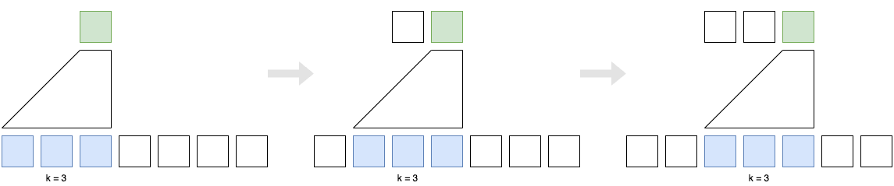
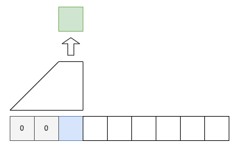
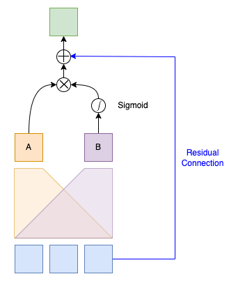
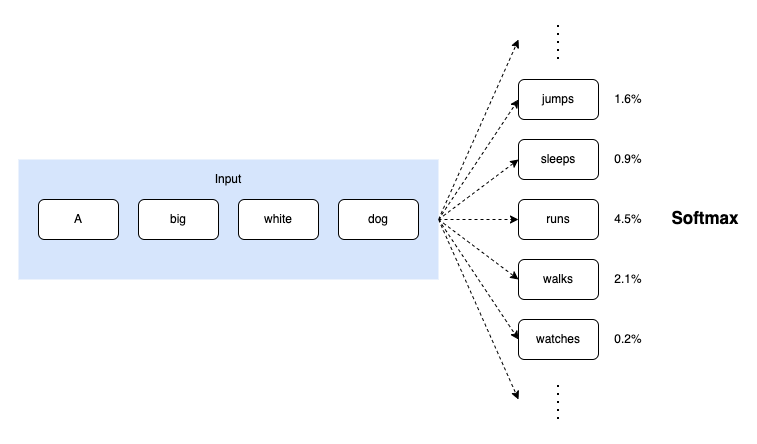

The Gated Linear Unit (GLU), introduced in 2016, is a crucial activation function influencing later activation functions.

Before the emergence of Transformer, the pre-dominant approach to language modeling was recurrent neural networks (RNNs). One drawback of RNNs is that they are sequential, meaning they can only process the input sequence one step at a time. Also, language sequences are variable in length and unbounded. Hence, it's not easy to parallelize RNNs. 

Naturally, scientists were looking for parallelizable alternatives to RNNs. Today, we know Transformer solved the parallelization problem for language models in 2017. 

However, there was another approach to parallelization before Transformer—such an approach processed variable-length sequences parallelly without any attention mechanism.

But is it worth discussing today if it's not a Trasformer-based model? 

The model we will discuss today is the first to introduce a new activation function called Gated Linear Unit (GLU). This activation function is the base for later activation functions such as SwiGLU used in Transformer-based models like PaLM and LLaMA.

So, the answer is yes, it's worth discussing, especially if you are interested in where the GLU activation function came from.

## Gated Convolutional Networks

In 2016, Meta (Facebook) researchers announced Gated Convolutional Networks for language modeling. The main idea is to use convolutional neural networks (CNNs) to process the input sequence. CNNs can process variable-length sequences, just like RNNs. However, it does so in a parallel manner.

The below shows the architecture of the model. The model has a stack of convolutional layers.

](images/fig-1.png){width=50%}

The following sections explain each component of the model.

## Word Embeddings

As in any neural language model, the input sequence first transforms into embeddings using a lookup table. Let's call the embedding sequence $E \in \mathbb{R}^{N \times m}$ where $N$ is the sequence length and $m$ is the input feature size.

](images/fig-1-embed.png)

## Convolutional Layers

Then, it applies two convolutional operations (A and B) to the embedding sequence $E$.

](images/fig-1-conv.png)

$$
\begin{aligned}
A &= E * W + \boldsymbol{b} \\
B &= E * V + \boldsymbol{c}
\end{aligned}
$$

- $W \in \mathbb{R}^{k \times m \times n}$
- $\boldsymbol{b} \in \mathbb{R}^n$
- $V \in \mathbb{R}^{k \times m \times n}$
- $\boldsymbol{c} \in \mathbb{R}^n$
- $k$ is the kernel size
- $m$ is the input feature size
- $n$ is the output feature size. 
- $*$ is the convolution operator.

These are the learnable parameters. As you can see, the outputs of the two convolutional operations have the same shape but can differ from that of the input embedding sequence $E$ since $m \neq n$ in general. The above diagram shows the input feature size $m=5$ and the output feature size $n=3$.

The convolutional layers are causal. That is, they do not see the future context. The idea is to prevent the model from cheating by looking at the future context. The idea of causal convolutions is similar to the idea of causal attention in the decoder of the Transformer architecture.



The causal convolution also zero-pads the beginning of the sequence with $k-1$ elements. We assume the first input element is the beginning of the sequence (BOS) marker, which the model does not predict. The model only predicts what follows after the BOS marker.



## Gating Mechanism

A gating mechanism follows convolutional operations.

](images/fig-1-gate.png)

The above figure from the paper applies the sigmoid function to the output of the first convolutional operation. However, the relevant paragraph in the paper says the sigmoid function applies to the output of the second convolutional operation. Below, I'm following the paper in that the sigmoid function applies to the output of the second convolutional operation. I believe the figure is wrong, or maybe it's the other way around, but I stick to the text in the paper.

The model computes the hidden layers $h_0$ from the embedding sequence $E$ as follows:

$$
h_0 = (E * W + \boldsymbol{b}) \otimes \sigma(E * V + \boldsymbol{c})
$$

- $\otimes$ is the element-wise multiplication operator.
- $\sigma$ is the sigmoid function.

We apply a sigmoid function to the output for the second convolutional operation. Then, we multiply the two outputs element-wise. 

In other words, the output of the sigmoid function acts as a gating mechanism to the output of the first convolutional operation. The gating works similarly to LSTM gates, controlling the flow of information. They call this gating mechanism a **GLU (Gated Linear Unit)**. 

Now, you know where GLU came from and how it works. For completeness' sake, I'll continue to explain how the model works.

The model has a stack of convolutional layers. Suppose $X_l \in \mathbb{R}^{N \times m}$ is the input of layer $h_l$, where $N$ is the sequence length and $m$ is the input feature size. The model computes the output of the hidden layers $h_l$ as follows:

$$
h_l(X_l) = (X_l * W_l + \boldsymbol{b_l}) \otimes \sigma(X_l * V_l + \boldsymbol{c_l})
$$

## Residual Connection

It also applies a residual connection from the input to the output of the hidden layer, which reduces the risk of vanishing gradients, allowing the model to have deeper layers to learn more complex representations.

Conceptually, the residual connection looks like the following:



However, they use the residual connection with residual building blocks, which I'll explain in the next section.

## Residual Building Blocks

The model organizes the convolutional layers into residual building blocks. Each block has a stack of convolutional layers. As such, the residual connection applies to the block output instead of each convolution. The below pseudo-code illustrates the residual building block.

```python
def residual_block(X):
    # Pre-activation input for residual connection
    residual = X

    # Zero-pad the beginning of the sequence
    X = left_zero_pad(X)

    # Stacked convolutional layers A
    A = conv_a3(conv_a2(conv_a1(X)))

    # Stacked convolutional layers B
    B = conv_b3(conv_b2(conv_b1(X)))

    # Gating mechanism
    G = A @ sigmoid(B)

    # Residual connection
    return G + residual 
```

The below shows the architecture of the model. The model has a stack of residual building blocks, indicated in brackets with the format [k, n], where k is the kernel size and n is the output feature size. 

](images/tab-1.png)

"B" in the model name denotes bottleneck architecture for computational efficiency.

For example, the following block has a stack of three convolutional layers with kernel sizes of 1, 5, and 1, respectively, and output feature sizes of 128, 128, and 512, respectively. 
$$
\begin{bmatrix}
1, 128 \\
5, 128 \\
1, 512
\end{bmatrix}
$$

Suppose the input feature size is 512. Then, the first convolutional layer with a kernel size of 1 reduces the feature size to 128. The second convolutional layer with a kernel size of 5 extracts dependencies of the context while keeping the feature size at 128. The third convolutional layer with a kernel size of 1 increases the feature size to 512. It requires less computation than applying a single convolutional layer with a kernel size of 5 to the input of 512 features.

## Adaptive Softmax

A series of convolutional layers and/or residual blocks output a representation $H = h_L \circ \dots \circ h_0(E)$ for each word given the input embedding sequence $E$. These representations are then fed into a softmax layer to compute the probability distribution over the vocabulary.

However, softmax is often computationally inefficient for large vocabulary sizes. Many tokens in the vocabulary will have near-zero probabilities. 



As such, the model applies an [adaptive softmax](/blog/2023/2023-04-12-adaptive-softmax-2016/) layer to the output of the last residual block.

## References
- [Language Modeling with Gated Convolutional Networks](https://arxiv.org/abs/1612.08083) \
  Yann N. Dauphin, Angela Fan, Michael Auli, David Grangier \
  [video](https://vimeo.com/238222385)
- [Adaptive Softmax](/blog/2023/2023-04-12-adaptive-softmax-2016/)
