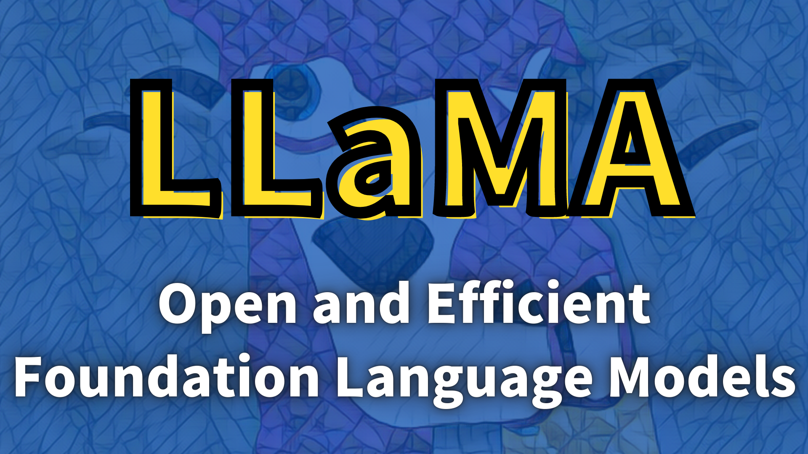

On February 24, 2023, Meta AI Research [unveiled](https://ai.facebook.com/blog/large-language-model-llama-meta-ai/) their cutting-edge language model, **LLaMA** (Large Language Model Meta AI). On March 3rd, user "llamanon" leaked the model (with its weights) on [4chan](https://www.4chan.org), allowing anyone to download it, which led to various fine-tuned versions being developed.

The following is a list of examples, to name a few:

- [Alpaca by Stanford](https://github.com/tatsu-lab/stanford_alpaca)
- [Vicuna by UC Berkeley, CMU, Stanford, UC San Diego, and MBZUAI](https://vicuna.lmsys.org/)
- [Koala by BAIR (Berkeley AI Research)](https://bair.berkeley.edu/blog/2023/04/03/koala/)

These models are also available through the [Hugging Face Hub](https://huggingface.co/models?search=llama).

LLaMA consists of a family of language models with parameters ranging from 7B to 65B, trained on **publicly available** datasets to achieve the best possible performance **at various inference budgets**. As such, the paper title says "LLaMA: Open and Efficient Foundation Language Models".

LLaMA-13B outperforms GPT-3 (175B) on most benchmarks **while being 10x smaller**. Furthermore, it can **run on a single GPU**. LLaMA-65B is competitive with the best models, such as Chinchilla-70B and PaLM-540B.

This article will explain the modifications to the Transformer architecture and performance comparison with other LLMs.

## LLaMA Architecture

Like GPT-3, LLaMA uses the Transformer's decoder-only architecture for text generation. It also benefits from enhancements made in other models, such as GPT-3, GPT-Neo, PaLM, and more, to improve its performance.

The below highlights the main modifications compared to the original Transformer architecture published in 2017.

Note: in the below headings, [.] indicates where they found inspiration for the change.

### Pre-normalization [GPT-3]

The original Transformer architecture applies layer normalization after the self-attention and feed-forward layers. LLaMA normalizes the input to the self-attention and feed-forward layers (pre-normalization). Pre-normalization is pretty standard among transformer-based LLMs nowadays.

They use the **RMSNorm** (Root Mean Square Layer Normalization), which is simpler and more efficient than layer normalization, yet achieves similar performance.

**About RMSNorm**

Suppose we have a feed-forward network that takes an input **x** ∈ ℝm, and outputs **y** ∈ ℝn.

$$
\begin{aligned}
a_i = \sum_{j=1}^m \, w_{ij} x_j \\\\
y_i = f(a_i + b_i)
\end{aligned}
$$

where _f_ is the activation function, wij and bi are the weights and biases, respectively.

This network may suffer from an internal covariate shift, which is the change in the distribution of network activations due to the change in network parameters during training. We can normalize the input to the activation function to solve this problem.

Layer normalization normalizes the input **x** to have zero mean and unit variance.

$$
\begin{aligned}
\bar{a}_i &= \frac{a_i - \mu}{\sigma} g_i \\\\
y_i &= f(\bar{a}_i + b_i)
\end{aligned}
$$

where gi is a learnable gain parameter (initially set to 1), and 𝜇 and 𝜎 are the mean and standard deviation of ai, respectively.

$$
\begin{aligned}
\mu &= \frac{1}{n} \sum_{i=1}^n a_{i} \\\\
\sigma &= \sqrt{\frac{1}{n} \sum_{i=1}^n (a_{i} - \mu)^2}
\end{aligned}
$$

A well-known explanation for the success of layer normalization is the re-centering and re-scaling invariance property, which gives the input to the activation function the same mean and variance. However, the authors of RMSNorm hypothesize that the re-scaling invariance is the key to the success of layer normalization. 

As such, they propose RMSNorm, which normalizes the input to have re-scaling invariance but does not re-center the input.

$$
\begin{aligned}
\bar{a}_i = \frac{a_i}{\text{RMS}(\boldsymbol{a})} \, g_i \\\\
\text{RMS}(\boldsymbol{a}) = \sqrt{\frac{1}{n} \sum_{i=1}^n a_{i}^2}
\end{aligned}
$$

The authors of RMSNorm show that RMSNorm achieves similar performance to layer normalization while being simpler and more efficient.

### SwiGLU Activation Function [PaLM]

The original Transformer architecture uses ReLU as the activation function in the feed-forward layer. In contrast, LLaMA uses [SwiGLU](/blog/2023/2023-04-30-swiglu-2020), a variation of [GLU](/blog/2023/2023-04-23-glu-gated-linear-unit-2016-lm-with-gcns/) (Gated Linear Unit), to improve the performance of the feed-forward layer.

SwiGLU is a variant of GLU, replacing the sigmoid activation function with Swish.

$$
\text{SwiGLU}(x) = \text{Swish}(xW) \otimes xV
$$

where _W_ and _V_ are learnable weight matrices, and ⊗︀ is the element-wise multiplication. 

The Swish activation function is as follows:

$$
\text{Swish}_\beta(x) = x \cdot \sigma(\beta x)
$$

where 𝜎 is the sigmoid function. They use PyTorch's `silu` (Sigmoid Linear Unit, another name for Swish), which does not have the 𝞫. Therefore, 𝞫 = 1.

Note: I've written [an article](/blog/2023-04-30-swiglu/) that explains more details on SwiGLU and other GLU variants.

### Rotary Embeddings [GPTNeo, RoFormer]

The original Transformer architecture uses (absolute) positional embeddings to encode the position of each token in the sequence. LLaMA uses **RoPE** (rotary positional embeddings), first appearing in the [RoFormer](https://arxiv.org/abs/2104.09864) paper.

It encodes absolute position with a rotation matrix and incorporates relative position dependency in self-attention.

For example, a rotation matrix Rd𝚯,m defines a rotation in _d_-dimensional space by an angle 𝚯 for the _m_-th position.

$$
\small{
\begin{aligned}
R^d_{\Theta, m} &= \begin{bmatrix}
\cos m\theta_1 & -\sin m\theta_1 & 0 & 0 & \cdots & 0 & 0 \\
\sin m\theta_1 & \cos m\theta_1 & 0 & 0 & \cdots & 0 & 0 \\
0 & 0 & \cos m\theta_2 & -\sin m\theta_2 & \cdots & 0 & 0 \\
0 & 0 & \sin m\theta_2 & \cos m\theta_2 & \cdots & 0 & 0 \\
\vdots & \vdots & \vdots & \vdots & \ddots & \vdots & \vdots \\
0 & 0 & 0 & 0 & \cdots & \cos m\theta_{d/2} & -\sin m\theta_{d/2} \\
0 & 0 & 0 & 0 & \cdots & \sin m\theta_{d/2} & \cos m\theta_{d/2}
\end{bmatrix} \\\\
\Theta &= \left\{ \theta_i = 1000^{-2(i-1)/d} \right\} \\\\
i &\in [1, 2, \cdots, d/2]
\end{aligned}
}
$$

Note: _d_ is the dimension of the token embeddings, and it must be even.

In two-dimensional space, the rotation matrix for the first position R2𝚯,1 is as follows:

$$
R^2_{\Theta, 1} = \begin{bmatrix}
\cos \theta_1 & -\sin \theta_1 \\
\sin \theta_1 & \cos \theta_1
\end{bmatrix}
$$

where 𝜽1 = 1000-2(1-1)/2 = 1. In other words, the above matrix rotates the first token by 𝜽1 degrees. 

The rotation matrix for the second position R2𝚯,2 is as follows:

$$
R^2_{\Theta, 2} = \begin{bmatrix}
\cos 2\theta_1 & -\sin 2\theta_1 \\
\sin 2\theta_1 & \cos 2\theta_1
\end{bmatrix}
$$

So, the above matrix rotates the second token by 2𝜽1 degrees.

Therefore, the position of the second token relative to the first token is 2𝜽1$ - 𝜽1 = 𝜽1 degrees.

In general, the attention score between the _m_-th and _n_-th positions is as follows:

$$
\begin{aligned}
q_m^\top k_n &= ( R^d_{\Theta, m} W_q \boldsymbol{x}_m )^T ( R^d_{\Theta, n} W_k \boldsymbol{x}_n ) \\
&= \boldsymbol{x}_m^\top W_q^\top R^d_{\Theta, n-m} W_k \boldsymbol{x}_n
\end{aligned}
$$

- xm and xn are the token embeddings for the _m_-th and _n_-th positions.
- _W_q and _W_k are learnable weight matrices for the query and key. 
- Rd𝚯, n-m = (Rd𝚯, m)T Rd𝚯, n since the transpose of a rotation matrix means the inverse rotation.

Below is Figure 1 from the RoPE paper showing how the rotation matrix encodes the relative position.

](images/RoPE-fig-1.png)

RoPE is a robust way to encode relative position dependency in self-attention, and the RoPE paper's experiments show that it outperforms the original Transformer's absolute positional embeddings.

### Efficient Causal Multi-Head Attention [xformers]
  
The original Transformer architecture uses a causal multi-head attention layer, which masks the future tokens in the sequence. However, it is inefficient as it computes the attention scores for all tokens in the sequence before masking the future ones.

LLaMA uses a more efficient causal multi-head attention layer, which only computes the current and past token's attention scores. Instead of using the **autograd** function from PyTorch, they implemented a more efficient backward function to reduce the memory footprint.

## LLaMA Training Configuration

They trained large transformers on extensive textual data, with the restriction of only using data that is publicly available and compatible with open sourcing. Otherwise, they reuse data sources leveraged to train other LLMs.

](images/tab-1.png)

They used the AdamW optimizer with the following hyperparameters:

- 𝞫1 = 0.9, 𝞫2 = 0.95
- A cosine learning rate schedule with a warmup of 2000 steps
  (the final learning rate is 10% of the maximal learning rate)
- A weight decay of 0.1
- Gradient clipping at 1.0
- Various learning rates and batch sizes based on the model sizes

](images/tab-2.png)

## LLaMA Performance

Table 3 shows the zero-shot performance of LLaMA on various benchmarks.

- LLaMA-13B outperforms GPT-3 on most benchmarks despite being 10× smaller.
- LLaMA-33B outperforms Chinchilla-70B on all reported benchmarks but BoolQ.
- LLaMA-65B surpasses PaLM-540B everywhere but on BoolQ and WinoGrande.

](images/tab-3.png)

They also compared LLaMA with other LLMs on two closed-book question and answering tasks: TriviaQA and Natural Questions.

- LLaMA-13B is also competitive on these benchmarks with GPT-3 and Chinchilla, despite being 5-10× smaller. It runs on a single V100 GPU during inference.
- LLaMA-65B achieves state-of-the-art performance in the zero-shot and few-shot settings.

](images/tab-4.png)

](images/tab-5.png)

The paper has many more results, so I encourage you to read it if you are interested.

## Conclusion

LLaMA is a family of LLMs trained on publicly available datasets and achieving state-of-the-art performance on various benchmarks. They are also more efficient than other LLMs.

More importantly, LLaMA got leaked, and people are now fine-tuning such powerful models on their machines in a matter of a few days. Such quick training is a game-changer for NLP research, enabling researchers to iterate faster and try out more ideas.

Moreover, there are versions of LLaMA whose inference can run on a smartphone. It would open up a realm of possibilities for intelligent assistants on our smart devices.

I look forward to seeing even more efficient LLMs being available to the public in the future.

## References

- [LLaMA: Open and Efficient Foundation Language Models](https://research.facebook.com/publications/llama-open-and-efficient-foundation-language-models/) \
  Hugo Touvron, Thibaut Lavril, Gautier Izacard, Xavier Martinet, Marie-Anne Lachaux, Timothée Lacroix, Baptiste Rozière, Naman Goyal, Eric Hambro, Faisal Azhar, Aurelien Rodriguez, Armand Joulin, Edouard Grave, Guillaume Lample
- [Self-attention Does Not Need O(n2) Memory](https://arxiv.org/abs/2112.05682) \
  Markus N. Rabe, Charles Staats
- [Decoupled Weight Decay Regularization](https://arxiv.org/abs/1711.05101) \
  Ilya Loshchilov, Frank Hutter
- [Root Mean Square Layer Normalization](https://arxiv.org/abs/1910.07467) \
  Biao Zhang, Rico Sennrich
- [GLU Variants Improve Transformer](https://arxiv.org/abs/2002.05202) \
  Noam Shazeer
- [RoFormer: Enhanced Transformer with Rotary Position Embedding](https://arxiv.org/abs/2104.09864) \
  Jianlin Su, Yu Lu, Shengfeng Pan, Ahmed Murtadha, Bo Wen, and Yunfeng Liu
- [Meta’s LLaMA Leaked to the Public, Thanks To 4chan](https://analyticsindiamag.com/metas-llama-leaked-to-the-public-thanks-to-4chan/) \
  Analytics India Magazine
- [SwiGLU: GLU Variants Improve Transformer (2020)](/blog/2023/2023-04-30-swiglu-2020/)