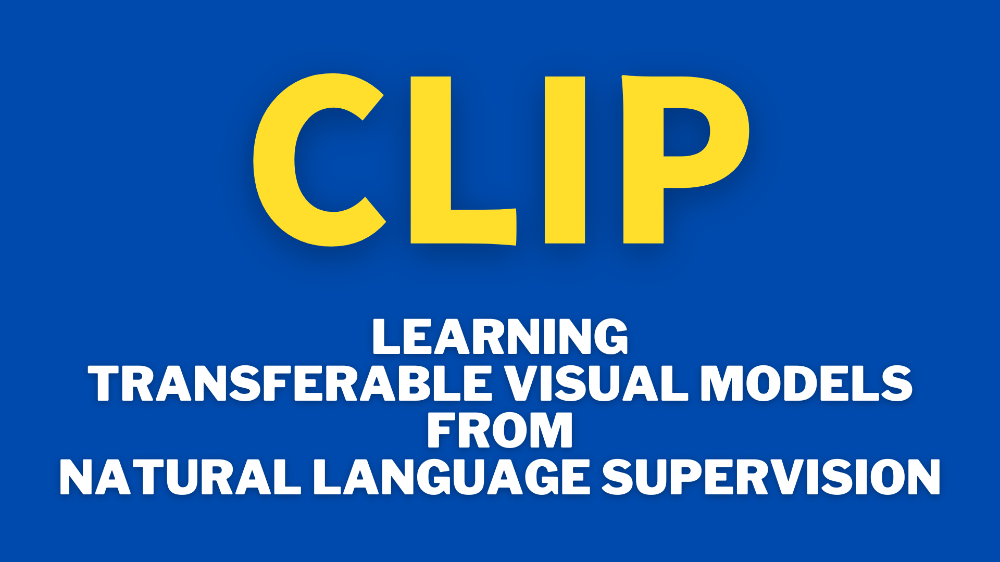

Deep learning vision models traditionally relied on vast collections of labeled images, each tailored to recognize objects in a specific category or class. OpenAI's approach, using images and natural language, offers an alternative that doesn't necessitate such tailored examples. They developed a CLIP model that can recognize objects without needing individual training sets for each new object. Moreover, generative models like OpenAI's DALLE-E and Stability AI's Stable Diffusion integrate CLIP to encode input texts for text-to-image generation. It showcases the power of combining natural language processing with computer vision.

This article will examine how CLIP works and what it brings to computer vision.

## Teaching Computers to Recognize Objects

### The Traditional Approach

Traditionally, when we teach computers to recognize things like cats, dogs, horses, or other objects, we give them a massive collection of images with labels specifying what's in each image. This method works well for those specified items, but what happens when we want the computer to recognize something new? It can become quite a challenge!

Imagine you're learning to identify different types of fruit, and all you have are images of apples, bananas, and oranges. If someone suddenly shows you a pineapple, you might be stumped! The same thing happens with computer vision models. They won't be able to recognize a zebra if we train them only on cats, dogs, and horses.

### A New Approach

In the old way of doing things, if we wanted the computer to recognize a zebra, we'd have to collect many images of zebras and tell our vision model, "These are zebras." That takes a lot of time and effort. Even worse, we need that for every new object we want our model to recognize.

Researchers at OpenAI came up with an alternative approach. 

What if we give a vision model images and texts describing those images? This way, the computer can start understanding what things look like and how we talk about them. This new method uses a massive collection of images and sentences from the internet. The computer's job is to match the correct sentence with the right images. Once the computer learns this matching game, it can recognize new things without additional images and labels.

In other words, it obtains **zero-shot learning** capability.

### Zero-Shot Learning with Language Supervision

Zero-shot learning means a model can infer or classify objects or concepts it has never explicitly seen during training. It can generalize from the knowledge it has gained, identifying new objects or situations without direct prior experience. 

OpenAI researchers pre-trained a neural network called **CLIP** (**C**ontrastive **L**anguage-**I**mage **P**re-training) on datasets of (image, text) pairs. The objective is to predict which caption goes with which image so that the model learns image representations. The approach uses natural language supervision instead of human-annotated labels, enabling the model to generalize to many tasks without fine-tuning.

So, how did OpenAI train the CLIP model to have zero-shot capabilities using natural language as supervision?

## The Structure of CLIP

### Overall Approach

The real innovation of OpenAI's CLIP model lies in its structure, which seamlessly integrates both images and texts into a common understanding. It does this by utilizing three key components:

- Image Encoder
- Text Encoder
- Shared Embedding Space

OpenAI's CLIP model simultaneously trains an image encoder and a text encoder to accurately predict the correct pairings of (image, text) within a shared embedding space, bridging the gap between visual understanding and natural language comprehension.

The figure below explains the overall approach of CLIP:

](images/figure-1-1.png)

As you can see in the figure, there are N images and N texts to match in the training batch. CLIP predicts which of the N x N possible (image, text) parings within the batch occurred.

For the image encoder, they experimented with modified versions of ResNet-50 or Vision Transformer. They experimented with a modified version of the Transformer architecture for the text encoder.

A shared embedding space for image and text is crucial because it allows the model to understand and relate visual information with natural language descriptions. 

### Contrastive Language Image Pre-training

By mapping both images and texts into the same mathematical space, CLIP can perform two critical tasks:

- maximize the cosine similarity of the image and text embeddings of the N real pairs in the batch
- minimize the cosine similarity of the embeddings of the N(N - 1) incorrect pairings

We refer to learning the above two objectives as contrastive learning since it emphasizes understanding the differences (or contrasts) between things. By maximizing the similarity between correct image-text pairs and minimizing the similarity between incorrect ones, the model learns to associate specific visual features with corresponding descriptive language. 

That shared understanding enables it to generalize and perform zero-shot learning, provided it can understand the texts and match them with corresponding images (and vice versa).

They used 400 million (image, text) pairs from the internet and trained a neural network to predict which caption goes with which image. This large and diverse dataset allowed the model to learn from many examples, building a comprehensive understanding of visual and textual information.

The resulting model performs well on various downstream tasks, showcasing the power of the CLIP model in handling complex recognition challenges without needing individual training sets for each new object."

### Loss Calculation

Below is the pseudo-code of the CLIP's core logic:

```python
# image_encoder - ResNet or Vision Transformer
# text_encoder - CBOW or Text Transformer
# I[n, h, w, c] - minibatch of aligned images
# T[n, l] - minibatch of aligned texts
# W_i[d_i, d_e] - learned proj of image to embed
# W_t[d_t, d_e] - learned proj of text to embed
# t - learned temperature parameter

# extract feature representations of each modality
I_f = image_encoder(I) #[n, d_i]
T_f = text_encoder(T)  #[n, d_t]

# joint multimodal embedding [n, d_e]
I_e = l2_normalize(np.dot(I_f, W_i), axis=1)
T_e = l2_normalize(np.dot(T_f, W_t), axis=1)

# scaled pairwise cosine similarities [n, n]
logits = np.dot(I_e, T_e.T) * np.exp(t)

# symmetric loss function
labels = np.arange(n)
loss_i = cross_entropy_loss(logits, labels, axis=0)
loss_t = cross_entropy_loss(logits, labels, axis=1)
loss = (loss_i + loss_t)/2
```

The comments at the top describe the various components involved:

- `I`: A batch of images.
- `T`: A  batch of aligned texts.
- `W_i`: A learned projection matrix to transform image features into a shared embedding space.
- `W_t`: A learned projection matrix to transform text features into the same shared embedding space.
- `t`: A learned temperature parameter that scales the similarities in the embedding space.

CLIP feeds images and texts to respective encoders to generate numerical feature vectors:

- `I_f = image_encoder(I)`: A batch of image features.
- `T_f = text_encoder(T)`: A batch of text features.

CLIP projects these features into a shared embedding space:

- `I_e = l2_normalize(np.dot(I_f, W_i), axis=1)`: Image embeddings in the shared embedding space.
- `T_e = l2_normalize(np.dot(T_f, W_t), axis=1)`: Text embeddings in the shared embedding space.

CLIP computes the cosine similarities between the image and text embeddings:

- `logits = np.dot(I_e, T_e.T) * np.exp(t)`: Pairwise similarities between all images and texts in the batch.

`np.exp(t)` deserves some explanation. Let's put `T = np.exp(t)` and call it a temperature parameter. `T` scales the logits and affects the results of the softmax operation.

- If `t` is positive, `T > 1`. The resulting probability distribution by `softmax(logits)` will be softer (more uniform).
- If `t` is negative, `T < 1`. The resulting probability distribution by `softmax(logits)` will be sharper (more peaked).
- If `t` is zero, `T = 1`. The logits are not scaled.

The exponential of `t` is used because `t` is a learnable parameter that is unbounded (can be any value without any limits) while the temperature must be non-negative. This formulation gives the learning algorithm more flexibility to find an optimal value for the temperature parameter during training. 

If the temperature needs to be high (i.e., the probability distribution should be softer), the learned value of `t` can be positive. If the temperature needs to be low (i.e., the probability distribution should be sharper), the learned value of `t` can be negative. The temperature parameter is adaptable to the needs of the specific model and data without having to set it manually.

CLIP calculates the loss to minimize the differences between the correct pairings and maximize the differences between incorrect pairings:

- `labels = np.arange(n)`: Creates the true labels for the batch.
- `loss_i = cross_entropy_loss(logits, labels, axis=0)`: Loss for the image alignment.
- `loss_t = cross_entropy_loss(logits, labels, axis=1)`: Loss for the text alignment.
- `loss = (loss_i + loss_t)/2`: The final symmetric loss function averages the loss over both modalities.

So, minimizing the cross-entropy losses ensures maximizing the similarity of real pairs (as we maximize the logits for them) and minimizing the similarity of incorrect pairings (as we minimize the logits for them). It's the essence of contrastive learning in the CLIP model.

In summary, CLIP takes a batch of images and texts, encodes them, projects them into a shared embedding space, and then minimizes the dual loss to understand the correlations between images and texts. CLIP uses this understanding to perform tasks like zero-shot learning, where the model can recognize new objects based on the relationships it has learned.

### Zero-shot Classifier Testing

After pre-training, the OpenAI researchers created a zero-shot classifier by embedding the label descriptions from the test dataset, as demonstrated in the following image:

](images/figure-1-2.png)

So, in the zero-shot classification setup, the labels of the target dataset (i.e., the classes you want to classify the images into) are expressed in natural language. They use the text encoder of CLIP to embed these descriptions into the shared embedding space. Also, the image encoder of CLIP embeds the images from the test dataset into the shared embedding space. The model measures each test image's similarity to the target classes' embedded descriptions by computing the cosine similarity between the image's embedding and the embeddings of the text descriptions.

This approach has the advantage of not needing to fine-tune the model for specific classification tasks. Since it can understand the relationships between images and texts, it can generalize to new tasks without requiring task-specific training data. It allows the model to recognize new objects as long as it can understand the text descriptions and match them with corresponding images, and vice versa. CLIP selects the predicted class for each image by the similarity between the text and the image in the shared embedding space.

OpenAI benchmarked the zero-shot transfer performance of CLIP on over 30 existing datasets, finding the model competitive with prior task-specific supervised models.

The below figure shows that a 63 million parameter transformer language model, which already uses twice the compute of its ResNet-50 image encoder, learns to recognize ImageNet classes three times slower than a much simpler baseline that predicts a bag-of-words encoding of the same text.

](images/figure-2.png)

The below figure shows that zero-shot CLIP is more robust to distribution shift than ResNet 101.

](images/figure-13-right.png)

Zero-shot CLIP performs well on ImageNet and other datasets, while ResNet 101 only performs on par with ImageNet and much worse on other datasets. Therefore, the zero-shot capabilities of CLIP provide a significant advantage over traditional models like ResNet 101. While ResNet 101 may perform well on specific tasks such as ImageNet classification, its performance may degrade on other datasets or tasks that it was not explicitly trained for. In contrast, CLIP's zero-shot learning ability allows it to generalize across various tasks and datasets without needing specific training for each one.

The comparison between zero-shot CLIP and ResNet 101 highlights the importance of models that can adapt and perform across various domains without requiring task-specific training, opening new possibilities in AI research and applications.

## Conclusion

The OpenAI's CLIP model represents an advancement in computer vision, enabling more adaptable object recognition through zero-shot learning. 

This generalization capability makes CLIP a more versatile and robust model, suitable for a wide range of applications beyond just image classification. Integrating CLIP in models like DALL-E and Stable Diffusion for text-to-image synthesis is a testament to its flexibility and potential in bridging the gap between language and vision.

## References

- [Learning Transferable Visual Models From Natural Language Supervision](https://arxiv.org/abs/2103.00020) \
  Alec Radford, Jong Wook Kim, Chris Hallacy, Aditya Ramesh, Gabriel Goh, Sandhini Agarwal, Girish Sastry, Amanda Askell, Pamela Mishkin, Jack Clark, Gretchen Krueger, Ilya Sutskever \
  OpenAI \
  [GitHub](https://github.com/OpenAI/CLIP)
