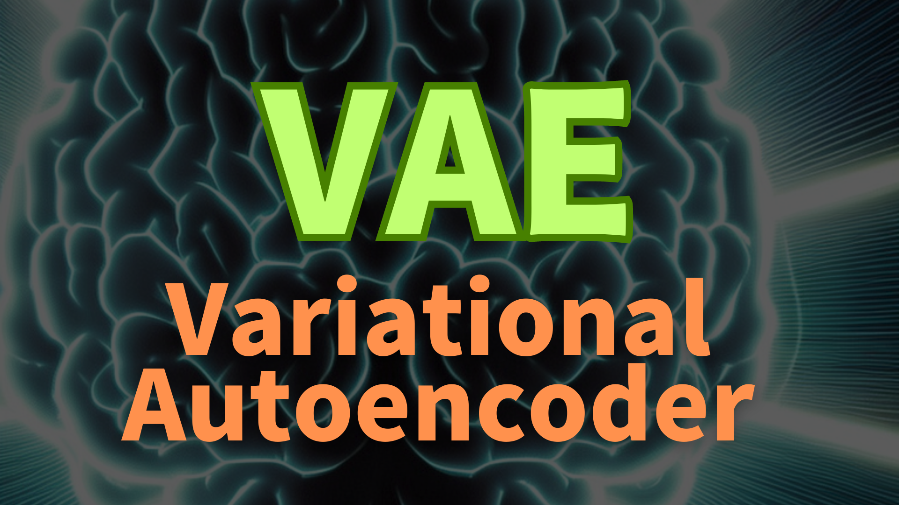
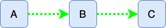
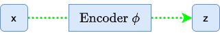
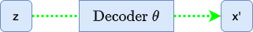
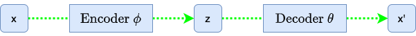
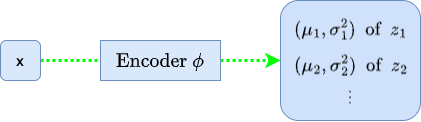
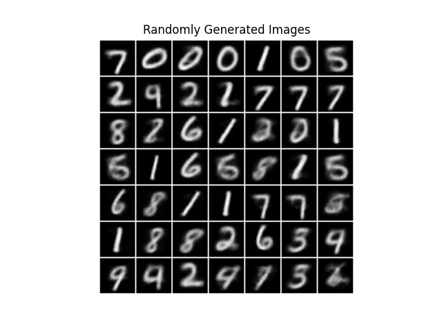
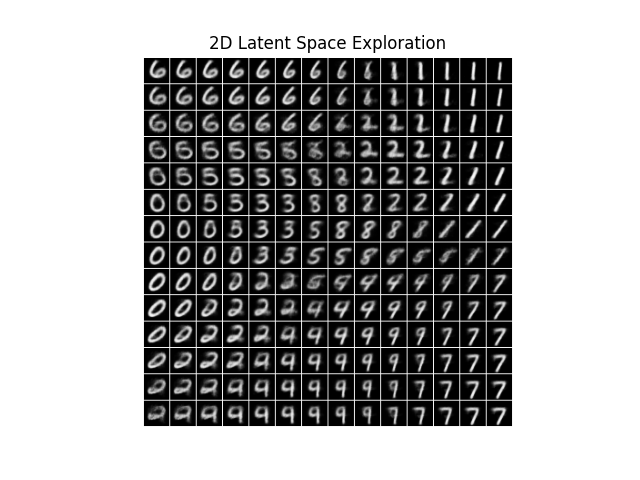

Ever stumbled upon the [Auto-Encoding Variational Bayes](https://arxiv.org/abs/1312.6114) paper and felt lost amid mathematical equations and concepts like Auto-Encoder, Bayesian Theorem, Variational Inference, and Deep Learning? Understanding this groundbreaking work is a challenge but a rewarding journey that unveils new perspectives in machine learning. Variational Auto-Encoders, at the core of this paper, are powerful tools that replicate input data and generate new outputs. If these concepts intrigue you and you want to uncover the insights behind the AEVB paper, this article is for you.

Variational Auto-Encoders, commonly known as VAEs, are powerful tools in machine learning. Unlike traditional Auto-Encoder models that primarily replicate input data, VAEs can generate new outputs. They achieve this by identifying and learning hidden features from training datasets and using them as a blueprint to generate new data.

Diederik P Kingma and Max Welling from the University of Amsterdam significantly advanced this field with their Auto-Encoding Variational Bayes paper. This pioneering work introduced AEVB, a novel approach to training generative models. AEVB's name symbolizes two crucial functions:

- 'AE' for compressing and reconstructing data
- 'VB' for approximating complex data distributions by optimizing towards simpler ones.

Using the AEVB framework, we derive VAEs, generative models capable of creating content like images. Imagine training a VAE on the MNIST dataset of handwritten digits, and it then generates new digit images not in the dataset. It's like an artist drawing new numbers after studying examples. Later in this article, I'll show you how to train a VAE using PyTorch.

While AEVB applies to various data types, this article centers on images for clarity and demonstration. In this article, the word 'VAE' refers to both the AEVB framework and the specific neural network design suitable for generating images. I won't delve into other data types or non-deep-learning approaches, keeping our focus sharp.

Now, let's uncover the inner workings of VAEs, starting with the big question.

## The Big Question

The paper [Auto-Encoding Variational Bayes](https://arxiv.org/abs/1312.6114) introduced Variational Auto-Encoder (VAE), starting with a question:

> How can we perform efficient inference and learning in directed probabilistic models, in the presence of continuous latent variables with intractable posterior distributions, and large datasets?
<cite>[Auto-Encoding Variational Bayes](https://arxiv.org/abs/1312.6114)</cite>

This question encapsulates the central challenge that VAEs aim to address. It may seem complex at first glance. However, understanding it unlocks the core mechanics of how VAEs function. Let's break it down and examine it piece by piece.

### Directed Probabilistic Models: The Big Picture

Directed probabilistic models, commonly known as Bayesian networks, utilize a directed acyclic graph (DAG) to illustrate the relationships and dependencies among various random variables.

Consider the simple DAG below, which depicts the dependencies between random variables A, B, and C:



In this graph, the nodes symbolize random variables, while the edges (arrows) indicate conditional dependencies. An edge from node A to node B signifies that random variable B depends on random variable A. This relationship is **directed** because it follows a specific direction, from A to B, and not vice versa. The term **probabilistic** in the context of these models alludes to their foundation in probability theory, with the arrows in the graph representing the conditional dependencies between these variables.

Let's transition from this basic diagram to a more intricate Variational Auto-Encoders (VAEs) structure.

](images/figure-1.png)

This figure presents two interconnected DAGs: the encoder and the decoder.

The encoder flow (delineated by the dotted line) demonstrates the compression of an input image x into a latent representation z within the feature space. The symbol ϕ represents the encoder's parameters.



The decoder flow (indicated by the solid line) illustrates the reconstruction process, transforming the latent representation z into an image resembling the original input x. Here, θ denotes the decoder's parameters.



The encoder and decoder are probabilistic, and their probability distributions exhibit conditional dependencies, as the two flows have a connection via the latent representation z.



The encoder is responsible for modeling the conditional probability distribution P(z|x), as it takes an input image x and produces a latent representation z. The decoder is responsible for modeling the conditional probability distribution P(x|z), as it takes latent variables z and reconstructs an image x' close to the input image x.

With a clear understanding of directed probabilistic models and the roles of the encoder and decoder, we're ready to delve deeper into the intricacies of the encoder and decoder and explore the challenges and solutions that VAEs introduce in probabilistic modeling.

### Continuous Latent Variables: Hidden Features

In the context of VAEs, the variable z captures the underlying latent features of the input data. While individual aspects of an image, such as specific colors or shapes, might be directly discernible, the latent features delve deeper, representing higher-level abstractions inferred from the raw data. These abstracted features, often hidden within the pixels but consistent across many images, capture common characteristics across diverse inputs. The encoder distills the input image x into this abstract representation, transcending immediate pixel values to capture the content's essence.

The latent space stands out because of two key features:

**Compactness**: The latent space of VAEs is typically of lower dimensionality than the original data. This compact representation ensures the VAE focuses on the most salient and generalizable features. By reducing dimensionality, the model abstracts away from granular, pixel-by-pixel details, centering its attention on the overarching essence of the content.

**Continuity**: The latent variables z are continuous, enabling smooth and coherent transitions within the latent space. This continuity ensures that even minute perturbations in the latent variables can be mapped to meaningful variations in the generated output, allowing VAEs to represent a broad spectrum of features. As the decoder leverages these continuous latent variables, it crafts images that resonate with the original's style and content without being mere replicas.

Together, these characteristics of the latent space empower VAEs to generate diverse and novel samples while retaining the fundamental attributes of the training data.

Suppose we can determine the distribution of these latent variables and sample from the latent space. In that case, we can use the decoder to generate new images that mirror the style and ambiance of the training dataset without the need for the input image or encoder. Ultimately, that is what we want. We want to use the decoder as an image generator.

However, a significant challenge persists: accurately determining the distribution of the latent variables, z, is not merely complex—it's intractable.

### Intractable Posterior Distributions: A Tough Challenge

Recall the encoder DAG from our earlier discussion:


The encoder's task is to capture the essence of the input image x and represent it in the latent space by modeling the conditional probability P(z∣x), known as the posterior distribution. The posterior represents the probability of our latent variables z given observed data x.

However, accurately determining this distribution is rather complex due to the intricate relationships between the data and latent variables. This complexity makes the posterior **intractable**.

According to Bayes' theorem, we can compute the posterior distribution P(z|x) as follows:

$$
P(z|x) = \frac{P(x|z) P(z)}{P(x)}
$$

Let's look at the right-hand side of the equation.

The decoder models the likelihood P(x∣z), the probability of observing an image x given the latent variables z.

The prior distribution P(z) captures our beliefs or assumptions about the latent variables z before observing any image x. In Bayesian inference, we refer to it as the prior belief. While we might typically assume it to be a simple distribution, such as a Gaussian, the choice of prior can be multifaceted:

- **Informative priors** reflect known information or beliefs about a parameter.
- **Non-informative or flat priors** are used when there's a lack of prior knowledge, assigning equal weight to all parameter values.
- **Conjugate priors** are chosen for mathematical convenience, ensuring the posterior distribution retains the same form as the prior.

These priors encapsulate our initial assumptions before any data observation and can influence the results of Bayesian inference.

In the context of VAEs, our choice of the prior (often a standard normal distribution) is motivated by computational convenience and the desire to impose specific structures on the latent space. While this choice aligns with the Bayesian principle of incorporating prior beliefs, in the case of VAEs, it's more about "**what we want it to be**" for the model efficiency and desired properties rather than strictly about "**what we believe it to be**".

In short, we want the distribution of latent variables as the standard normal distribution because it makes our model simple and easy to sample from.

Returning to Bayes' theorem formula, the denominator P(x) represents the marginal likelihood or the evidence. It quantifies the likelihood of observing the image data x without conditioning on any specific value of z. To determine it, we must calculate the probability density (or mass) of image x for every conceivable value of z, then integrate (or sum) across all these values.

Mathematically, we can represent the evidence P(x) as:

$$
P(x) = \int P(x|z) P(z) dz
$$

If we could precisely compute P(x), we would use the posterior distribution P(z|x) to sample the latent features. However, the intertwined complexities of high-dimensional data, model structures, and the need for integration across the latent space render the direct computation of P(x) practically impossible, even though it's central to our Bayesian framework. This inherent challenge in assessing P(x) makes the posterior P(z|x) intractable.

Now, recall the big question says:

> in the presence of continuous latent variables with intractable posterior distributions

It says the posterior distribution P(z|x) is intractable. We now know why. It's because directly computing the evidence P(x) is practically impossible.

The intractability of the posterior distribution presents a significant challenge, but it’s not insurmountable. Researchers have devised clever techniques to address this issue, enabling efficient inference and learning in VAEs. As we progress, we'll uncover the strategies that have made VAEs practical and powerful.

### Efficient Inference: Variational Inference

Given the challenges of intractable posterior distributions of latent variables z, how do VAEs perform efficient inference and learning? The answer lies in a technique called **variational inference**.

Variational inference (VI) is a method used to approximate complex, often intractable, posterior distributions with simpler, more tractable ones. The core idea revolves around two main steps:

- **Choose an Approximating Distribution**: Select a family of distributions, typically simpler than the true posterior, to act as an approximation. These distributions have parameters that we can adjust to make the approximation better.
- **Optimize to Minimize the Difference**: Adjust the parameters of the approximating distribution based on observed data to make it as close as possible to the true posterior. The measure of "closeness" is usually the Kullback-Leibler (KL) divergence (more on in the next section).

You might wonder why simpler distributions can approximate a more intricate one effectively.

While the true posterior might be complex and intractable across its entire domain, the beauty of VI lies in its locality. Instead of attempting a global approximation that fits the entire distribution, VI hones in on regions relevant to the observed data. By focusing on these local regions, VI can leverage simpler distributions to approximate the complex behavior of the true posterior where it matters most. This selective approach is why a seemingly simpler distribution can approximate a more intricate one, and it's very effective.

Here is an analogy that might further clarify the locality of variational inference. 

Imagine we're trying to understand the shape of a complex mountain range with peaks, valleys, and intricate terrains. If we tried a global approximation, we'd attempt to fit a single smooth curve to capture the entire range. That would be challenging, computationally intense, and might miss many details.

Think of another approach: Instead of mapping the whole range, focus on small sections. We fit curves to these local areas, capturing their details accurately. Over time, we aim to approximate the entire range more accurately by piecing together our understanding of many such sections. This strategy of focusing on specific areas or regions, then stitching them together for a broader understanding, mirrors the principle of local approximation in VI.

Now, with this VI approach in mind, let's ponder on the next challenge: How can we fine-tune the parameters of our approximating function for each local area such that, when combined, they provide a close match to the global true posterior?

### Efficient Learning: Deep Learning

Let's denote our approximating posterior distribution as Q<sub>ϕ</sub>(z∣x). Here, ϕ represents the parameters that we can adjust to fit Q<sub>ϕ</sub>(z∣x) to the true posterior P(z|x). The main challenge is determining how to adjust these parameters efficiently.

As a reminder, we're working in high-dimensional spaces and need an approach that can dynamically adjust Q<sub>ϕ</sub>(z∣x) based on the input data x. Can you think of a way to learn those parameters in the presence of large datasets?

If that reminds you of neural networks, you're thinking along the same lines as the researchers in the paper. In VAEs, we use neural networks as an efficient way to parameterize and optimize our approximating distributions. Specifically, given an image x, the neural network outputs the parameters (like the mean and variance) that define the distribution Q<sub>ϕ</sub>(z∣x), from which we can sample the latent variable z.

Neural networks can handle high-dimensional spaces and large datasets using techniques like stochastic gradient descent. By defining a loss function, we can adjust the parameters ϕ of our network, efficiently making Q<sub>ϕ</sub>(z∣x) a better approximation of P(z∣x).

But how can we define a loss function to achieve efficient learning?

That is where the [Kullback-Leibler (KL) divergence](/blog/2018-11-06-kl-divergence-demystified/) comes into play, which measures how one probability distribution differs from another. As we want to make our Q<sub>ϕ</sub>(z∣x) closer to the true posterior P(z∣x), we should aim to minimize the KL divergence between the two distributions, which we can include in our loss function as a regularization term.

The immediate question is: if P(z∣x) is intractable, how can we compute the KL divergence between P(z|x) and Q<sub>ϕ</sub>(z∣x)? The answer is that we don’t compute the KL divergence directly. Instead, we maximize the **Evidence Lower Bound** (ELBO) derived from the KL divergence. By maximizing the ELBO, we implicitly minimize the KL divergence between the approximating distribution Q<sub>ϕ</sub>(z∣x) and the true posterior P(z|x), even though we don't compute this divergence directly. We'll discuss the details of the mathematics later on. 

So, we covered all the ingredients to understand the big question. In simple terms, the question from the VAE paper asks:

"How can we design a model that quickly understands hidden patterns from vast amounts of data, especially when it's tricky to predict these patterns, and then use this knowledge to recreate or generate new data?"

The solution involves designing a deep learning model that learns the posterior distribution of latent variables z from training images x and then uses these features to reconstruct or generate new images. Researchers combined clever techniques with mathematical insights to develop what we now call Variational Auto-Encoders (VAEs).

Let's dive deeper into the inner workings of VAEs.

## Solving the Problem: The Inner Workings of VAEs

### Evidence Lower Bound (ELBO): Deriving from KL Divergence

In Variational Auto-Encoders (VAEs), the Evidence Lower Bound (ELBO) plays a pivotal role. It's a surrogate objective function to optimize our model even when the actual posterior distribution is intractable. Let's unpack its derivation from the KL divergence.

The Kullback-Leibler (KL) divergence between the approximating posterior Q<sub>ϕ</sub>(z∣x) and the true posterior P(z|x) is given by:

$$
D_{KL}(Q_\phi(z|x) || P(z|x)) = \mathbb{E}_{Q_\phi(z|x)}[\log Q_\phi(z|x) - \log P(z|x)]
$$

When considering the KL divergence, it's crucial to understand the order of its arguments. It's because the KL divergence is not symmetric, and the order of its arguments plays a significant role. The above KL divergence formula measures the divergence of the true posterior P(z∣x) from our approximating distribution Q<sub>ϕ</sub>(z∣x), not vice versa. As such, we use Q<sub>ϕ</sub>(z∣x) for the expectation calculation, which is under our control. If we instead used the KL divergence D<sub>KL</sub>(P(z|x)||Q<sub>ϕ</sub>(z∣x)), we would need to use the true posterior P(z∣x), intractable due to its complexity, for expectation calculation, which would make the KL divergence intractable.

So, we calculate the KL divergence based on Q<sub>ϕ</sub>(z∣x), but the formula still has the intractable P(z|x). How can we circumvent it? Let's see what we can do.

Expanding P(z|x) using Bayes' theorem:

$$
P(z|x) = \frac{P(x|z) P(z)}{P(x)}
$$

Substituting this into the KL divergence:

$$
\small{
\begin{aligned}
D_{KL}(Q_\phi(z|x) || P(z|x)) &= \mathbb{E}_{Q_\phi(z|x)}\biggl[\log Q_\phi(z|x) - \log P(z|x)\biggr] \\\\
&= \mathbb{E}_{Q_\phi(z|x)}\left[\log Q_\phi(z|x) - \log \frac{P(x|z) P(z)}{P(x)}\right] \\\\
&= \mathbb{E}_{Q_\phi(z|x)}\biggl[\log Q_\phi(z|x) - \log P(x|z) - \log P(z) + \log P(x)\biggr] \\\\
&= D_{KL}(Q_\phi(z|x) || P(z)) - \mathbb{E}_{Q_\phi(z|x)}[\log P(x|z)] + \log P(x)
\end{aligned}
}
$$

Rearranging terms:

$$
\small{
\mathbb{E}_{Q_\phi(z|x)}[\log P(x|z)] - D_{KL}(Q_\phi(z|x) || P(z)) = \log P(x) - D_{KL}(Q_\phi(z|x) || P(z|x))
}
$$

The left-hand side is what we refer to as the Evidence Lower Bound (ELBO). Therefore, we can define the ELBO as:

$$
\text{ELBO} = \mathbb{E}_{Q_\phi(z|x)}[\log P(x|z)] - D_{KL}(Q_\phi(z|x) || P(z))
$$

In VAEs, we use the decoder to approximate the generation process of P(x∣z), and we have control over the prior P(z). Given this, we use the notation P<sub>θ</sub> to represent these parameterized distributions. Specifically, P<sub>θ</sub>(x∣z) represents the probability distribution of observing the image x given the latent variables z as modeled by the decoder, and P<sub>θ</sub>(z) represents our chosen prior distribution for the latent variables.

$$
\text{ELBO} = \mathbb{E}_{Q_\phi(z|x)}[\log P_\theta(x|z)] - D_{KL}(Q_\phi(z|x) || P_\theta(z))
$$

The ELBO formula does not include the intractable true posterior P(z|x), and we can use them to serve the following dual purposes:

- **Maximizing Data Likelihood**: The term E<sub>Q<sub>ϕ</sub>(z∣x)</sub>[log P<sub>θ</sub>(x|z)] represents the expected log-likelihood of the image data x given the encoder-encoded latent variables z. By maximizing this term, we aim to ensure that the reconstructed data (from the decoder) is as close as possible to the original image data x.

- **Regularizing the Latent Space**: The term D<sub>KL</sub>(Q<sub>ϕ</sub>(z∣x)∣∣P<sub>θ</sub>(z)) acts as a regularizer. It ensures that the distribution of the latent variables z, as modeled by the encoder, doesn't deviate too much from the prior distribution of our choice (more on this later). This term encourages the latent space to maintain a desired structure, allowing us to sample z to generate new images.

By maximizing the ELBO, we achieve these two objectives: we ensure that our VAE reconstructs the data accurately while maintaining a structured latent space.

We can also define ELBO like this:

$$
\text{ELBO} = \log P(x) - D_{KL}(Q_\phi(z|x) || P(z|x))
$$

While this representation of the ELBO may look different from the previously discussed one, it is an equivalent definition using different terms based on the earlier derivation of the ELBO formula.

This version of ELBO includes the intractable true posterior P(z|x). However, it tells us that maximizing ELBO means maximizing the evidence P(x) and minimizing the KL divergence between the approximating posterior Q<sub>ϕ</sub>(z∣x) and the true posterior P(z|x), which is why maximizing ELBO ensures our approximating posterior becomes closer to the intractable true posterior P(z|x), without ever calculating it.

Moreover, the ELBO provides a lower bound on the log evidence as any KL divergence is non-negative:

$$
\log P(x) \ge \text{ELBO}
$$

The ELBO becomes equal to the log evidence only when the Q<sub>ϕ</sub>(z∣x) and P(z|x) are the same.

Note: The original VAE paper uses the notation P<sub>θ</sub>(x) and P<sub>θ</sub>(z∣x) to denote the evidence and the true posterior. However, for clarity in our discussion, we'll use the notation P(x) and P(z∣x) without any parameter subscript. That is because these distributions are intractable, and I want to differentiate between idealized mathematical relationships and the neural network-based approximations in VAEs. As such, I've reserved θ for the decoder's generative process to maintain this distinction and reduce potential confusion.

Having derived the ELBO, we now face the challenge of optimizing it. Let's discuss that in the following sections.

### The Encoder: From Images to Distributions in Latent Space

Unlike traditional Auto-Encoders, which directly map an input to a point in the latent space, VAEs map an input to a distribution in the latent space. This probabilistic approach recognizes the inherent uncertainty when representing complex data, like images, in a lower-dimensional latent space.

The encoder in a VAE, often implemented as a convolutional neural network (CNN), processes an input image and estimates the distribution of the latent variables that correspond to that image. More specifically, for each input image x, the encoder predicts the mean and variance of the latent variables z, locally approximating the posterior distribution for that image.



So, the encoder processes an input image x and estimates the distribution parameters of the latent variables z. You might wonder: are these estimates constrained at all? Indeed, they are. The encoder's predictions are guided and regulated. In the VAE, the KL divergence term within the ELBO acts as a regularizer—it quantifies the divergence between the encoder's predicted distribution Q<sub>ϕ</sub>(z|x) and a predetermined prior distribution P<sub>θ</sub>(z). This arrangement ensures that the latent space is well-structured and not scattered randomly.

We assume that each latent variable in P<sub>θ</sub>(z) follows a standard normal distribution, as this choice simplifies the KL divergence term in the ELBO and often results in a well-behaved latent space. It's worth noting that this choice is not a restriction of VAEs, but instead by design. The prior could be another distribution, depending on the problem context or the specific design decisions.

Let's think of 1D latent space to keep the discussion simple.

$$
P_\theta(z) = \mathcal{N}(z; 0, 1)
$$

Here, _N_ represents the Normal (or Gaussian) distribution.

For Q<sub>ϕ</sub>(z∣x), we have:

$$
Q_\phi(z|x) = \mathcal{N}(z; \mu_\phi(x), \sigma^2_\phi(x))
$$

Here, μ<sub>ϕ</sub>(x) and σ<sup>2</sup><sub>ϕ</sub>(x) indicate that we get a different Gaussian distribution for each input x. In other words, based on x, the encoder predicts a mean μ and variance σ<sup>2</sup> for latent variable z. In this way, the encoder provides the local approximation.

Given large datasets, the objective is to minimize the KL divergence between Q<sub>ϕ</sub>(z∣x) and P<sub>θ</sub>(z) across many images. It ensures that, in the aggregate, the distributions Q<sub>ϕ</sub>(z∣x) across various inputs will converge to approximate the prior P<sub>θ</sub>(z), which we design as the standard normal distribution.

In the training phase, the encoder's task is to predict the parameters of Q<sub>ϕ</sub>(z∣x) for each image. The KL divergence then serves as a regularization term in the loss function, guiding the encoder's predictions toward our desired prior distribution.

I hope you can see a progression: from the high-level goal (minimizing KL divergence across many images) to the mechanism (the encoder predicts parameters) to the method (using KL divergence as regularization).

As we design the approximating posterior Q<sub>ϕ</sub>(z∣x) and the prior P<sub>θ</sub>(z) as Gaussian distributions, we can derive the KL divergence between these distributions by the following derivation:

$$
\small{
  \begin{aligned}
  D_{KL}(Q_\phi(z|x) \| P_\theta(z)) &= \int Q_\phi(z|x) \log \left( \frac{Q_\phi(z|x)}{P_\theta(z)} \right) dz \\\\
  &= \int Q_\phi(z|x) \biggl[\ \log Q_\phi(z|x) - \log P_\theta(z) \ \biggr] dz \\\\
  &= \int Q_\phi(z|x) \biggl[\ \log \frac{1}{\sqrt{2\pi\sigma^2_\phi(x)}} \exp \left( - \frac{(z - \mu_\phi(x))^2}{2\sigma^2_\phi(x)} \right) \\
  &\qquad\qquad\qquad - \log \frac{1}{\sqrt{2\pi}} \exp \left( - \frac{z^2}{2} \right) \ \biggr] \\\\
  &= \int Q_\phi(z|x) \biggl[\ -\frac{1}{2} \log (2\pi\sigma^2_\phi(x)) - \frac{(z - \mu_\phi(x))^2}{2\sigma^2_\phi(x)} \\
  &\qquad\qquad\qquad  - \left( -\frac{1}{2} \log 2\pi - \frac{z^2}{2} \right) \ \biggr] \\\\
  &= \frac{1}{2} \int Q_\phi(z|x) \biggl[ -\log \sigma^2_\phi(x) - \frac{(z - \mu_\phi(x))^2}{\sigma^2_\phi(x)} + z^2 \biggr] \\\\
  &= \frac{1}{2} \biggl( -\log \sigma^2_\phi(x) - 1 + \mu^2_\phi(x) + \sigma^2_\phi(x) \biggr)
  \end{aligned}
}
$$

In the last step, I used the relationship: E[z<sup>2</sup>] = μ<sup>2</sup> + σ<sup>2</sup>.

For a VAE with J independent latent variables, we sum this value from all dimensions:

$$
D_{KL}(Q_\phi(z|x) \| P_\theta(z)) = \frac{1}{2} \sum_{j=1}^{J} \biggl( -\log \sigma^2_{\phi_j}(x) - 1 + \mu^2_{\phi_j}(x) + \sigma^2_{\phi_j}(x) \biggr)
$$

This equation measures how much the encoder's predictions deviate from the standard normal prior. Minimizing this KL divergence during training encourages the encoder's predicted distributions to closely align with the standard normal distribution, facilitating a structured latent space. By estimating the latent distribution for each image across large datasets, the VAE aligns its representations with the designed latent structure.

More intuitively, we use the KL divergence to force the distribution of latent variables to be standard normal so that we can sample latent variables from the standard normal distribution. As such, it is included in the loss function to improve the similarity between the distribution of latent variables and the standard normal distribution. In this setup, the prior distribution is less as our initial guess and more as a desired shape or structure for our latent space.

So, what do VAEs do with the estimated latent distribution parameters during training?

VAEs employ a unique strategy in their latent space. Instead of learning a fixed representation for each image, they understand a range of possible representations by sampling different points around the mean. This sampling process is fundamental to the VAE’s generative capabilities.

During the encoding phase, the VAE estimates the latent variable distribution for an image. However, the broader goal isn't just to represent existing images. We want to use this latent space to generate new ones. If the VAE only relied on the mean value, it might limit the diversity of the latent space and hinder the generation of varied images. Sampling from the estimated latent distributions ensures a well-populated and continuous latent space, reinforcing the VAE's strength as a generative model.

However, there's a hitch. The sampling operation is inherently non-differentiable, which poses a challenge for backpropagation. Thankfully, the reparameterization trick (the topic of the next section) addresses it, allowing gradients to flow through this non-differentiable step.

In essence, by nudging the encoder's outputs to fit a predefined distribution, VAEs sculpt a structured latent space, paving the way for robust sampling and the generation of diverse data points.

In essence, by nudging the encoder's outputs to fit a predefined distribution, VAEs sculpt a structured latent space, paving the way for robust sampling to generate diverse images.

### The Reparameterization Trick: Enabling Gradient Flow in VAEs

In our discussion so far, we've looked at the VAE through the lens of a Directed Acyclic Graph (DAG) that captures the probabilistic dependencies between variables. This perspective is crucial for understanding the generative process and the relationships between the encoder, latent variables, and decoder.


However, when training the VAE, we must shift our viewpoint slightly.

Training a VAE, like any deep learning model, involves optimizing a loss function using gradient-based methods. That requires us to compute gradients of the loss with respect to the model's parameters. In this context, we should consider the VAE as a computational graph where nodes represent operations and edges represent the flows of data and gradients. So, we need to think about both ways, in feed-forward and back-propagation steps.

As mentioned earlier, a challenge arises when we sample latent variables. Sampling is a stochastic operation and is inherently non-differentiable. That means that we can't directly compute gradients through the sampling step, which poses a problem for backpropagation, the primary algorithm used to train deep neural networks.

Enter the **reparameterization trick**.

The reparameterization trick is a clever workaround that allows us to bypass the non-differentiability of the sampling step. Instead of sampling from the distribution predicted by the encoder, we sample from a standard normal distribution and then shift and scale the sample using the mean and variance predicted by the encoder.

$$
z = \mu + \sigma \odot \epsilon
$$

Here, ⊙ denotes element-wise multiplication. This reparameterization allows us to separate the stochasticity from the parameters we want to optimize. The randomness is now in ϵ, which doesn't depend on μ or σ, allowing gradients to flow through μ and σ during backpropagation.

In summary, the reparameterization trick transforms the optimization problem into one in which the randomness is external to the computational graph, enabling gradient-based optimization methods to work. It is a vital aspect of VAEs, allowing them to learn efficiently using standard deep learning frameworks and optimization techniques.

Now that we've discussed the encoder's role and the ingenious reparameterization trick, our next focus is the decoder. This component of the VAE architecture takes the sampled latent variables and reconstructs the input data, playing a vital role in the VAE's generative capabilities.

### The Decoder: Reconstructing Images from Latent Representations

The decoder in a VAE is responsible for translating the latent variables back into the original data space. In the context of images, this means taking the sampled latent variables and producing an image x' that closely resembles the original input x.


At its core, the decoder is a neural network designed to do the opposite of what the encoder does. In more straightforward terms, it transforms the condensed latent vector into a complete image.

The process typically begins with a fully connected layer that takes the latent vector z as input and produces a tensor of suitable shape. This tensor then goes through a set of upsampling layers. For example, these upsampling layers may consist of [transposed convolution](/blog/2017-11-14-up-sampling-with-transposed-convolution/) layers that progressively enlarge the tensor's spatial dimensions until they match the desired image size.

In essence, the decoder's main aim is to create an image x′ that closely resembles the original image x. To achieve this, it focuses on maximizing the likelihood P<sub>θ</sub>(x|z) of the observed data x given the latent variables z. The greater this likelihood, the more proficient the decoder becomes at reconstructing the original data from the latent space.

Considering that P<sub>θ</sub>(x|z) follows a Gaussian distribution with a mean x' (the decoder's output) and a fixed variance σ<sup>2</sup>, we can represent the likelihood of the entire image as the product of likelihoods of individual pixels:

$$
P_\theta(x|z) = \prod_{i=1}^D P_\theta(x_i|z)
$$

where _D_ is the number of pixels in one image.

The Gaussian likelihood represents the likelihood of the original data x, given this average reconstruction x′ and the assumed constant variance σ<sup>2</sup>. This variance reflects the inherent uncertainty or noise in the process of reconstruction.

By taking the logarithm of both sides, we have:

$$
\log P_\theta(x|z) = \sum_{i=1}^D \log P_\theta(x_i|z)
$$

Expanding the log-likelihood for each pixel based on our Gaussian assumption:

$$
\log P_\theta(x_i|z) = - \frac{1}{2\sigma^2} (x_i - x'_i)^2 + \text{const}
$$

Summing up the log-likelihoods for all pixels, we get:

$$
\log P_\theta(x|z) = -\frac{1}{2\sigma^2} \sum_{i=1}^D (x_i - x'_i)^2 + D \times \text{const}
$$

When maximizing this log-likelihood with respect to x′ (or equivalently, minimizing the negative log-likelihood), the resulting optimization objective is directly proportional to the squared difference between x and x'. Given that σ<sup>2</sup> is fixed, this scaling factor doesn't alter the optimization's direction. As "D x const" includes terms that don't depend on x and x', we can ignore them in the optimization process.

So, the key aspect within the log-likelihood is the squared difference (x<sub>i</sub> - x'<sub>i</sub>)<sup>2</sup> for every pixel. When we add up these squared differences for all pixels, we obtain the Sum of Squared Errors (SSE) between the original and reconstructed images:

$$
\text{SSE}(x, x') = \sum\limits_{i=1}^D (x_i - x'_i)^2
$$

where _D_ is the total number of pixels in one image, and x<sub>i</sub> and x'<sub>i</sub> are the pixel values at the i-th position in the original and reconstructed images, respectively. This SSE quantifies the total squared differences between corresponding pixels in the two images, measuring the reconstruction quality. A lower SSE indicates that the reconstructed image x' is closer to the original image x.

Thus, the SSE can serve as a reconstruction loss for the VAE, directly emerging from our Gaussian likelihood assumption.

During the training process with image data, the last layer of the decoder commonly employs a sigmoid activation function to ensure that the output pixel values lie in the range [0, 1], matching the normalized pixel values of the original images. If the images are normalized in the range [-1, 1], we can use tanh instead. Irrespective of the activation function, the reconstructed image x' is then compared to the original input x to compute the reconstruction loss, guiding the training process to improve the decoder's performance over time.

The reconstruction loss also relates to the first term in the ELBO:

$$
\text{ELBO} = \mathbb{E}_{Q_\phi(z|x)}[\log P_\theta(x|z)] - D_{KL}(Q_\phi(z|x) || P_\theta(z))
$$

The first term represents the expected log-likelihood of the image data x given the latent variable z, predicted by Q<sub>ϕ</sub>(z|x). This term captures how well the decoder reconstructs the original data from the latent representation. We aim to maximize this term during training by minimizing the SSE loss.

We've already discussed that the second term measures how well the encoder approximates the prior distribution of the latent variables z. So, we've covered the inner workings of VAEs. I hope you can see what's going on behind the below diagram while training a VAE:

](images/figure-1.png)

Let's dive into a basic training scenario using PyTorch to solidify our grasp of our discussed concepts.

## Training a Simple VAE: The Concrete Example

Let's go through a simple architecture for the encoder and decoder tailored for the MNIST dataset, consisting of grayscale images of size 28 x 28. We'll start with the encoder and decoder classes.

### Encoder Implementation

The encoder's primary role is to capture the essential characteristics of the input data and compress it into a lower-dimensional latent space. Given an image, the encoder outputs two vectors: a mean and a log variance. These vectors define a Gaussian distribution in the latent space from which we can sample latent vectors.

```python
import torch
import torch.nn as nn
import torch.nn.functional as F
import torch.optim as optim
from torchvision import datasets, transforms
from torch.utils.data import DataLoader


class Encoder(nn.Module):
    def __init__(self, latent_dim: int):
        super().__init__()
        
        # Feature extraction
        self.feature_extractor = nn.Sequential(
            nn.Conv2d(1, 32, kernel_size=3, stride=1, padding=1),
            nn.ReLU(),
            nn.MaxPool2d(2),
            nn.Conv2d(32, 64, kernel_size=3, stride=1, padding=1),
            nn.ReLU(),
            nn.MaxPool2d(2),
            nn.Flatten(),
        )
        
        # Estimate mean and log variance
        self.fc1 = nn.Linear(64*7*7, 400)  # 7x7 feature maps
        self.fc2_mean = nn.Linear(400, latent_dim)
        self.fc2_logvar = nn.Linear(400, latent_dim)
    
    def forward(self, x: torch.Tensor) -> (torch.Tensor, torch.Tensor):
        # Feature extraction
        x = self.feature_extractor(x)

        # Estimate mean and log variance
        x = F.relu(self.fc1(x))
        mean = self.fc2_mean(x)
        logvar = self.fc2_logvar(x)
        return mean, logvar
```

Our encoder starts with a series of convolutional layers. These layers help in extracting hierarchical features from the input images. The architecture consists of two convolutional layers with ReLU activations. As we move through these layers, the spatial dimensions of the feature maps reduce due to the stride of 2, while the depth (number of channels) increases, capturing more complex features.

After convolution operations, the feature maps are flattened and passed through fully connected layers. These layers produce the mean and log variance vectors. We use log variance (instead of the variance) because it's more numerically stable and can represent both small and large values unboundedly.

### Decoder Implementation

The decoder takes the role of a generative network. Given a point in the latent space (either sampled or directly provided), the decoder's job is to reconstruct the original data (in this context, an image) from this point.

```python
class Decoder(nn.Module):
    def __init__(self, latent_dim: int):
        super().__init__()
        
        # Transform latent variables to a suitable shape for later upsampling
        self.fc = nn.Sequential(
            nn.Linear(latent_dim, 64*7*7),
            nn.ReLU(),
        )
        
        # Upsampling with transposed convolutions
        self.decoder = nn.Sequential(
            nn.ConvTranspose2d(64, 32, kernel_size=3, stride=2, padding=1, output_padding=1),
            nn.ReLU(),
            nn.ConvTranspose2d(32, 1, kernel_size=3, stride=2, padding=1, output_padding=1),
            nn.Sigmoid(),  # Ensuring output is in [0,1]
        )
    
    def forward(self, z: torch.Tensor) -> torch.Tensor:
        # Transform latent variables to a suitable shape
        z = self.fc(z)

        # Reshape z to (batch_size, 64, 7, 7)
        z = z.view(z.size(0), 64, 7, 7)

        # Upsampling for reconstruction
        x_recon = self.decoder(z)
        return x_recon
```

Before upsampling, the decoder has a fully connected layer that takes the latent vector as input and expands it into a tensor that matches the dimensions needed for the transposed convolutional layers. This tensor serves as the starting point for the upsampling process.

The decoder uses transposed convolution (sometimes called deconvolution) operations to perform the upsampling. These layers work inverse to the convolutional layers, gradually increasing the spatial dimensions while reducing the depth. The final transposed convolution layer uses a sigmoid activation to ensure that the pixel values of the reconstructed image are in the range [0, 1], matching the normalized pixel values of the input.

Through these operations, the decoder learns to map any point in the latent space back to a valid image, effectively learning the inverse transformation of the encoder.

### VAE for Simultaneous Training

We can combine the Encoder and Decoder classes to build a VAE class for simultaneously training both the Encoder and Decoder.

```python
class VAE(nn.Module):
    def __init__(self, latent_dim: int):
        super().__init__()
        
        # Instantiate the Encoder and Decoder
        self.encoder = Encoder(latent_dim)
        self.decoder = Decoder(latent_dim)
        
    def reparameterize(self, mu: torch.Tensor, logvar: torch.Tensor) -> torch.Tensor:
        """Reparameterization trick to sample from the latent space."""
        std = torch.exp(0.5 * logvar)
        eps = torch.randn_like(std)
        return mu + eps * std

    def forward(self, x: torch.Tensor) -> tuple:
        # Pass the input through the encoder
        mu, logvar = self.encoder(x)
        
        # Reparameterization step
        z = self.reparameterize(mu, logvar)
        
        # Pass the latent vector through the decoder
        x_reconstructed = self.decoder(z)
        
        return x_reconstructed, mu, logvar
```

The forward implementation first encodes the input into the latent space, samples from this space using the reparameterization trick, then decodes the sample back into the data space.

### The Loss Function

During training, we'll use the reconstruction loss (from the difference between the input and x_reconstructed) and the KL divergence (using mu and logvar) to compute the VAE's loss function.

```python
def loss_function(recon_x, x, mu, logvar):
    """Compute the VAE loss."""

    # Reconstruction (SSE) loss: explicitly summing over all dimensions
    recon_loss = F.mse_loss(recon_x, x, reduction='sum')

    # KL divergence loss (regularization term)
    kld_loss = -0.5 * torch.sum(1 + logvar - mu.pow(2) - logvar.exp())
    
    # Average per image
    batch_size = x.size(0)
    return (recon_loss + kld_loss)/batch_size
```

- **Reconstruction Loss** measures how well the decoder has reconstructed the original input. Using the mse_loss function with reduction='sum' calculates the sum of the squared differences between the original and reconstructed images.
- **KL Divergence Loss** act as a regularization term, ensuring that the latent space conforms to a standard normal distribution, aiding in generating new samples. 

The model's goal during training is to minimize this combined loss, simultaneously improving its reconstruction ability and shaping the learned latent space into the standard normal distributions so that we can sample from it to generate new images.

### Training Loop of VAE

Below is the main function that runs the training loop of VAE:

```python
def main():
    # Set device
    if torch.cuda.is_available():
        device = 'cuda'
    elif torch.backends.mps.is_available():
        device = 'mps'
    else:
        device = 'cpu'
    print('Using {} device'.format(device))
    device = torch.device(device)

    # Load data
    transform = transforms.ToTensor()
    train_dataset = datasets.MNIST(
        root='./data', 
        train=True,
        transform=transform,
        download=True)
    train_loader = DataLoader(train_dataset, batch_size=32, shuffle=True)

    # Initialize the VAE and optimizer
    model = VAE(latent_dim=2).to(device)
    model.train()

    # Optimizer
    optimizer = optim.AdamW(model.parameters(), lr=1.0e-3)

    # Train for multiple epochs
    for epoch in range(100):
        train_loss = 0

        # Training loop
        for batch_idx, (data, _) in enumerate(train_loader):
            # We only use images not labels
            data = data.to(device)
            
            # Forward pass
            recon_batch, mu, logvar = model(data)
            
            # Backward pass
            optimizer.zero_grad()
            loss = loss_function(recon_batch, data, mu, logvar)        
            loss.backward()
            optimizer.step()

            # Accumulate the loss for logging
            train_loss += loss.item()

            if batch_idx % 100 == 0:
                print('Train Epoch: {} [{:5d}/{:5d} ({:2.0f}%)] Loss: {:8.4f}'.format(
                    epoch, batch_idx * len(data), len(train_loader.dataset),
                    100. * batch_idx / len(train_loader),
                    loss.item() / len(data)))

        average_loss = train_loss / len(train_loader.dataset)
        print('Epoch: {} Average loss: {:.4f}'.format(epoch, average_loss))

    # Save the model
    model_path = './vae_model.pth'
    torch.save(model.state_dict(), model_path)


if __name__ == '__main__':
    main()
```

Overall, the training loop is a straightforward implementation. However, it's worth highlighting that I'm specifying the number of latent dimensions as 2 when initializing the VAE object. This choice isn't arbitrary; it illustrates the VAE's ability to compress data compactly using just two dimensions. It demonstrates the model's efficiency and lets us visualize the image generation process in a 2D space later, making the complex process more tangible and understandable.

To run the training, follow the below instruction to create a Python environment:

```bash
mkdir vae_test
cd vae_test

python3 -m venv venv
source venv/bin/activate

pip install --upgrade pip
pip install torch torchvision matplotlib
```

The versions of the above dependencies at the time of writing is as follows:

```bash
matplotlib==3.7.2
torch==2.0.1
torchvision==0.15.2
```

Save all the class definitions, the loss function, and the training loop in train.py, and run it to execute the training:

```bash
python train.py
```

After the training, we can generate new images.

### Generating Random New Images

The below code generates random new images using the trained VAE model.

```python
import torch
from torchvision.utils import make_grid
import matplotlib.pyplot as plt

# Assuming VAE is defined in the train.py
from train import VAE


# 1. Create a new VAE instance and load the saved weights
latent_dim = 2

model = VAE(latent_dim)
model.load_state_dict(torch.load('./vae_model.pth'))
model.eval()


# 2. Sample from the latent space (the standard normal) and generate images
num_samples = 49
z = torch.randn(num_samples, latent_dim)

with torch.no_grad():
    images = model.decoder(z)


# 3. Visualize the generated images in a grid
grid = make_grid(images, nrow=7, padding=1, pad_value=1)
grid = grid.permute(1, 2, 0)

plt.imshow(grid)
plt.axis('off')
plt.title('Randomly Generated Images')
plt.show()
```

It loads the trained model and samples two values from the standard normal distributions to generate each new image.

Save the above code in generate_new_images.py, and run it to generate sample images:

```bash
python generate_new_images.py
```

Below is the output from the script:



Given only two dimensions in the latent space, the VAE can generate MNIST-like images. Although some of the images are unclear, it clearly shows the ability of the VAE to generate new random images by sampling from the compressed latent space.

### Exploring the 2D Latent Space

Now, let's explore the latent space, scanning through a 2D grid of values in the latent space and observing how generated images change.

Below is the Python code that achieves this exploration.

```python
import torch
from torchvision.utils import make_grid
import matplotlib.pyplot as plt

# Assuming VAE is defined in the train.py
from train import VAE

# 1. Create a new VAE instance and load the saved weights
latent_dim = 2

model = VAE(latent_dim)
model.load_state_dict(torch.load('./vae_model.pth'))
model.eval()


# 2. Generate a 2D grid of values in the latent space and generate images
steps = 14
latent_values = torch.linspace(-1.5, 1.5, steps)
grid_z = torch.tensor([[z1, z2] for z1 in latent_values for z2 in latent_values])

with torch.no_grad():
    images = model.decoder(grid_z)


# 3. Visualize the generated images in a 7x7 grid
grid = make_grid(images, nrow=steps, padding=1, pad_value=1)
grid = grid.permute(1, 2, 0)

plt.imshow(grid)
plt.axis('off')
plt.title('2D Latent Space Exploration')
plt.show()
```

Save the above code in explore_latent_space.py, and run it to generate sample images:

```bash
python explore_latent_space.py
```

Below is the output from the script:



The grid visually demonstrates how adjusting values within the 2D latent space leads to smooth transformations in the generated images. As you move across the grid, you can observe how small changes in the latent values create gradual variations in the images.

This continuous relationship between the latent space and the generated images is a powerful feature of VAEs. Feel free to modify the code and explore how different dimensions in the latent space correspond to various aspects of the data. 

Having said that, I have a word of caution: using values far from the mean of the latent distribution (e.g., large positive or negative values) might lead to less clear reconstructions. 

While the latent space follows a standard normal distribution and is technically unbounded, the model primarily learns from the range of values that are frequent under this distribution, concentrated around the mean. Values far from the mean might not be well-represented in the model's training, leading to less accurate reconstructions.

Knowing the effective range of latent variables is crucial when employing VAEs as practical image-generation tools, such as image augmentation, to control the quality of the generated images and fully leverage the model's capabilities.

Enjoy the exploration!

## References

- [KL Divergence Demystified](/blog/2018-11-06-kl-divergence-demystified/)
- [Auto-Encoding Variational Bayes](https://arxiv.org/abs/1312.6114) \
  Diederik P Kingma, Max Welling
